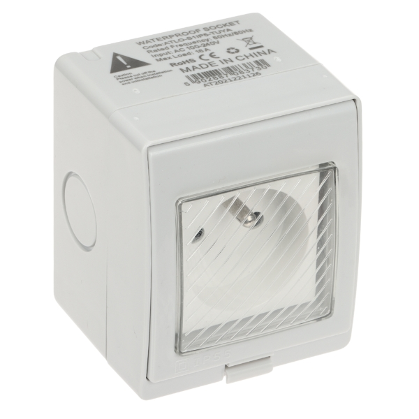
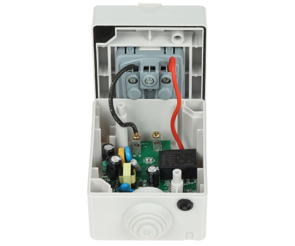
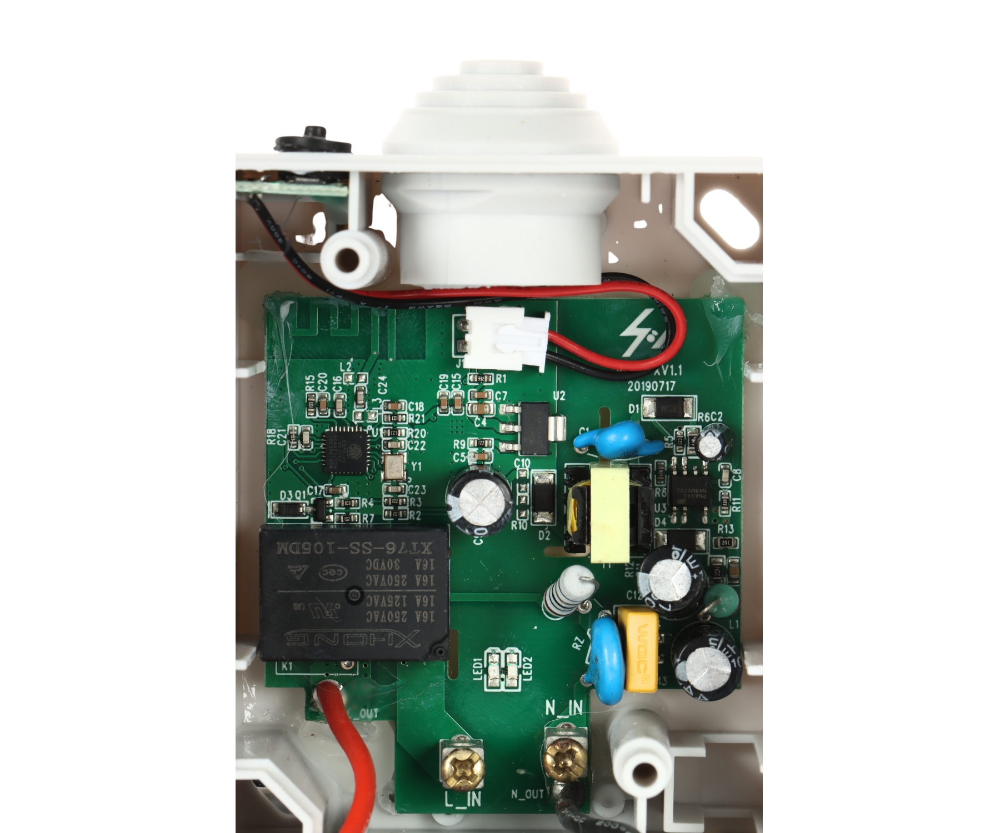
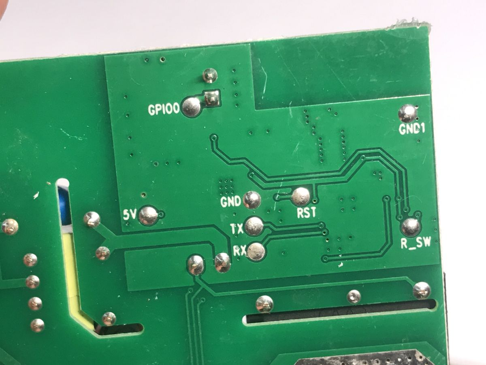

  
  
  
  

Model reference: ALTO-S1IP5-TUYA

Manufacturer: ALTO

## GPIO Pinout

| Pin    | Function                   |
|--------|----------------------------|
| GPIO00 | Button (pullup, inverted)  |
| GPIO12 | Relay                      |
| GPIO13 | LED  (inverted)            |


## Basic Configuration

```yaml
# Basic Config
esphome:
  name: alto-s1ip5-tuya
  friendly_name: alto-s1ip5-tuya

esp8266:
  board: esp8285

web_server:

mdns:

logger:

captive_portal:

api:
  password: !secret api_password

ota:
  password: !secret ota_password

wifi:
  ssid: !secret wifi_ssid
  password: !secret wifi_password
  ap:


# Button configuration
binary_sensor:
  - platform: gpio
    pin:
      number: GPIO0
      mode: INPUT_PULLUP
      inverted: true
    name: 'Button'
    on_press:
      - switch.toggle: relay1

# Config for switch
switch:
  - platform: gpio
    name: 'relay'
    pin: GPIO12
    id: relay

# Status LED for connection
status_led:
  pin:
    number: GPIO13
    inverted: true
```
