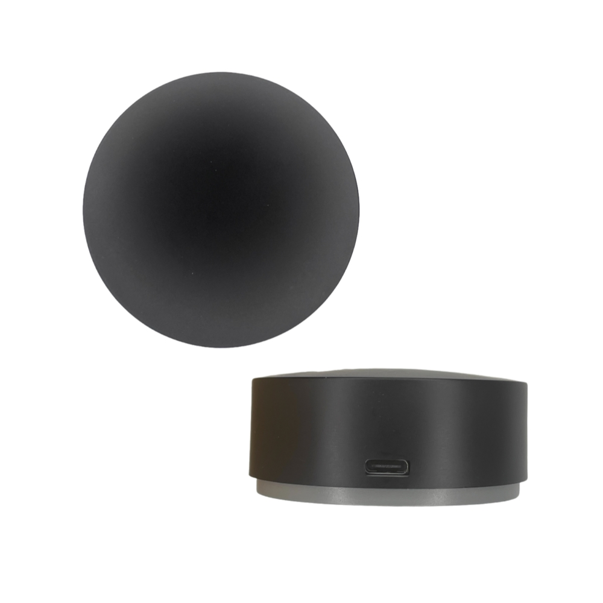

Maker: [Athom](https://www.athom.tech/)

Product page: [RF433 IR Remote Controller Made For ESPHome with BLE Proxy](https://www.athom.tech/blank-1/esphome-rf433-ir-remote-controller)

## Description

The Athom RF433 IR Remote Controller is an ESP32-based, cloud-free controller for Home Assistant. It combines a
433 MHz RF transceiver, a 38 kHz infrared transceiver, and a Bluetooth proxy in one device.

The controller is powered by 5 V over USB-C. Its built-in CH340K USB-to-serial adapter allows the firmware to be
flashed or customized without an external programmer.

## Features

- ESP32-WROOM-32E with 8 MB flash
- 433 MHz RF signal learning and transmission
- 38 kHz infrared signal learning and transmission
- Bluetooth proxy for nearby BLE and BTHome devices
- 2.4 GHz Wi-Fi and local Home Assistant integration
- USB-C power and firmware flashing

The manufacturer's configuration provides ten learning slots each for infrared and RF signals, an infrared climate
entity, Bluetooth proxy support, and managed firmware updates. It uses the manufacturer's `Flash_comp` external
component to persist learned signals.

## RF compatibility

RF compatibility depends on the protocol used by the remote or target device. Encrypted, rolling-code, and proprietary
RF protocols may not be learnable or replayable.

## GPIO Pinout

| Pin    | Function       |
| ------ | -------------- |
| GPIO19 | RF receiver    |
| GPIO18 | RF transmitter |
| GPIO33 | IR receiver    |
| GPIO25 | IR transmitter |
| GPIO0  | Button         |
| GPIO27 | Status LED     |

## Configuration

The configuration below is maintained by Athom and is loaded directly from its upstream repository.

```yaml url=https://github.com/athom-tech/esp32-configs/blob/main/athom-rf-ir-remote.yaml
```
