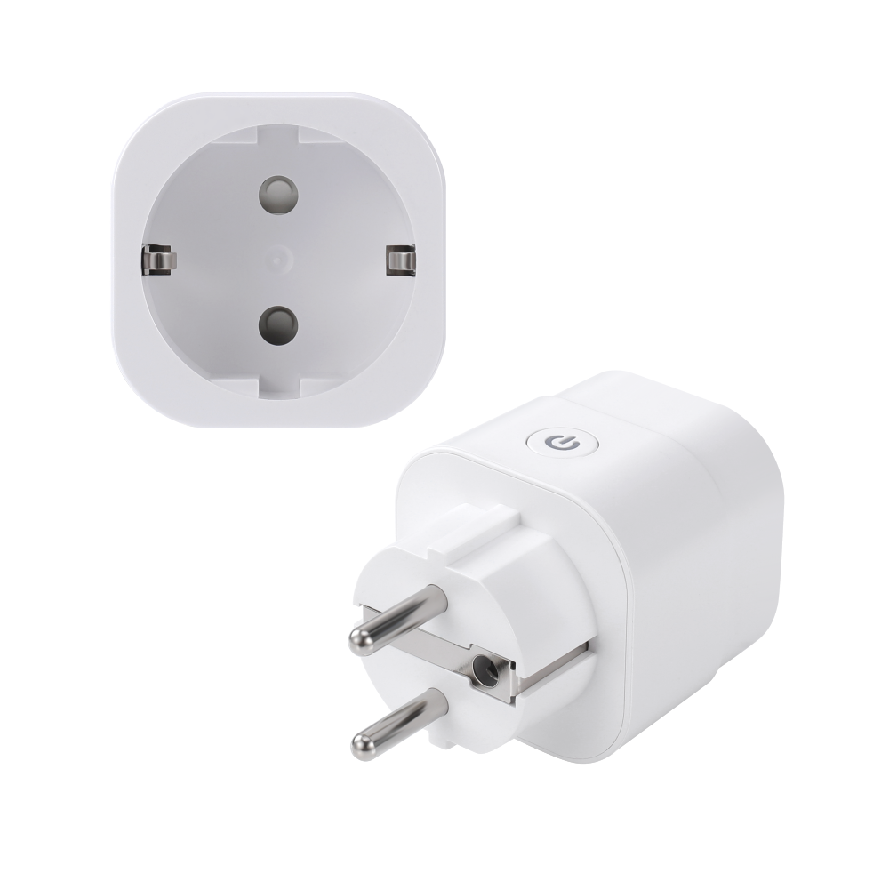

Maker: [Athom](https://www.athom.tech/)

Product page: [ESP32-C5 Dual-Band Wi-Fi EU Plug Made for ESPHome](https://www.athom.tech/blank-1/esp32-c5-dual-band-wi-fi-eu-plug-made-for-esphome)

## Description

The Athom Smart Plug EU V5 is a 16 A EU smart plug pre-installed with ESPHome for local control through Home
Assistant. Its BL0942 power metering chip reports voltage, current, power, frequency, and energy consumption.

## Features

- ESP32-C5 with 4 MB flash
- 2.4 GHz and 5 GHz Wi-Fi 6
- Bluetooth Low Energy proxy enabled by default
- BL0942 power and energy monitoring
- 16 A maximum load
- Local Home Assistant integration and OTA updates

The manufacturer's configuration requires ESPHome 2026.6.0 or newer.

## GPIO Pinout

| Pin    | Function   |
| ------ | ---------- |
| GPIO12 | BL0942 RX  |
| GPIO11 | BL0942 TX  |
| GPIO10 | Button     |
| GPIO23 | Relay      |
| GPIO6  | Status LED |

## Configuration

```yaml url=https://github.com/athom-tech/esp32-configs/blob/main/athom-smart-plug-v5.yaml
```
