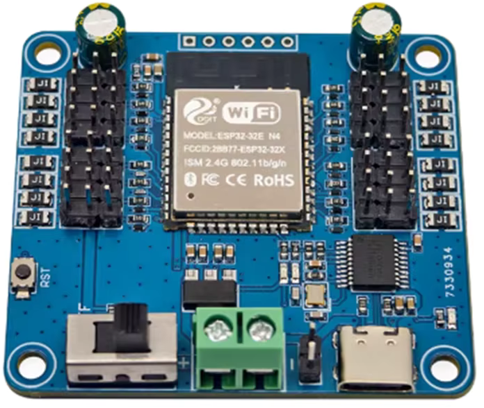
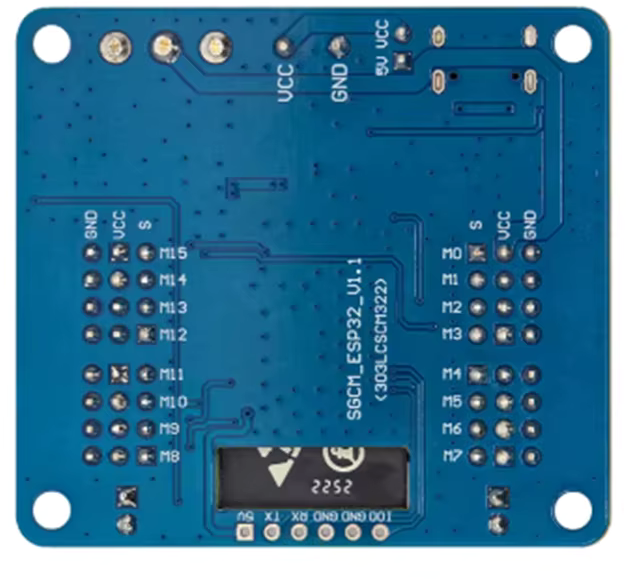
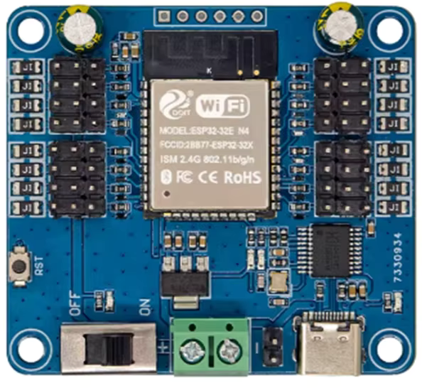

## Product description

This is a 16-servo controller board with an ESP32-32E-N4.

Each servo is protected by an 1.5A fuse.

It is available on aliexpress.

## GPIO Pinout

|      |      |      | 5V  | TX  | RX  | GND | GND | IO0 |      |      |      |
| :--: | :--: | :--: | :-: | :-: | :-: | :-: | :-: | :-: | :--: | :--: | :--: |
| GND  | VCC  | IO15 |     |     |     |     |     |     | IO22 | VCC  | GND  |
| GND  | VCC  | IO32 |     |     |     |     |     |     | IO21 | VCC  | GND  |
| GND  | VCC  | IO33 |     |     |     |     |     |     | IO19 | VCC  | GND  |
| GND  | VCC  | IO25 |     |     |     |     |     |     | IO18 | VCC  | GND  |
| GND  | VCC  | IO26 |     |     |     |     |     |     | IO12 | VCC  | GND  |
| GND  | VCC  | IO27 |     |     |     |     |     |     | IO17 | VCC  | GND  |
| GND  | VCC  | IO14 |     |     |     |     |     |     | IO16 | VCC  | GND  |
| GND  | VCC  | IO13 |     |     |     |     |     |     | IO4  | VCC  | GND  |

## Basic Config

```yaml file=config.yaml
```
