<!-- markdownlint-disable MD013 MD024 MD025 -->

# Elecrow ESP32-P4 All-in-One Starter Kit

## Product Description

The Elecrow ESP32-P4 All-in-One Starter Kit is a comprehensive AI and IoT development board based on Espressif's ESP32-P4 microprocessor. It integrates 16 common sensor modules on a single circuit board, eliminating the need for complex soldering and wiring, making it ideal for students, educators, makers, and hardware engineers to learn AI applications and embedded development.

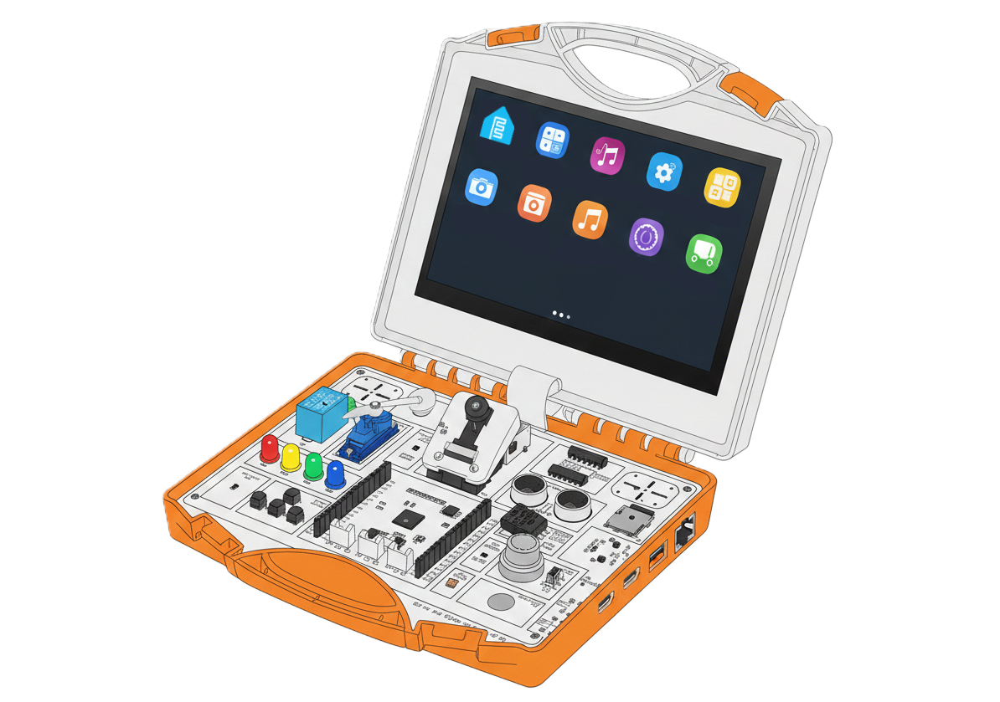

## Specifications

| Parameter | Value |
| ----------- | ------- |
| **Main Processor** | ESP32-P4NRW32 |
| **CPU (HP)** | 32-bit RISC-V dual-core processor  (up to 360 MHz) |
| **CPU (LP)** | 32-bit RISC-V single-core processor (up to 40 MHz) |
| **System Memory** | 32 MB in-Package PSRAM |
| **Storage** | 128 KB HP ROM, 16 KB LP ROM, 128 Mbit (16 MB) QSPI NOR Flash |
| **Display Size** | 7 inch |
| **Display Resolution** | 1024×600 |
| **Display Type** | IPS Capacitive Touch |
| **Camera** | 2 MegaPixel, 100° wide-angle lens |
| **Audio** | Dual stereo speakers |
| **Wireless Expansion** | Reserved module slot for optional Wi-Fi / HaLow / Bluetooth / LoRa / Zigbee / Thread / nRF / Temperature / Humidity / TinyML modules |
| **16-in-1 Integrated Modules** | All sensors integrated on single PCB |
| **Interfaces** | TYPE-C, I2C, UART, I/O, CSI, USB, Ethernet, TF Card Slot |
| **Input Voltage** | 5V DC - 4W-7W |
| **Dimensions** | 195×170×46 mm |
| **Weight** | 600g |

[Back to top](#elecrow-esp32-p4-all-in-one-starter-kit)

## Integrated Sensors

The board includes 16 pre-integrated sensor modules:

1. [Ultrasonic Sensor (HC-SR04)](#1-ultrasonic-distance-sensor-hc-sr04-j14)
2. [Light/Luminosity Sensor (BH1750)](#2-light-luminosity-sensor-bh1750)
3. [RGBW Red Yellow Green Blue LED WS2814A](#3-rgbw-red-yellow-green-blue-led-ws2814a-u14)
4. [Temperature & Humidity Sensor (DHT20)](#4-temperature--humidity-sensor-dht20-u5)
5. [DSI Display (EK79007)](#5-mipi-dsi-ek79007-j17)
6. [PIR Motion Sensor (Silvan BIS0001)](#6-pir-motion-sensor-silvan-bis0001-j101)
7. [Servo Motor (V1.0 continuous / V1.1 180°)](#7-servo-v10-continuous--v11-180-j3)
8. [Accelerometer & Gyro (STMicroelectronics LSM6DS3TR-C IMU 6-DoF)](#8-accelerometer--gyro-stmicroelectronics-lsm6ds3tr-c-imu-6-dof-u6)
9. [Hall Effect Sensor (Hallwee HAL248)](#9-hall-effect-sensor-hallwee-hal248-u7)
10. [Custom_key (4 x Buttons) (ADC)](#10-adc-buttons-custom-key-ladder-k5-k6-k7-k8)
11. [Touch Sensor (Tontek TTP223)](#11-touch-pad-button-tontek-ttp223-u123)
12. [Microphone (LinkMems LMD4737T261-OAC02)](#12-mic-linkmems-lmd4737t261-oac02-u8)
13. [Audio (Nsiway Tech NS4168 L/R)](#13-i2s-audio-nsiway-tech-ns4168-l-u9-ns4168-r-u10)
14. [Gas Sensor (Hanwei MQ2)](#14-gas-sensor-hanwei-mq-2-j6)
15. [Relay Module (SRD-05VDC-SL-C)](#15-relay-srd-05vdc-sl-c-k4)
16. [CSI Camera (SmartSens SC2336 2MP CMOS sensor)](#16-camera-csi-smartsens-sc2336-2mp-j12)

Additional I/O:

1. [SD-Card Slot](#sd-card-slot-j7)
2. [UART to USB-C (CH340K)](#usb1--power-in-j5)
3. [USB C Host](#usb2-high-speed--power-in-j1)
4. [USB A Host](#usb-type-a-j4)
5. [Ethernet (IP101)](#ethernet-ip101-j2)

## Lessons

The following lessons demonstrate how to use each sensor and component on the board.

Each lesson below is from the manual and corresponds to a conversion of the ESP-IDF code to an ESPHome example YAML. There are also a few extras at the end (Ethernet, SD-Card, USB, wireless modules, etc.).

```yaml file=config.yaml
```

**📖 For detailed lesson instructions, see the [Official User Manual V1.0 (PDF)](https://www.elecrow.com/download/product/SEE00804D/All-in-one_Starter_Kit_for_ESP32-P4_User_Manual.pdf) or [User Manual V1.1 (PDF)](https://www.elecrow.com/download/product/SEE00804D/All-in-one_Starter_Kit_for_ESP32-P4_User_Manual_V1.1.pdf).**

1. [Lesson 1 GPIO LED Control](#lesson-gpio---led-control)
2. [Lesson 2 Relay](#lesson-relay-control)
3. [Lesson 3 Touch Sensor](#lesson-touch-sensor)
4. [Lesson 4 PIR Motion Sensor](#lesson-pir-motion-sensor)
5. [Lesson 5 Hall Effect Sensor](#lesson-hall-effect-sensor)
6. [Lesson 6 UART Communication](#lesson-6-uart-communication)
7. [Lesson 7 Timer](#lesson-timer)
8. [Lesson 8 Servo Motor (V1.0/V1.1)](#lesson-servo-motor-control-v10-continuous-rotation)
9. [Lesson 9 Display Touch](#lesson-display--touch)
10. [Lesson 10 Ultrasonic Distance Sensor](#lesson-ultrasonic-distance-sensor)
11. [Lesson 11 Temperature & Humidity Sensor](#lesson-temperature--humidity-dht20)
12. [Lesson 12 Light Sensor](#lesson-light-sensor-bh1750)
13. [Lesson 13 Accelerometer & Gyro (IMU 6DoF)](#lesson-imu-6-dof-lsm6ds3tr-c)
14. [Lesson 14 RGBW LED](#lesson-rgbw-led-ws2814a)
15. [Lesson 15 ADC Buttons](#lesson-adc-buttons)
16. [Lesson 16 Gas Sensor](#lesson-gas-sensor-mq2)
17. [Lesson 17 Microphone](#lesson-microphone-i2s)
18. [Lesson 18 Speaker](#lesson-18-speaker-i2s-audio)
19. [Lesson 19 Display LVGL Touch](#lesson-display-with-lvgl--touch)

## Quick Dev Environment Setup For New Users

How to setup a quick environment to play with.

## Required Versions

- Python 3.13+
- ESPHome 2026.02+
- ESP-IDF 5.4.2+ (the ESP32-C6 ESP-Hosted build is tested with 5.5.2)

## Installation

### Development Environment Setup

1. **Install Visual Studio Code**
   - Download from [code.visualstudio.com](https://code.visualstudio.com/)
   - Follow default installation

2. **Install Helpful VSCode Extensions**

   - [C/C++ Extension Pack](https://marketplace.visualstudio.com/items?itemName=ms-vscode.cpptools-extension-pack)
   - [Python extension](https://marketplace.visualstudio.com/items?itemName=ms-python.python)
   - [PlatformIO IDE](https://marketplace.visualstudio.com/items?itemName=platformio.platformio-ide)
   - [ESP-IDF extension](https://marketplace.visualstudio.com/items?itemName=espressif.esp-idf-extension)
   - [YAML extension](https://marketplace.visualstudio.com/items?itemName=redhat.vscode-yaml)

3. **Install ESPHome**

Requirements: Git, Python 3.13+, and pip. Clone the ESPHome repository:

```bash
git clone https://github.com/esphome/esphome.git
cd esphome
git checkout dev
```

#### Linux

```bash
python3 -m venv venv
source venv/bin/activate
python -m pip install --upgrade pip
python -m pip install -e .
```

The P4 usually appears as `/dev/ttyACM0` or `/dev/ttyUSB0`. If access is
denied, add your user to the `dialout` group, then sign out and back in:

```bash
sudo usermod -a -G dialout "$USER"
```

#### macOS

```bash
python3 -m venv venv
source venv/bin/activate
python -m pip install --upgrade pip
python -m pip install -e .
```

The P4 usually appears as `/dev/cu.usbmodem*` or `/dev/cu.SLAB_USBtoUART`.

#### Windows PowerShell

```powershell
py -3.13 -m venv venv
.\venv\Scripts\Activate.ps1
python -m pip install --upgrade pip
python -m pip install -e .
```

If PowerShell blocks activation, run:

```powershell
Set-ExecutionPolicy -Scope CurrentUser RemoteSigned
```

The P4 usually appears as a `COM` port. Find the exact port in Device Manager
under **Ports (COM & LPT)**.

1. **Connect Device**
   - Connect AIO ESP32-P4 kit via USB Type-C cable.
   - Ensure device is detected with the proper drivers and lights up.

## Backup ESP-IDF Factory Firmware

Backup the factory firmware just in case you want to test to see if everything is working again.

### Identify P4

```bash
esptool --chip esp32p4 --port PORT flash-id
```

### Dump Flash P4

```bash
esptool --chip esp32p4 --port PORT read-flash 0 0x1000000 elecrow_aio_kit_firmware_backup.bin
```

### Restore Flash P4

```bash
esptool --chip esp32p4 --port PORT write-flash 0 elecrow_aio_kit_firmware_backup.bin
```

Replace `PORT` with `/dev/ttyUSB0` or `/dev/ttyACM0` on Linux,
`/dev/cu.usbmodemXXXX` on macOS, or `COM5` (for example) on Windows.

## ESPHome ESP32-P4 Basic Run Command (Compile/Upload/Logs)

This command will compile your YAML, then upload it, and then attach to the log to see what's up!

Linux:

```bash
esphome run Your-YAML-Name-Here-001.yaml --device /dev/ttyACM0
```

macOS:

```bash
esphome run Your-YAML-Name-Here-001.yaml --device /dev/cu.usbmodemXXXX
```

Windows PowerShell:

```powershell
esphome run Your-YAML-Name-Here-001.yaml --device COM5
```

[Back to top](#elecrow-esp32-p4-all-in-one-starter-kit)

## Pinout / Schematics / Examples

**Note**: *These are in order by schematic number not lesson number.*

### 16 Integrated Sensors GPIO & Pinout

#### 1. Ultrasonic Distance Sensor (HC-SR04) J14

Schematic 1

[ESPHome Docs - Ultrasonic](https://esphome.io/components/sensor/ultrasonic/)

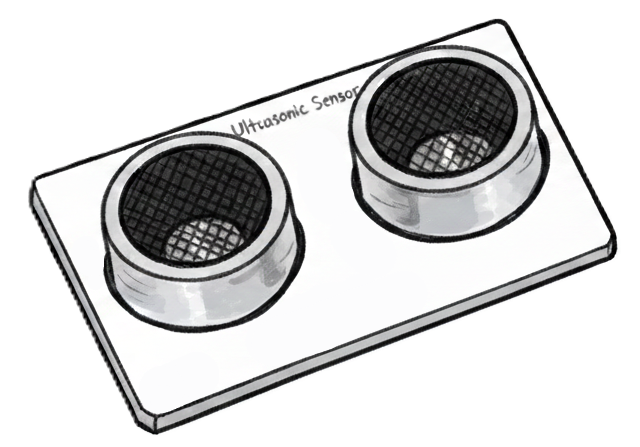

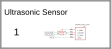

| GPIO | Label |
| :--- | :--- |
| GPIO12 | Echo |
| GPIO13 | Trigger |

```yaml file=example-001.yaml
```

### Lesson: Ultrasonic Distance Sensor

Manual Lesson 10

**Description**: Measure distance using the HC-SR04 ultrasonic sensor.

```yaml file=example-002.yaml
```

#### 2. Light Luminosity Sensor (BH1750)

[ESPHome Docs - BH1750](https://esphome.io/components/sensor/bh1750/)

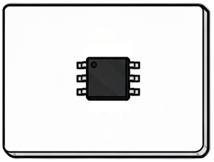

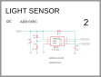

| GPIO | Label |
| :--- | :--- |
| GPIO18 | SDA (0x5c) |
| GPIO19 | SCL (0x5c) |

```yaml file=example-003.yaml
```

### Lesson: Light Sensor (BH1750)

Manual Lesson 12

**Description**: Measure ambient light intensity.

```yaml file=example-004.yaml
```

#### 3. RGBW Red Yellow Green Blue LED WS2814A U14

[ESPHome Docs - LED Strip](https://esphome.io/components/light/esp32_rmt_led_strip/)

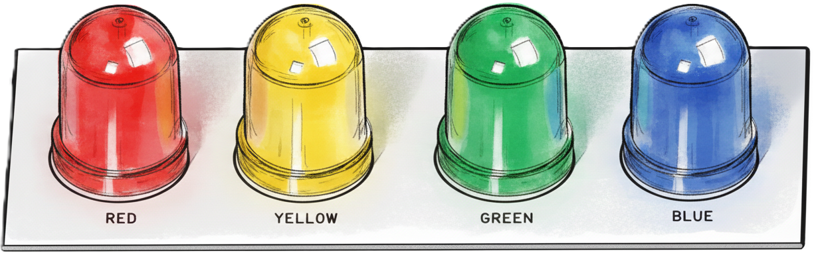

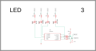

| GPIO | Label |
| :--- | :--- |
| GPIO08 | DIN |

```yaml file=example-005.yaml
```

### Lesson: RGBW LED (WS2814A)

Manual Lesson 14

**Description**: Control the single RGBW LED, cycling through red, white, green,
and blue every second.

```yaml file=example-006.yaml
```

#### 4. Temperature & Humidity Sensor (DHT20) U5

[ESPHome Docs - DHT](https://esphome.io/components/sensor/dht/)

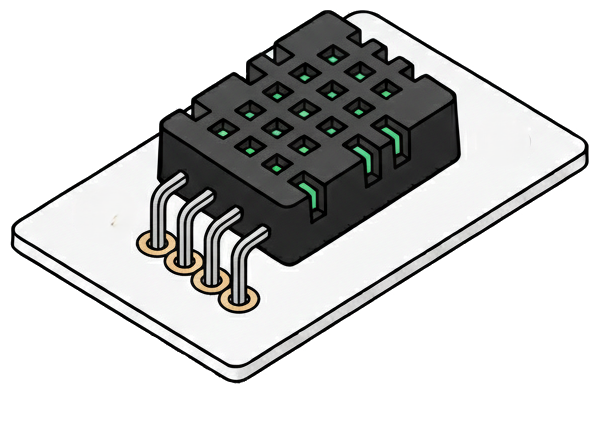

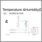

| GPIO | Label |
| :--- | :--- |
| GPIO18 | SDA (0x38) |
| GPIO19 | SCL (0x38) |

```yaml file=example-007.yaml
```

### Lesson: Temperature & Humidity (DHT20)

Manual Lesson 11

**Description**: Read temperature and humidity from the DHT20 sensor.

```yaml file=example-008.yaml
```

#### 5. MIPI DSI (EK79007) J17

[ESPHome Docs - MIPI DSI](https://esphome.io/components/display/mipi_dsi/)

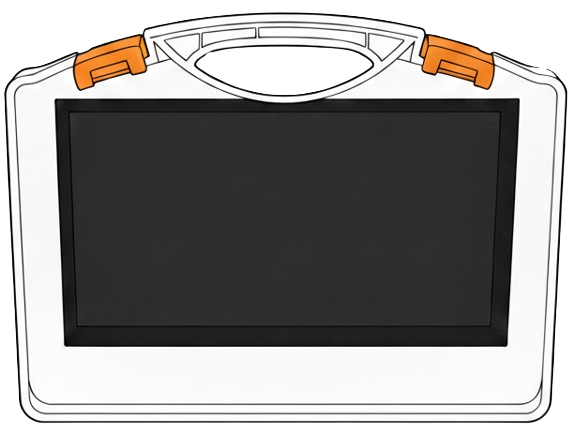

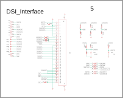

**Key Display Parameters (Verified from Official Code):**

| Parameter | Value | Source |
| ----------- | ------- | -------- |
| **Controller** | EK79007 | esp_lcd_new_panel_ek79007() |
| **Resolution** | 1024×600 | H_size × V_size |
| **Lane Bit Rate** | 1000 Mbps | Tested custom AIO YAML configuration |
| **DPI Clock** | 51 MHz | dpi_config.dpi_clock_freq_mhz |
| **Data Lanes** | 2 | bus_config.num_data_lanes |
| **Pixel Format** | RGB565/RGB666/RGB888 | Configurable (16/18/24-bit) |
| **Hsync Back Porch** | 160 | video_timing.hsync_back_porch |
| **Hsync Pulse Width** | 70 | video_timing.hsync_pulse_width |
| **Hsync Front Porch** | 160 | video_timing.hsync_front_porch |
| **Vsync Back Porch** | 23 | video_timing.vsync_back_porch |
| **Vsync Pulse Width** | 10 | video_timing.vsync_pulse_width |
| **Vsync Front Porch** | 12 | video_timing.vsync_front_porch |
| **UPDN (GPIO32)** | 0 | Vertical scan normal |
| **SHLR (GPIO33)** | 1 | Horizontal scan inverted |
| **Reset GPIO** | GPIO5 | LCD_GPIO_RESET |
| **Backlight GPIO** | GPIO20 | LCD_GPIO_BLIGHT (PWM) |

**Backlight PWM Settings:**

- Frequency: 1 kHz (BLIGHT_PWM_Hz in code)
- Resolution: 11-bit (LEDC_TIMER_11_BIT)
- Formula: `duty = (brightness * 18) + 200` where brightness is 0-100
- Channel: LEDC_CHANNEL_0, LEDC_TIMER_0, Low-speed mode
- Min duty: 0 (off), Max duty: ~2048 (100% = 1800 + 200 = 2000)

| GPIO | Label |
| :--- | :--- |
| GPIO05 | LCD Reset / LED |
| GPIO20 | LCD Backlight (PWM) |
| GPIO32 | UPDN |
| GPIO33 | SHLR |
| GPIO18 | SDA (Not used for LCD) |
| GPIO19 | SCL (Not used for LCD) |

1. **MIPI-DSI Display**: [PR #11886](https://github.com/esphome/esphome/pull/11886)

```yaml file=example-009.yaml
```

##### Touch Screen (Goodix GT911) J17

[ESPHome Docs - Touch Screen](https://esphome.io/components/touchscreen/gt911/)

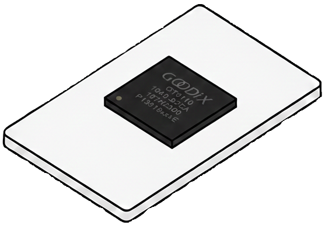


| GPIO | Label |
| :--- | :--- |
| GPIO40 | Reset TP |
| GPIO41 | INT TP |
| GPIO18 | SDA (0x14 or 0x5d) |
| GPIO19 | SCL (0x14 or 0x5d) |

```yaml file=example-010.yaml
```

### Lesson: Display & Touch

Manual Lesson 9

**Description**: Initialize the 7-inch display with LVGL and touch support.

```yaml file=example-011.yaml
```

### Lesson: Display with LVGL & Touch

Manual Lesson 19

**Description**: Create interactive UI with LVGL graphics library and touch input.

```yaml file=example-012.yaml
```

[Back to top](#elecrow-esp32-p4-all-in-one-starter-kit)

#### 6. PIR Motion Sensor (Silvan BIS0001) J101

[ESPHome Docs - PIR](https://devices.esphome.io/devices/generic-pir/)

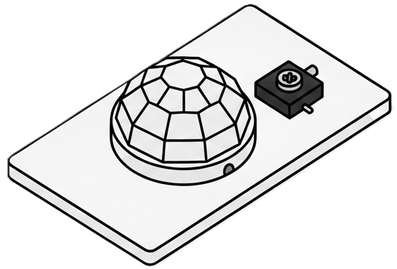

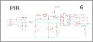

| GPIO | Label |
| :--- | :--- |
| GPIO24 | VO |

GPIO24 is the PIR sensor output on the AIO board. This example assumes the
board is using UART0 rather than the USB-Serial-JTAG interface.

```yaml file=example-013.yaml
```

### Lesson: PIR Motion Sensor

Manual Lesson 4

**Description**: Detect motion using the passive infrared sensor and control an LED.

```yaml file=example-014.yaml
```

#### 7. Servo (V1.0 Continuous / V1.1 180°) J3

[ESPHome Docs - Servo](https://esphome.io/components/servo/)

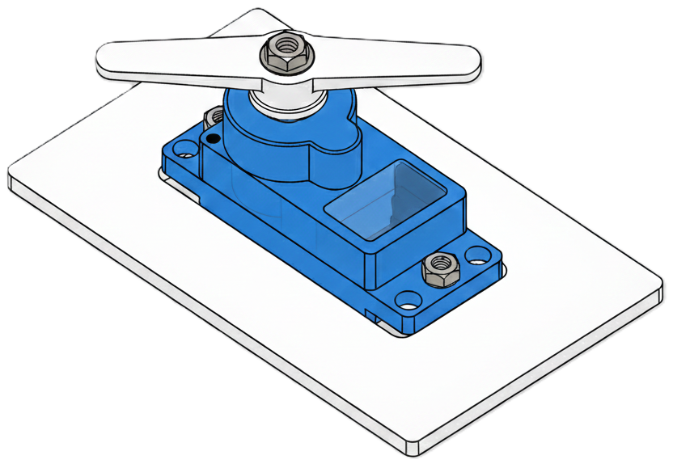

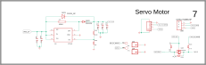

| Pin / GPIO | Label |
| :--- | :--- |
| 1 | GND |
| 2 | V5 |
| 3 | N/C |
| GPIO25 | Signal (PWM) |

GPIO25 is the AIO servo PWM output (`IO25_SERVO`). This example assumes the
board is using UART0 rather than the USB-Serial-JTAG interface.

**Board revision note:** The V1.0 kit uses a continuous-rotation servo, so
servo levels represent direction and speed around the stop position. The V1.1
kit uses a standard 180° servo, so servo levels represent position instead.
Both revisions use the GPIO25 PWM signal shown below.

```yaml file=example-015.yaml
```

### Lesson: Servo Motor Control (V1.0 Continuous Rotation)

Manual Lesson 8

**Description**: Control the V1.0 continuous-rotation servo with different
speeds and directions in a continuous loop.

```yaml file=example-016.yaml
```

### Lesson: Servo Motor Control (V1.1 180° Servo)

Use this example with the V1.1 board and its standard 180° servo. The same
GPIO25 PWM signal is used, but `servo.write` now selects a position rather than
continuous-rotation speed.

```yaml file=example-017.yaml
```

#### 8. Accelerometer & Gyro (STMicroelectronics LSM6DS3TR-C IMU 6-DoF) U6

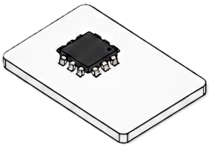


| GPIO | Label |
| :--- | :--- |
| GPIO18 | SDA (0x6b) |
| GPIO19 | SCL (0x6b) |

```yaml file=example-018.yaml
```

### Lesson: IMU 6-DoF (LSM6DS3TR-C)

Manual Lesson 13

**Description**: Read accelerometer and gyroscope data from the 6-axis IMU.

```yaml file=example-019.yaml
```

#### 9. Hall Effect Sensor (Hallwee HAL248) U7

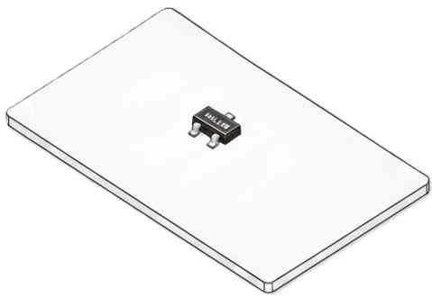

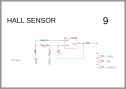

| GPIO | Label |
| :--- | :--- |
| GPIO07 | VOUT |

**Note**: This pin is used in the wireless module header so you can't use them at the same time.

```yaml file=example-020.yaml
```

### Lesson: Hall Effect Sensor

Manual Lesson 5

**Description**: Detect magnetic fields using the Hall effect sensor.

```yaml file=example-021.yaml
```

#### 10. ADC Buttons Custom Key Ladder k5 k6 k7 k8

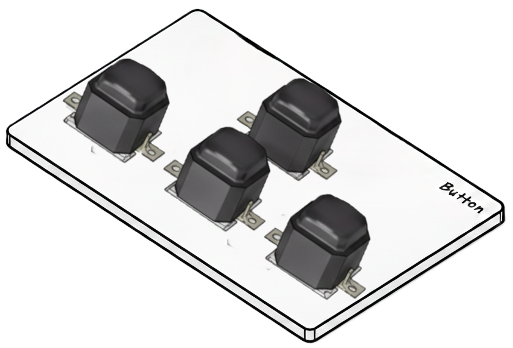

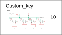

| GPIO | Resistor | Key / Direction |
| :--- | :--- | :--- |
| GPIO16 | 1kΩ | K8 [Left] |
| GPIO16 | 2kΩ | K7 [Right] |
| GPIO16 | 3.6kΩ | K6 [Down] |
| GPIO16 | 8.2kΩ | K5 [Up] |

```yaml file=example-022.yaml
```

### Lesson: ADC Buttons

Manual Lesson 15

**Description**: Read multiple buttons using a single ADC pin and control RGB LED colors based on button press.

```yaml file=example-023.yaml
```

#### 11. Touch Pad Button (Tontek TTP223) U123

[ESPHome Docs - Touchpad](https://esphome.io/components/binary_sensor/ttp229/)

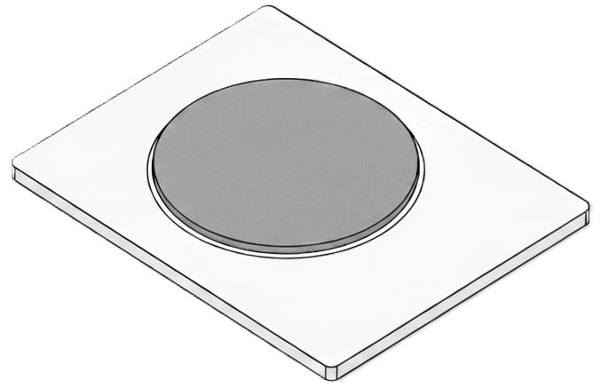

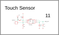

| GPIO | Label |
| :--- | :--- |
| GPIO02 | OUT |

```yaml file=example-024.yaml
```

### Lesson: Touch Sensor

Manual Lesson 3

**Description**: Detect touch input using the capacitive touch sensor and control an LED.

```yaml file=example-025.yaml
```

#### 12. Mic (LinkMems LMD4737T261-OAC02) U8

[ESPHome Docs - Microphone](https://esphome.io/components/microphone/)

> **Tested on ESP32-P4:** The onboard microphone works as a PDM microphone.
> ESPHome required an additional P4 PDM-microphone code change because P4
> support was initially treated as unavailable. The configuration below was
> tested after that change was added.

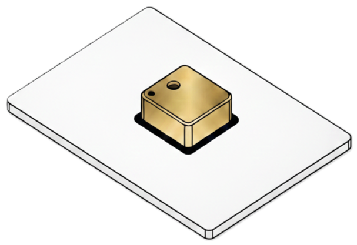

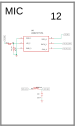

| GPIO | Label |
| :--- | :--- |
| GPIO03 | CLK |
| GPIO04 | Data |

```yaml file=example-026.yaml
```

### Lesson: Microphone (I2S)

Manual Lesson 17

**Description**: Capture audio using the I2S microphone.

```yaml file=example-027.yaml
```

#### 13. I2S Audio (Nsiway Tech) NS4168-L U9 NS4168-R U10

[ESPHome Docs - I2S Audio](https://esphome.io/components/media_player/i2s_audio/)

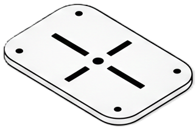

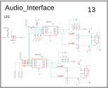

#### Pinout

| GPIO | Label |
| :--- | :--- |
| GPIO06 | Enable |
| GPIO21 | LRCLK |
| GPIO22 | BCLK |
| GPIO23 | DSDIN |

#### ESPHome Basic Setup

```yaml file=example-028.yaml
```

### Lesson 18: Speaker (I2S Audio)

Manual Lesson 18

**Description**: Play audio through the I2S speakers.

```yaml file=example-029.yaml
```

#### 14. Gas Sensor (Hanwei MQ-2) J6

[ESPHome Docs - ADC](https://esphome.io/components/sensor/adc/)

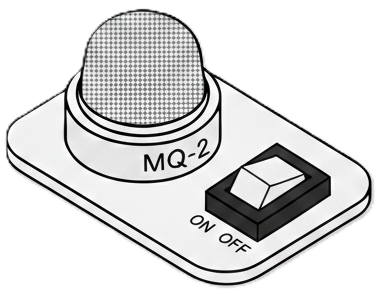

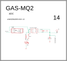

| GPIO | Label |
| :--- | :--- |
| GPIO17 | AOUT (ADC) |

```yaml file=example-030.yaml
```

### Lesson: Gas Sensor (MQ2)

Manual Lesson 16

**Description**: Detect gas levels using the analog MQ2 sensor.

```yaml file=example-031.yaml
```

#### 15. Relay (SRD-05VDC-SL-C) K4

[ESPHome Docs - Switch](https://esphome.io/components/switch/)

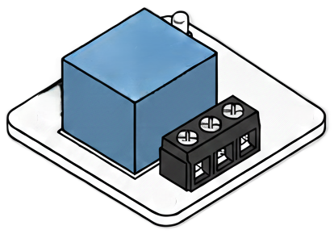

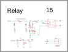

| GPIO | Label |
| :--- | :--- |
| GPIO42 | Transistor Relay GND Enable |

```yaml file=example-032.yaml
```

### Lesson: Relay Control

Manual Lesson 2

**Description**: Control a relay to switch external devices on and off every 5 seconds.

```yaml file=example-033.yaml
```

#### 16. Camera CSI (SmartSens SC2336 2MP) J12

[ESPHome Docs - CSI Camera](https://github.com/esphome/esphome/pull/7639)

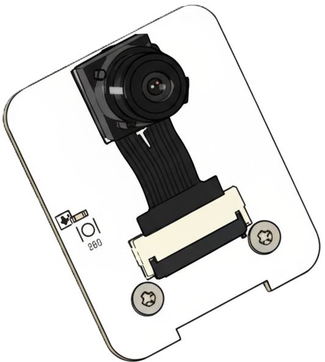

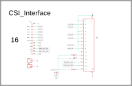

| GPIO | Label |
| :--- | :--- |
| GPIO45 | SDA (0x30) |
| GPIO46 | SCL (0x30) |

This example uses the SC2336 camera component from the external project used
by the tested AIO configuration. It is not part of a stable ESPHome release.

```yaml file=example-057.yaml
```

[Back to top](#elecrow-esp32-p4-all-in-one-starter-kit)

### Additional Information

### Lesson: Timer

Manual Lesson 7

**Description**: Use timers for periodic tasks and delays.

```yaml file=example-034.yaml
```

#### SD-Card Slot J7

> **Temporary dependency:** Official ESPHome SD-card support for this board is
> not available yet. Until it is accepted upstream, this example uses the
> `dev` branch of the `p1ngb4ck/esphome` fork. The `refresh: 0s` setting is
> intentional during development so the latest compatible changes are used.
> Pin this dependency to a tested commit or release once upstream support is
> available.

[ESPHome Docs - TF Card Slot](https://github.com/p1ngb4ck/esphome/tree/dev/esphome/components/storage)

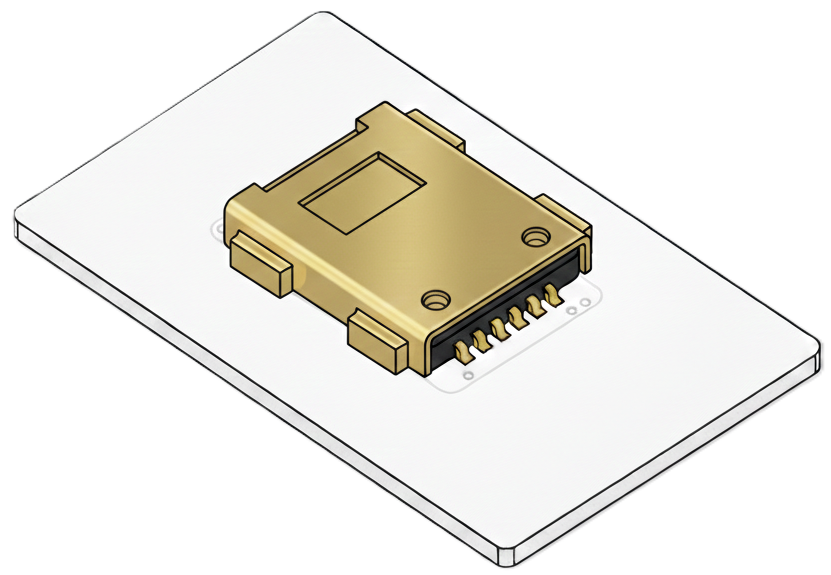

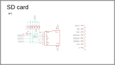

| Function / GPIO | Hardware Pin |
| :--- | :--- |
| GPIO39 | DO |
| GPIO43 | SCK |
| GPIO44 | CMD |

```yaml file=example-035.yaml
```

Add the credentials to ESPHome's `secrets.yaml` file:

```yaml file=example-036.yaml
```

#### ESP32-P4 Primary Header Interface

[ESPHome Docs - P4](https://esphome.io/components/esp32/#esp32-p4)

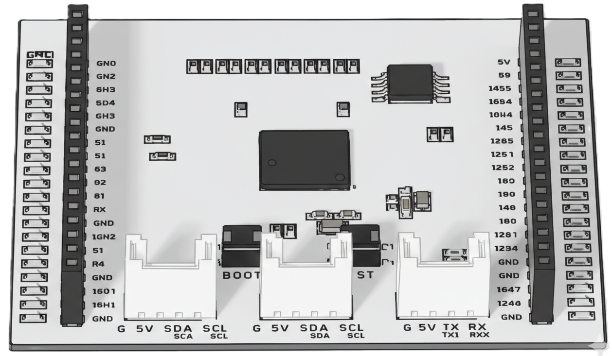

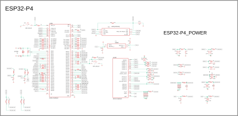

### IO LED

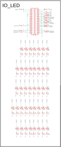

#### J8

| Function / GPIO | Hardware Pin |
| :--- | :--- |
| VDD_3V3 | J8 Pin 01 |
| VDD_3V3 | J8 Pin 02 |
| VDD_3V3 | J8 Pin 03 |
| GND | J8 Pin 04 |
| GND | J8 Pin 05 |
| GND | J8 Pin 06 |
| N/C | J8 Pin 07 |
| N/C | J8 Pin 08 |
| N/C | J8 Pin 09 |
| N/C | J8 Pin 10 |
| N/C | J8 Pin 11 |
| N/C | J8 Pin 12 |
| GND | J8 Pin 13 |
| GPIO41 | J8 Pin 14 |
| N/C | J8 Pin 15 |
| N/C | J8 Pin 16 |
| GND | J8 Pin 17 |
| GPIO45 | J8 Pin 18 |
| GPIO46 | J8 Pin 19 |
| GND | J8 Pin 20 |

##### J9

| Function / GPIO | Hardware Pin |
| :--- | :--- |
| VDD 5V | J9 Pin 01 |
| VDD 5V | J9 Pin 02 |
| GPIO14 | J9 Pin 03 |
| GPIO11 | J9 Pin 04 |
| GPIO10 | J9 Pin 05 |
| GPIO09 | J9 Pin 06 |
| GPIO53 | J9 Pin 07 |
| GPIO54 | J9 Pin 08 |
| GPIO15 | J9 Pin 09 |
| GPIO07 | J9 Pin 10 |
| GPIO08 | J9 Pin 11 |
| GPIO06 | J9 Pin 12 |
| GPIO05 | J9 Pin 13 |
| USB_A_P | J9 Pin 14 |
| USB_A_N | J9 Pin 15 |
| GND | J9 Pin 16 |
| GND | J9 Pin 17 |
| GPIO47 | J9 Pin 18 |
| GPIO48 | J9 Pin 19 |
| GND | J9 Pin 20 |

```yaml file=example-037.yaml
```

### Lesson: GPIO - LED Control

Manual Lesson 1

**Description**: Learn basic GPIO output control by toggling an LED on and off every 500ms.

```yaml file=example-038.yaml
```

#### Accessory Module Header

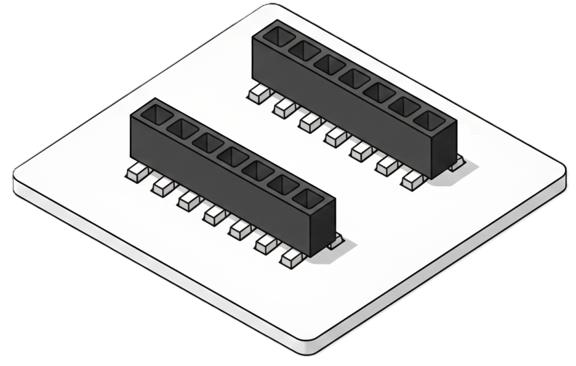

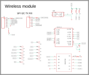

> **Wireless-module pin conflict warning:** The accessory header shares ESP32-P4
> GPIOs with other board functions. When a wireless module is installed, do
> not use GPIO2, GPIO7, GPIO9, GPIO10, GPIO11, GPIO14, GPIO15, GPIO53, or
> GPIO54 for unrelated sensors, LEDs, or switches. GPIO2 is the C6
> enable/reset line; GPIO7, GPIO9-GPIO11, and GPIO14-GPIO15 carry the
> one-wire full-duplex SPI transport; GPIO53 and GPIO54 are module control
> lines. Configure only the signals required by the installed module and
> verify the module-specific pin table before enabling any other example.

##### J13

| Function / GPIO | Hardware Pin |
| :--- | :--- |
| GPIO53 W TX CE | J13 Pin 01 |
| GPIO09 W CLK | J13 Pin 02 |
| GPIO10 W MISO | J13 Pin 03 |
| GPIO11 W MOSI | J13 Pin 04 |
| VDD 3V3 | J13 Pin 05 |
| GND | J13 Pin 06 |
| VDD 5V | J13 Pin 07 |

##### J16

| Function / GPIO | Hardware Pin |
| :--- | :--- |
| GPIO54 W RX IRQ | J16 Pin 01 |
| GPIO07 CMD | J16 Pin 02 |
| GPIO02 CLK | J16 Pin 03 |
| N/C | J16 Pin 04 |
| GPIO15 W | J16 Pin 05 |
| GPIO14 W Busy | J16 Pin 06 |
| N/C | J16 Pin 07 |

## Add-On Modules

The Elecrow AIO ESP32-P4 kit supports several expansion modules:

### 1. Wireless Modules (via expansion slot)

#### ESP32-C6 (Wi-Fi 6, Bluetooth 5.3) Wireless Module

[ESPHome Docs - C6](https://esphome.io/components/esp32/#esp32-c6)

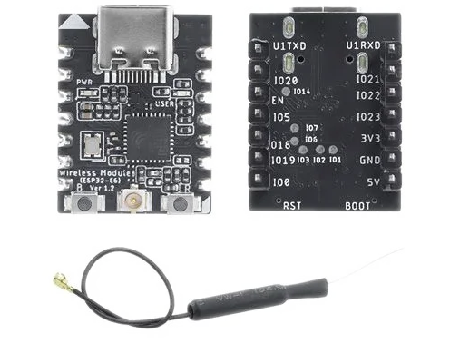


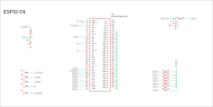

| Specifications | |
| :--- | :--- |
| Function | WiFi/WiFi 6 |
| Chip | ESP32-C6FH4 |
| Flash | 4MB Quad SPI |
| Frequency Range | 2402-2480MHz |
| Size | 18mm x 23.7mm |
| Antenna | IPEX |

##### Left Pins

| Module signal / GPIO | Module pin | ESP32-P4 GPIO | Signal role |
| :--- | :--- | :--- | :--- |
| U1RXD | Left Pin 01 | GPIO53 | Not used by SPI transport |
| GPIO21 | Left Pin 02 | GPIO09 | MISO |
| GPIO22 | Left Pin 03 | GPIO10 | Data-ready |
| GPIO23 | Left Pin 04 | GPIO11 | Handshake |
| VDD 3V3 | Left Pin 05 | VDD 3V3 | Power 3V3 |
| GND | Left Pin 06 | GND | GROUND |
| VDD 5V | Left Pin 07 | VDD 5V | Power 5V |

##### Right Pins

| Module signal / GPIO | Module pin | ESP32-P4 GPIO | Signal role |
| :--- | :--- | :--- | :--- |
| U1TXD | Right Pin 01 | GPIO54 | Not used by SPI transport |
| GPIO20 | Right Pin 02 | GPIO07 | MOSI |
| EN | Right Pin 03 | GPIO02 | Reset |
| GPIO05 | Right Pin 04 | N/C | Not Connected |
| GPIO18 | Right Pin 05 | GPIO15 | SCLK |
| GPIO19 | Right Pin 06 | GPIO14 | CS |
| GPIO00 | Right Pin 07 | N/C | Not Connected |

##### Back Pads

| Function / GPIO | Hardware Pin | ESP32-P4 |
| :--- | :--- | :--- |
| GPIO14 | Back Pad 14 | N/C |
| GPIO07 | Back Pad 07 | N/C |
| GPIO06 | Back Pad 06 | N/C |
| GPIO03 | Back Pad 03 | N/C |
| GPIO02 | Back Pad 02 | N/C |
| GPIO01 | Back Pad 01 | N/C |

### Flashing SPI (1-Wire) Firmware (Not SDIO 4-Wire)

**Note**:*The Elecrow ESP32-P4 AIO Kit doesn't work with SDIO, which the module is programmed from the factory with. You MUST reprogram it or it will not work in SPI (1-Wire) mode.*

Remove wireless module from AIO board, plug USB-C cable into the ESP32-C6 wireless module.

The commands below use the placeholder `C6_PORT`: use `/dev/ttyACM0` on Linux,
`/dev/cu.usbmodemXXXX` on macOS, or the appropriate `COM` port on Windows.

### Identify C6

Linux/macOS:

```bash
esptool --chip esp32c6 --port C6_PORT flash-id

esptool v5.2.0
Connected to ESP32-C6 on /dev/ttyACM0:
Chip type:          ESP32-C6FH4 (QFN32) (revision v0.2)
Features:           Wi-Fi 6, BT 5 (LE), IEEE802.15.4, Single Core + LP Core, 160MHz, Embedded Flash 4MB
Crystal frequency:  40MHz
USB mode:           USB-Serial/JTAG
MAC:                ##:##:##:##:##:##
BASE MAC:           ##:##:##:##:##:##
MAC_EXT:            ##:##

Stub flasher running.

Flash Memory Information:
=========================
Manufacturer: 46
Device: 4016
Detected flash size: 4MB

Hard resetting via RTS pin...
```

Windows PowerShell (replace `COM5` with the port shown in Device Manager):

```powershell
python -m esptool --chip esp32c6 --port COM5 flash-id
```

### Read Flash C6

Linux/macOS:

```bash
esptool --chip esp32c6 --port C6_PORT read-flash 0 0x400000 elecrow-esp32-c6-wireless-module-firmware-backup.bin
```

Windows PowerShell:

```powershell
python -m esptool --chip esp32c6 --port COM5 read-flash 0 0x400000 .\elecrow-esp32-c6-wireless-module-firmware-backup.bin
```

### Compile SPI ESP_Hosted Firmware

```bash
# Clone and setup ESP-IDF
git clone -b v5.5.2 --recursive https://github.com/espressif/esp-idf.git
cd esp-idf
git submodule update --init --recursive
./install.sh esp32c6  # or your target
source export.sh      # for Linux/macOS
# Windows Command Prompt: export.bat
# Windows PowerShell: .\export.ps1
cd ..

# Create project from ESP-Hosted example
idf.py create-project-from-example "espressif/esp_hosted==2.12.3:slave"

cd slave/
# Build for your target
idf.py set-target esp32c6  # or your target

idf.py menuconfig
(Top) → Example Configuration → Bus Config in between Host and Co-processor → Transport layer → (X) SPI Full-duplex

Configure the SPI GPIOs for the one-wire full-duplex transport as follows:

Espressif IoT Development Framework Configuration

(19) Slave GPIO pin for Host CS
(18) Slave GPIO pin for Host CLK
(20) Slave GPIO pin for Host MOSI
(21) Slave GPIO pin for Host MISO
(22) Slave GPIO pin for Data Ready
    DataReady GPIO Config (Active High)  --->
(23) Slave GPIO pin for Host Handshake

idf.py build

Creating esp32c6 image...
Successfully created esp32c6 image.
Generated slave/build/network_adapter.bin
network_adapter.bin binary size 0x127370 bytes. Smallest app partition is 0x1e0000 bytes. 0xb8c90 bytes (38%) free.
```

On Windows, run the equivalent commands from **ESP-IDF Command Prompt** or
PowerShell. Use `install.bat` and `export.bat` from Command Prompt, or
`export.ps1` from PowerShell, instead of the Unix shell scripts:

```powershell
git clone -b v5.5.2 --recursive https://github.com/espressif/esp-idf.git
cd esp-idf
git submodule update --init --recursive
.\install.bat esp32c6
.\export.ps1
cd ..
idf.py create-project-from-example "espressif/esp_hosted==2.12.3:slave"
cd slave
idf.py set-target esp32c6
idf.py menuconfig
idf.py build
```

### Write Flash C6 ESP_Hosted

```bash
Project build complete. To flash, run:
 idf.py flash
or
 idf.py -p PORT flash
or
 python -m esptool --chip esp32c6 -b 460800 --before default-reset --after hard-reset write-flash --flash-mode dio --flash-size 4MB --flash-freq 80m 0x0 build/bootloader/bootloader.bin 0x8000 build/partition_table/partition-table.bin 0xd000 build/ota_data_initial.bin 0x10000 build/network_adapter.bin
or from the "slave/build" dir
 python -m esptool --chip esp32c6 -b 460800 --before default-reset --after hard-reset write-flash "@flash_args"
```

```bash
esptool --chip esp32c6 --port C6_PORT write-flash 0 build/network_adapter.bin
```

Windows PowerShell:

```powershell
python -m esptool --chip esp32c6 --port COM5 write-flash 0 .\build\network_adapter.bin
```

For the generated multi-image build, flash from the `slave` directory with
the Windows paths shown below:

```powershell
python -m esptool --chip esp32c6 -b 460800 --before default-reset --after hard-reset write-flash --flash-mode dio --flash-size 4MB --flash-freq 80m 0x0 .\build\bootloader\bootloader.bin 0x8000 .\build\partition_table\partition-table.bin 0xd000 .\build\ota_data_initial.bin 0x10000 .\build\network_adapter.bin
```

If successful, unplug your ESP32-C6 wireless module from the USB-C cable, identify the correct pinout for the module to go in the right way 3V3 to the 3V3 header, plug the USB-C cable back into the AIO Kit "Serial/JTAG Power In" USB-C port.

**Do not restore SDIO firmware for use with this AIO board.** The AIO
supports only the 1-bit, full-duplex SPI transport described above. If you
remove the module and want to use it with another board that supports
ESP-Hosted SDIO, you can restore compatible SDIO firmware from the
[ESP-Hosted firmware downloads](https://esphome.github.io/esp-hosted-firmware/).

#### Pin Alignment

```text
ESP32-P4  C6-Wireless-Module
GPIO02    EN
GPIO14    GPIO19
GPIO15    GPIO18
GPIO07    GPIO20
GPIO09    GPIO21
GPIO10    GPIO22
GPIO11    GPIO23
```

##### YAML Example

```yaml file=example-039.yaml
```

##### Resources

- [Product Information](https://www.elecrow.com/wireless-module-for-crowpanel-advanced-series.html)
- [Wireless Module Documentation](https://www.elecrow.com/wireless-module-for-crowpanel-advanced-series.html)
- [Example Code](https://drive.google.com/drive/folders/1DWLBHqny0IwR9hPPtEwjRyMHmVubhqIj)
- [Wireless Module-ESP32-C6 Datasheet](https://www.elecrow.com/download/product/DAC0010/Wireless_Module-ESP32-C6_DataSheet.pdf)

#### ESP32-H2 Wireless Module

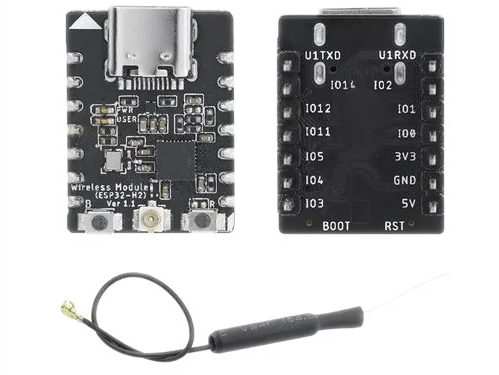

| Specifications | |
| :--- | :--- |
| Function | Thread/Zigbee/Matter |
| Chip | ESP32-H2FH4 |
| Flash | 4MB Quad SPI |
| Frequency Range | 2402-2480MHz |
| Size | 18mm x 23.7mm |
| Antenna | IPEX |

The module-side H2 pinout below is taken from the supplied H2 module image.
The module GPIO names are not ESP32-P4 GPIO numbers. The host-side AIO slot
signals are shown separately using the confirmed J13/J16 header mapping.

##### Left Pins

| Module signal / GPIO | Module pin | ESP32-P4 GPIO | Signal role |
| :--- | :--- | :--- | :--- |
| U1TXD | Left Pin 01 | GPIO53 | UART transmit (module) |
| GPIO01 | Left Pin 02 | GPIO09 | Module GPIO |
| GPIO00 | Left Pin 03 | GPIO10 | Module GPIO |
| GPIO02 | Left Pin 04 | GPIO11 | Module GPIO |
| GPIO22 | Left Pin 05 | VDD 3V3 | Module GPIO; header pin is 3V3 |
| GPIO10 | Left Pin 06 | GND | Module GPIO; header pin is ground |
| GPIO11 | Left Pin 07 | VDD 5V | Module GPIO; header pin is 5V |

##### Right Pins

| Module signal / GPIO | Module pin | ESP32-P4 GPIO | Signal role |
| :--- | :--- | :--- | :--- |
| U1RXD | Right Pin 01 | GPIO54 | UART receive (module) |
| GPIO12 | Right Pin 02 | GPIO07 | Module GPIO; host mapping unverified |
| GPIO13 | Right Pin 03 | GPIO02 | Module GPIO; host mapping unverified |
| GPIO14 | Right Pin 04 | N/C | Module GPIO; host mapping unverified |
| 3V3 | Right Pin 05 | GPIO15 | Module power label; J16 pin 5 is GPIO15 |
| GND | Right Pin 06 | GPIO14 | Module ground label; J16 pin 6 is GPIO14 |
| NC | Right Pin 07 | N/C | Not connected on module or header |

#### ESP32-H2 (Bluetooth, Thread, Zigbee)

```yaml file=example-040.yaml
```

##### Resources

- [Product Information](https://www.elecrow.com/wireless-module-for-crowpanel-advanced-series.html)
- [Wireless Module Documentation](https://www.elecrow.com/wireless-module-for-crowpanel-advanced-series.html)
- [Example Code](https://drive.google.com/drive/folders/1DWLBHqny0IwR9hPPtEwjRyMHmVubhqIj)
- [Wireless Module-ESP32-H2 Datasheet](https://www.elecrow.com/download/product/DAC0010/Wireless_Module-ESP32-H2_Datasheet.pdf)

#### LoRa Wireless Module

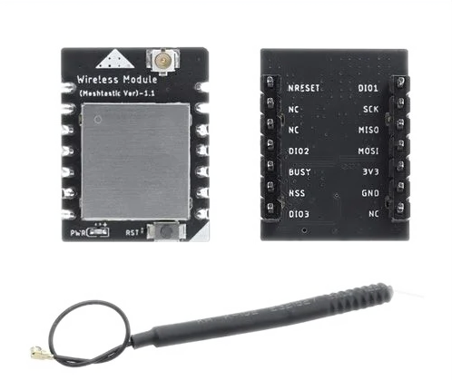

| Specifications | |
| :--- | :--- |
| Function | LoRa |
| Chip | SX1262 |
| Frequency Range | 860-930MHz |
| Size | 18mm x 23.7mm |
| Antenna | IPEX |

The pinout below is the **module-side** pinout shown on the supplied LoRa
module image. These are module connector signals, not ESP32-P4 GPIO numbers.
The ESP32-P4 column uses the confirmed J13/J16 adapter-header mapping.

##### Left Pins

| Module signal / GPIO | Module pin | ESP32-P4 GPIO | Signal role |
| :--- | :--- | :--- | :--- |
| NRESET | Left Pin 01 | GPIO54 | LoRa reset input |
| NC | Left Pin 02 | N/C | Not connected on module |
| NC | Left Pin 03 | N/C | Not connected on module |
| DIO2 | Left Pin 04 | N/C | LoRa digital I/O; not assigned in the example |
| BUSY | Left Pin 05 | GPIO15 | LoRa busy output |
| NSS | Left Pin 06 | GPIO14 | LoRa chip select |
| DIO3 | Left Pin 07 | N/C | LoRa digital I/O; not assigned in the example |

##### Right Pins

| Module signal / GPIO | Module pin | ESP32-P4 GPIO | Signal role |
| :--- | :--- | :--- | :--- |
| DIO1 | Right Pin 01 | GPIO53 | LoRa digital I/O |
| SCK | Right Pin 02 | GPIO09 | SPI clock |
| MISO | Right Pin 03 | GPIO10 | SPI controller input |
| MOSI | Right Pin 04 | GPIO11 | SPI controller output |
| 3V3 | Right Pin 05 | VDD 3V3 | Module power input |
| GND | Right Pin 06 | GND | Module ground |
| NC | Right Pin 07 | N/C | Not connected on module or header |

##### Basic Setup (AIO Expansion Header)

This is an example of the LoRa component configuration using the confirmed
AIO host GPIO assignments shown above. The module-side labels remain the
module's own pin names.

```yaml file=example-041.yaml
```

#### YAML Example (AIO Expansion Header)

```yaml file=example-042.yaml
```

##### Resources

- [Product Information](https://www.elecrow.com/wireless-module-for-crowpanel-advanced-series.html)
- [Wireless Module Documentation](https://www.elecrow.com/wireless-module-for-crowpanel-advanced-series.html)
- [Example Code](https://drive.google.com/drive/folders/1DWLBHqny0IwR9hPPtEwjRyMHmVubhqIj)
- [Wireless Module-Meshtastic DataSheet](https://www.elecrow.com/download/product/DAC0010/Wireless_Module-Meshtastic_DataSheet.pdf)

#### nRF2401 (ISM 2.4GHz) Wireless Module

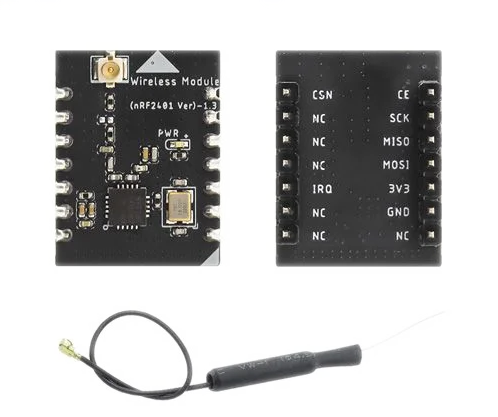

| Specifications | |
| :--- | :--- |
| Function | ISM |
| Chip | nRF24L01+ |
| Frequency Range | Worldwide 2.4GHz ISM band operation |
| Size | 18mm x 23.7mm |
| Antenna | IPEX |

The pinout below is the **module-side** pinout shown on the supplied nRF2401
module image. The GPIO labels are GPIOs of the module's onboard controller,
not ESP32-P4 GPIOs. The ESP32-P4 column uses the confirmed J13/J16
adapter-header mapping; it does not rename the module GPIOs.

##### Left Pins

| Module signal / GPIO | Module pin | ESP32-P4 GPIO | Signal role |
| :--- | :--- | :--- | :--- |
| U1TXD | Left Pin 01 | GPIO54 | Module UART TX; radio-side label CSN |
| GPIO23 | Left Pin 02 | N/C | Module GPIO; radio-side label NC |
| GPIO22 | Left Pin 03 | N/C | Module GPIO; radio-side label NC |
| GPIO21 | Left Pin 04 | N/C | Module GPIO; radio-side label NC |
| GPIO20 | Left Pin 05 | GPIO15 | Module GPIO; radio-side label IRQ |
| GPIO19 | Left Pin 06 | GND | Module GPIO; radio-side label NC |
| GPIO18 | Left Pin 07 | N/C | Module GPIO; radio-side label NC |

##### Right Pins

| Module signal / GPIO | Module pin | ESP32-P4 GPIO | Signal role |
| :--- | :--- | :--- | :--- |
| U1RXD | Right Pin 01 | GPIO53 | Module UART RX; radio-side label CE |
| GPIO0 | Right Pin 02 | GPIO09 | Module GPIO; radio-side label SCK |
| GPIO1 | Right Pin 03 | GPIO10 | Module GPIO; radio-side label MISO |
| GPIO2 | Right Pin 04 | GPIO11 | Module GPIO; radio-side label MOSI |
| 3V3 | Right Pin 05 | VDD 3V3 | Module power input |
| GND | Right Pin 06 | GND | Module ground |
| NC | Right Pin 07 | N/C | Not connected on module or header |

#### YAML Example (AIO Expansion Header)

This is an example of the external component configuration using the
confirmed AIO host GPIO assignments shown above. The module GPIO labels are
module-side names and are not ESP32-P4 GPIO numbers.

> **Experimental external component:** the nRF24 component is hosted outside
> ESPHome and is not pinned to a release or commit. Verify its current schema
> before compiling this example.

```yaml file=example-043.yaml
```

##### Resources

- [Product Information](https://www.elecrow.com/wireless-module-for-crowpanel-advanced-series.html)
- [Wireless Module Documentation](https://www.elecrow.com/wireless-module-for-crowpanel-advanced-series.html)
- [Example Code](https://drive.google.com/drive/folders/1DWLBHqny0IwR9hPPtEwjRyMHmVubhqIj)
- [Wireless Module-nRF2401 DataSheet](https://www.elecrow.com/download/product/DAC0010/Wireless_Module-nRF2401_DataSheet.pdf)

#### HaLow (Sub 1GHz) Wireless Module

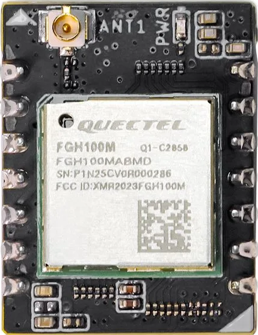
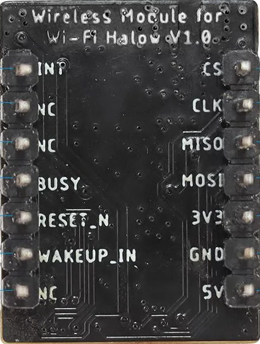

Wi-Fi HaLow serves as a specialized wireless protocol designed specifically for Internet of Things (IoT) use cases. Functioning below the 1 GHz frequency band, this technology surpasses conventional Wi-Fi in its ability to transmit over greater distances and through barriers more effectively. Its low-power design with efficient sleep and wake mechanisms extends battery life, while supporting high device density and stable connections in crowded environments, solving congestion issues of traditional Wi-Fi.

| Specifications | |
| :--- | :--- |
| Function | HaLow WiFi |
| Chip | Quectel FGH100MABMD (MM61080) |
| Frequency Range | 850-950 MHz |
| Standard | IEEE 802.11ah |
| Distance | Up to 1km |
| Data Rate | Up to 32.5Mbps |
| Size | 18mm x 23.7mm |
| Antenna | IPEX |

The pinout below is the **module-side** pinout shown on the supplied HaLow
module image. These are module connector signals, not ESP32-P4 GPIO numbers.
The ESP32-P4 column uses the confirmed J13/J16 adapter-header mapping.

##### Left Pins

| Module signal / GPIO | Module pin | ESP32-P4 GPIO | Signal role |
| :--- | :--- | :--- | :--- |
| INT | Left Pin 01 | GPIO53 | Module interrupt output |
| NC | Left Pin 02 | GPIO09 | Not connected on module |
| NC | Left Pin 03 | GPIO10 | Not connected on module |
| BUSY | Left Pin 04 | GPIO11 | Module busy output |
| RESET_N | Left Pin 05 | VDD 3V3 | Module reset input; header pin is 3V3 |
| WAKEUP_IN | Left Pin 06 | GND | Module wake-up input; header pin is ground |
| NC | Left Pin 07 | VDD 5V | Not connected on module; header pin is 5V |

##### Right Pins

| Module signal / GPIO | Module pin | ESP32-P4 GPIO | Signal role |
| :--- | :--- | :--- | :--- |
| CS | Right Pin 01 | GPIO54 | SPI chip select |
| CLK | Right Pin 02 | GPIO07 | SPI clock |
| MISO | Right Pin 03 | GPIO02 | SPI controller input |
| MOSI | Right Pin 04 | N/C | SPI controller output; header pin is N/C |
| 3V3 | Right Pin 05 | GPIO15 | Module power input; header pin is GPIO15 |
| GND | Right Pin 06 | GPIO14 | Module ground; header pin is GPIO14 |
| 5V | Right Pin 07 | N/C | Module supply input; header pin is N/C |

#### YAML Example

```yaml file=example-044.yaml
```

##### Resources

[Elecrow Wiki](https://www.elecrow.com/pub/wiki/Wireless_Module_for_Wi-Fi_HaLow.html)

[Elecrow Github](https://github.com/Elecrow-RD/Wireless-Module-for-Wi-Fi-HaLow)

[Official Product Website](https://www.elecrow.com/wireless-module-for-wi-fi-halow.html)

## 3RD Party Modules

### 1. GRC EnSens BME688 Air Quality Sensor Add-on

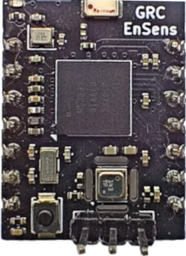

Environmental sensor add-on module with Bosch BME688 for VOC, eCO₂, IAQ, temperature, pressure, and humidity monitoring. Plug-and-play with Elecrow Panel via I²C. Ideal for smart homes, air quality dashboards, and automation.

- Temperature
- Relative Humidity
- Barometric Pressure
- VOC (Volatile Organic Compounds)
- CO₂ Equivalent (eCO₂)
- IAQ (Indoor Air Quality Index)

#### Pinout

##### Left Pins

| Module signal / GPIO | Module pin | ESP32-P4 GPIO | Signal role |
| :--- | :--- | :--- | :--- |
| ? | Left Pin 01 | GPIO53 | ? |
| ? | Left Pin 02 | GPIO09 | ? |
| ? | Left Pin 03 | GPIO10 | ? |
| ? | Left Pin 04 | GPIO11 | ? |
| ? | Left Pin 05 | VDD 3V3 | Power 3V3 |
| ? | Left Pin 06 | GND | GROUND |
| ? | Left Pin 07 | VDD 5V | Power 5V |

##### Right Pins

| Module signal / GPIO | Module pin | ESP32-P4 GPIO | Signal role |
| :--- | :--- | :--- | :--- |
| ? | Right Pin 01 | GPIO54 | ? |
| ? | Right Pin 02 | GPIO07 | ? |
| ? | Right Pin 03 | GPIO02 | ? |
| ? | Right Pin 04 | N/C | ? |
| ? | Right Pin 05 | GPIO15 | ? |
| ? | Right Pin 06 | GPIO14 | ? |
| ? | Right Pin 07 | N/C | ? |

#### YAML Example

```yaml file=example-045.yaml
```

#### Additional Links

- [Product Information](https://www.elecrow.com/bme688-air-quality-sensor-add-on-for-srowpanel-advance.html)
- [EnSens Add-on firmware on GitHub](https://github.com/Grovety/EnSens_Add-on)
- [Android App on GitHub](https://github.com/Grovety/EnSens_App)
- [Example project for  CrowPanel Advance 3.5", and 2.8"](https://github.com/Grovety/CrowPanel_MiniMeteo)
- [nRF52833 Product Specification v1.5](https://docs.nordicsemi.com/bundle/nRF52833-PS/resource/nRF52833_PS_v1.5.pdf)
- [BME 688 Datasheet](https://www.bosch-sensortec.com/media/boschsensortec/downloads/datasheets/bst-bme688-ds000.pdf)

### 2. GRC AI Add-on (Himax HX6538)

 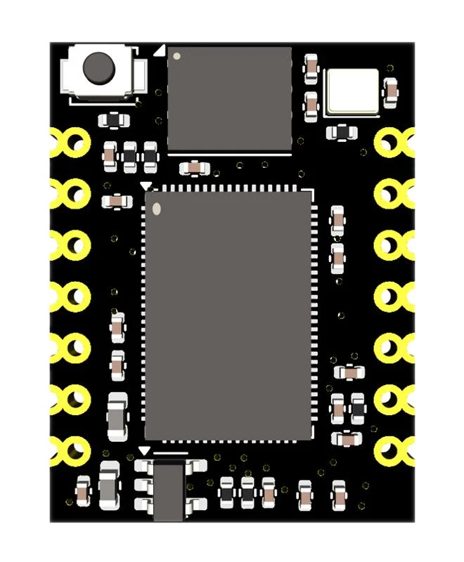
 

Ready-to-use AI coprocessor with open-source firmware, hardware, and examples. Turn your CrowPanel into a smart, AI-powered device — run TinyML and TinyLM locally, with no cloud and no setup.

| AI Core | |
| :--- | :--- |
| Microcontroller | Himax HX6538-A06TDFG |
| CPU | Arm Cortex-M55 |
| NPU | Arm Ethos-U55 |
| SRAM | 2 MB |
| ROM | 4 MB |
| External Flash | 128 Mbit (16 MB) QSPI NOR Flash |
| Board size | ~20×25 mm |
| Voltage | 3.3V |

#### Usage

- TinyML/TinyLM inference
- Frameworks supported: CMSIS-NN, GRC SDK, TensorFlow Lite for Micro (adapted)
- Text generation, classification
- Voice interfaces

#### Demo

TinyStories

An interactive storytelling prototype based on the TinyStories Language Model. It showcases how compact hardware can be used for interactive natural language generation — all at the edge, with low power consumption and no internet required for model inference.

The pinout below uses the **HX6538 module's PB labels** for the module side
and the `IOxx` nets shown in the supplied connector schematic for the
ESP32-P4 side. These are different numbering systems. The connector is shown
counter-clockwise in that schematic; verify the physical orientation before
installing the module.

##### Left Pins

| Module signal / GPIO | Module pin | ESP32-P4 GPIO | Signal role |
| :--- | :--- | :--- | :--- |
| PB0 | Left Pin 01 | GPIO20 | IO20_TX_CE / M55 GPIO0 |
| PB4 | Left Pin 02 | GPIO05 | IO5_W_CLK / M55 GPIO4 |
| PB3 | Left Pin 03 | GPIO04 | IO4_W_MISO / M55 GPIO3 |
| PB2 | Left Pin 04 | GPIO06 | IO6_W_MOSI / M55 GPIO2 |
| VDD 3V3 | Left Pin 05 | VDD 3V3 | Power 3V3 |
| GND | Left Pin 06 | GND | GROUND |
| N/C | Left Pin 07 | N/C | Connector signal not identified in the supplied schematic |

##### Right Pins

| Module signal / GPIO | Module pin | ESP32-P4 GPIO | Signal role |
| :--- | :--- | :--- | :--- |
| PB1 | Right Pin 01 | GPIO19 | IO19_RX_IRQ / M55 GPIO1 |
| PB5 | Right Pin 02 | GPIO16 | IO16_SCL / M55 GPIO5 |
| PB6 | Right Pin 03 | GPIO15 | IO15_SDA / M55 GPIO6 |
| PB7 | Right Pin 04 | N/C | Host net is unconnected in the supplied schematic |
| PB9 | Right Pin 05 | GPIO02 | IO2_W_CS / M55 GPIO9 |
| RESET | Right Pin 06 | GPIO00 | IO0_BOOT_BUSY / M55 reset |
| PB8 | Right Pin 07 | N/C | Host net is unconnected in the supplied schematic |

#### YAML Example

```yaml file=example-046.yaml
```

#### Additional Links

- **Product Information**: [Official Website](https://www.elecrow.com/grc-ai-add-on-for-crowpanel-on-hx6538.html)
- **GRC AI Add-on**: [GitHub Repository](https://github.com/Grovety/grc_ai_add-on)

[Back to top](#elecrow-esp32-p4-all-in-one-starter-kit)

#### Reset Switch K1

K1 is connected to the ESP32-P4 `RST_EN` reset net. It is a hardware reset
switch and is not connected to GPIO35 or available as a user GPIO.

#### Boot Switch K2

K2 is the ESP32-P4 boot button. The schematic labels its signal
`IO35_BOOT`, so it is connected to GPIO35 and should be held while entering
the bootloader during flashing.

#### I2C Header JST-HY2.0 J10

[ESPHome Docs - I2C](https://esphome.io/components/i2c.html)


| Pin/GPIO | Label |
| :--- | :--- |
| Pin 1 | GND |
| Pin 2 | 5V |
| GPIO18 | SDA |
| GPIO19 | SCL |

```yaml file=example-047.yaml
```

#### I2C Header JST-HY2.0 J18


| Pin/GPIO | Label |
| :--- | :--- |
| Pin 1 | GND |
| Pin 2 | 5V |
| GPIO18 | SDA |
| GPIO19 | SCL |

```yaml file=example-048.yaml
```

#### UART Header JST-HY2.0 J19

[ESPHome Docs - UART](https://esphome.io/components/uart.html)


| Pin | Label |
| :--- | :--- |
| Pin 1 | GND |
| Pin 2 | 5V |
| GPIO47 | TX |
| GPIO48 | RX |

```yaml file=example-049.yaml
```

### Lesson 6: UART Communication

**Description**: Send and receive data via UART serial communication.

```yaml file=example-050.yaml
```

#### SPI (Add-on Module Header)

[ESPHome Docs - SPI](https://esphome.io/components/spi.html)

| GPIO | Label |
| :--- | :--- |
| GPIO09 | CLK |
| GPIO10 | MISO |
| GPIO11 | MOSI |

```yaml file=example-051.yaml
```

#### USB1 & Power In J5


| Pin | Label |
| :--- | :--- |
| 1 | USB1_5V |
| 2 | USB1_D_N |
| 3 | USB1_D_P |
| 4 | GND |

#### USB2 High Speed & Power In J1


| Pin | Label |
| :--- | :--- |
| 1 | USB2_5V |
| 2 | USB_A_N |
| 3 | USB_A_P |
| 4 | GND |

#### USB Type A J4


| Pin | Label |
| :--- | :--- |
| 1 | VBUS_OUT |
| 2 | USBD_N |
| 3 | USBD_P |
| 4 | GND |

#### Ethernet (IP101) J2

[ESPHome Docs - Ethernet](https://esphome.io/components/ethernet.html)


| GPIO | Label |
| :--- | :--- |
| GPIO31 | MDC |
| GPIO50 | CLK |
| GPIO51 | Power |
| GPIO52 | MDIO |

```yaml file=example-052.yaml
```

### Power Rails


| Rail | Voltage | IC | Notes |
| ------ | --------- | ----- | ------- |
| **VDD_3V3** | 3.3V | RY3430 | Main 3.3V rail |
| **ESP_VDD_HP_1V2** | 1.2V | RY3430 | ESP32-P4 core supply (U3) |
| **VDD_5V** | 5V | Input | USB/External |
| **VDD_5V2** | 5.2V | MT3540 | Boosted 5V rail |
| **LCD_VDD_1V8** | 1.8V | ME6211 | Display logic |
| **LCD_AVDD_9V6** | 9.6V | SX1308 | Display analog bias output |
| **LCD_VGH_18V** | 18V | SX1308 | Display high-voltage bias output |
| **LCD_VGL_-6V** | -6V | SX1308 | Display negative bias output |
| **PHY_3V3** | 3.3V | - | Ethernet PHY |

## Extra Examples Not In Manual

### Minimal Configuration

```yaml file=example-053.yaml
```

### Complete AIO Project Configuration (Tested)

This is the complete project configuration used to test the Elecrow AIO
features. It is board-specific, but it is not a portable baseline: it depends
on custom components and development branches listed in the YAML. Replace all
`REPLACE_ME` values and review the external component sources before building.

```yaml file=example-054.yaml
```

### Voice Assistant Integration

```yaml file=example-055.yaml
```

## Home Assistant Integration

### Dashboard Example

```yaml file=example-056.yaml
```

### Additional Links

- **Product Information**: [Official Website](https://www.elecrow.com/bme688-air-quality-sensor-add-on-for-srowpanel-advance.html)
- **EnSens Add-on firmware on GitHub**: [Github](https://github.com/Grovety/EnSens_Add-on)
- **Android App on GitHub**: [Github](https://github.com/Grovety/EnSens_App)
- **Example project for  CrowPanel Advance 3.5", and 2.8"**: [Github](https://github.com/Grovety/CrowPanel_MiniMeteo)
- **nRF52833 Product Specification v1.5**: [PDF](https://docs.nordicsemi.com/bundle/nRF52833-PS/resource/nRF52833_PS_v1.5.pdf)
- **BME 688 Datasheet**: [PDF](https://www.bosch-sensortec.com/media/boschsensortec/downloads/datasheets/bst-bme688-ds000.pdf)

## Resources

### Official Resources

- **Product Information**: [Official Website](https://www.elecrow.com/all-in-one-starter-kit-for-esp32-p4-with-common-board-design-16-modules-and-ai-lessons.html)
- **GitHub Repository**: [All-in-one-Starter-Kit-for-ESP32-P4](https://github.com/Elecrow-RD/All-in-one-Starter-Kit-for-ESP32-P4-with-Common-Board-design)
- **3D Model (STP archive)**: [ESP32-P4 3D files](https://github.com/Elecrow-RD/All-in-one-Starter-Kit-for-ESP32-P4-with-Common-Board-design/blob/master/3D%20file/ESP32-p4.zip)
- **Camera Interface Schematic V1.0**: [Camera board schematic (PDF)](https://github.com/Elecrow-RD/All-in-one-Starter-Kit-for-ESP32-P4-with-Common-Board-design/blob/master/Eagle_SCH%26PCB/1.0/EV-Board-Camera_V1.0/EV-Board-Camera_V1.0.pdf)
- **LCD Interface Schematic V1.0**: [LCD interface board schematic (PDF)](https://github.com/Elecrow-RD/All-in-one-Starter-Kit-for-ESP32-P4-with-Common-Board-design/blob/master/Eagle_SCH%26PCB/1.0/LCD_Interface%20Board_V1.0/LCD_Interface%20Board_V1.0.pdf)
- **Wiki Documentation**: [ESP32-P4 Kit Wiki](https://www.elecrow.com/wiki/All-in-one_Starter_Kit_for_ESP32-P4_with_Common_Board_design.html)
- **Schematic V1.0**: [All-in-one Starter Kit for ESP32-P4 Arduino V1.0 (PDF)](https://www.elecrow.com/download/product/SEE00804D/All-in-one_Starter_Kit_for_ESP32-P4_Arduino-V1.0.pdf)
- **Schematic V1.1**: [All-in-one Starter Kit for ESP32-P4 Arduino V1.1 (PDF)](https://www.elecrow.com/download/product/SEE00804D/All-in-one_Starter_Kit_for_ESP32-P4_Arduino-V1.1.pdf)
- **User Manual V1.0**: [User Manual V1.0 (PDF)](https://www.elecrow.com/download/product/SEE00804D/All-in-one_Starter_Kit_for_ESP32-P4_User_Manual.pdf)
- **User Manual V1.1**: [User Manual V1.1 (PDF)](https://www.elecrow.com/download/product/SEE00804D/All-in-one_Starter_Kit_for_ESP32-P4_User_Manual_V1.1.pdf)
- **Arduino lessons**: See the [User Manual V1.0 (PDF)](https://www.elecrow.com/download/product/SEE00804D/All-in-one_Starter_Kit_for_ESP32-P4_User_Manual.pdf) and [User Manual V1.1 (PDF)](https://www.elecrow.com/download/product/SEE00804D/All-in-one_Starter_Kit_for_ESP32-P4_User_Manual_V1.1.pdf) for the lesson materials.
- **ESP32-P4 Datasheet**: [ESP32-P4 Datasheet](https://www.elecrow.com/download/product/SEE00804D/esp32-p4_datasheet_en.pdf)

### Elecrow Community

- [Elecrow Forum](https://forum.elecrow.com)
- [Elecrow Discord](https://discord.com/invite/xYXCnH4AR9)
- Technical Support: [techsupport@elecrow.com](mailto:techsupport@elecrow.com)
