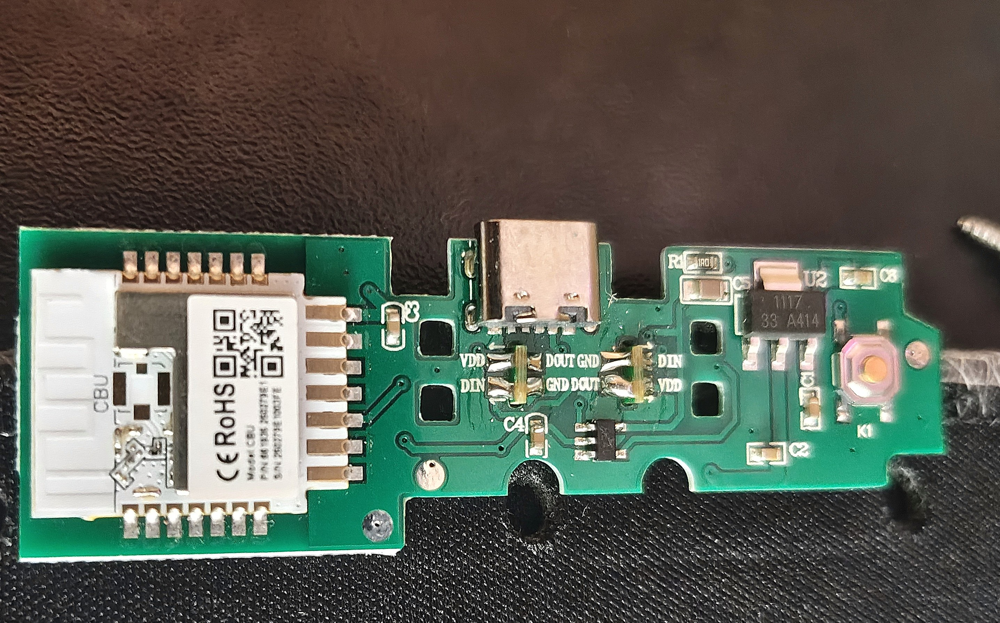

## General Notes

This configuration is for the LSC Battletron XXL Mousepad


## Warning

The LEDs on this product are quite dim and not resembling of the picture on the box, if you're buying this product, maybe reconsider. If you are fine with this then proceed.

## Disassembly

To get into this product you need to unscrew 7 Philips head screws hidden beneath the bottom sticker.

To unscrew them you either need to damage the bottom sticker or remove it and have to glue it again.


## How to flash

To flash the controller, open up the controller and take the board out.

On the back of the board there are 2 pins on the Tuya CBU module you need to solder wires to.



Alternatively if you are a bit crative you can try to use some wires and some pins and hold them to the required points. This is not recommended but is an option if you are very bad with soldering or can't for some reason.

Remember that you will still need another jumper wire to short the ground and the CEN pin on the module to begin the flashing

Powering the board from regular 5V USB to flash is fine, i used a Raspberry Pi to flash my chip.

### To take a backup

If you are using the CLI tool take a backup using:

```bash
ltchiptool flash read bk7231n <backupname>
```

### To flash the chip

1. Create an empty configuration with the yaml below
2. Download the compiled firmware file
3. If you are using the CLI tool flash the chip using:

```bash
ltchiptool flash write <firmwarefile>
```

## GPIO Pinout

| Pin | Function |
| --- | -------------- |
| P6 | Button |
| P16 | 2 WS2812 Leds |

### YAML Config

Bare hardware definitions

```yaml file=config.yaml
```

#### If you want a ready config with light effects

```yaml file=full-config.yaml
```
