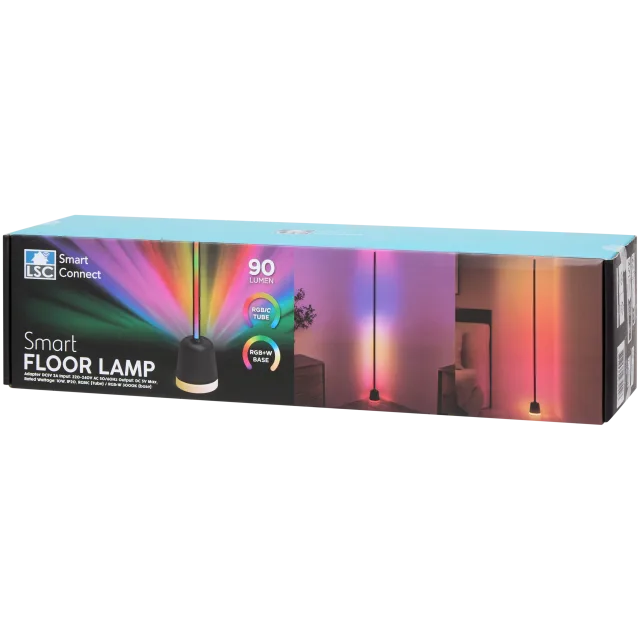
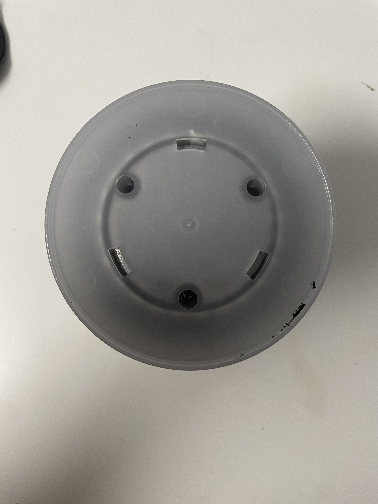
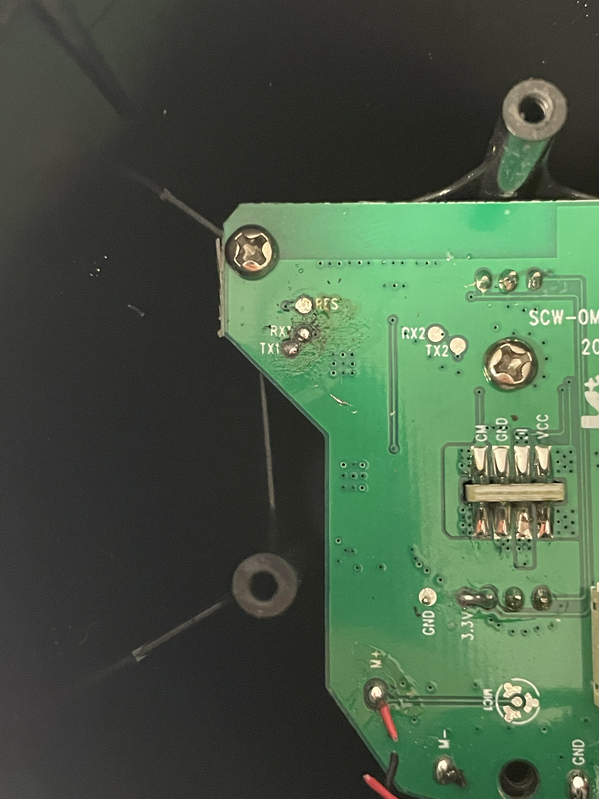

# LSC Smart Connect Smart Floor Lamp

This guide applies to the **LSC Smart Connect Smart Floor Lamp** sold by **Action**.

| Property | Value |
|----------|-------|
| Brand | LSC Smart Connect |
| Retailer | Action |
| Product | Smart Floor Lamp |
| Article number | **3221699** |



The lamp features two independently controllable lighting zones. The main light section is an **addressable LED strip**, allowing animations and individually controlled LEDs. The illuminated base uses a conventional RGBW LED, providing independent RGB and white light control.

The device can be flashed using **LTChipTool** and a **3.3 V USB-to-UART adapter**.

### UART flashing

1. Turn the lamp upside down.


2. Carefully remove the large foam pad from the bottom of the base.

3. Remove the three screws underneath the foam pad.



4. Carefully open the base to access the PCB.

5. Disconnect the connector between the base and the PCB. Hold the connector itself instead of pulling on the wires.


6. Connect the USB-to-UART adapter to the programming pads.



| USB-to-UART | Lamp |
|-------------|------|
| TX | RX1 |
| RX | TX1 |
| GND | GND |

The programming pads can be accessed either by soldering temporary wires or by using pogo pins. **Pogo pins are recommended**, as they do not require any permanent modification to the PCB.

7. Build your ESPHome configuration and download the **UF2** firmware image. In **LTChipTool**, select the downloaded **.uf2** file, leave the flash address at the default value of **`0x0`**, select the correct serial port, and start the flashing process. Once LTChipTool is waiting for the device, either power on the lamp or briefly short the **RESET** pad to **GND**. LTChipTool should detect the bootloader and begin flashing automatically.

8. Wait until flashing has completed successfully.

9. Disconnect the programmer, reconnect the cable between the PCB and the base, and reassemble the lamp.

> **Warning**
>
> Use only a **3.3 V** USB-to-UART adapter. Applying **5 V** may permanently damage the device.

### LTChipTool

For detailed installation and usage instructions, please refer to the official LibreTiny LTChipTool documentation:

https://docs.libretiny.eu/docs/flashing/tools/ltchiptool/#flashing-firmware

## GPIO configuration

| Function | GPIO |
|----------|------|
| Base Red | P8 |
| Base Green | P24 |
| Base Blue | P9 |
| Base White | P26 |
| Addressable LEDs | P16 |
| IR Receiver | P23 |
| Capacitive Button | P22 |

## Basic configuration

```yaml
# Board: T1-U Wi-Fi Module
# Definition: definitions/boards/t1-u/manifest.yaml

esphome:
  name: lsc-smart-connect-floor-lamp
  friendly_name: LSC Smart Connect Smart Floor Lamp


bk72xx:
  board: generic-bk7238-tuya

logger:

api:
  encryption:
    key: !secret otaPassword
ota:
  - platform: esphome

wifi:
  ssid: !secret wifi_ssid
  password: !secret wifi_password
  ap:
    ssid: LSC Smart Connect Hotspot
    password: "!secret apPassword"

captive_portal:

web_server:
  version: "2"

light:
  - platform: beken_spi_led_strip
    name: Main
    pin: P16
    id: light_beken_spi_led_strip_1
    chipset: SM16703
    num_leds: 96
    rgb_order: GRB
    effects:
      - addressable_rainbow:
      - addressable_twinkle:
  - platform: rgbw
    name: Base
    blue: blue_base
    green: green_base
    red: red_base
    white: white_base
    id: light_rgbw_1
    icon: "mdi:lightbulb"
    restore_mode: ALWAYS_ON

output:
  - platform: libretiny_pwm
    pin: P9
    id: blue_base
  - platform: libretiny_pwm
    pin: P24
    id: green_base
  - platform: libretiny_pwm
    pin: P8
    id: red_base
  - platform: libretiny_pwm
    pin: P26
    id: white_base


remote_receiver:
  id: ir_rx
  pin:
    number: P23
    inverted: true
    mode:
      input: true
      pullup: true

binary_sensor:
  - platform: gpio
    name: Touch Button
    pin:
      number: P22
      mode:
        input: true
        pullup: true
      inverted: true
    id: binary_sensor_gpio_1
    on_click:
      - then:
          - light.toggle: light_beken_spi_led_strip_1


```

## Notes

- Supports two independently controllable lighting zones.
- Main light section uses addressable LEDs.
- Base uses a conventional RGBW LED.
- Flashing requires opening the device.
- This guide is based on the Action retail version with article number **3221699**.

