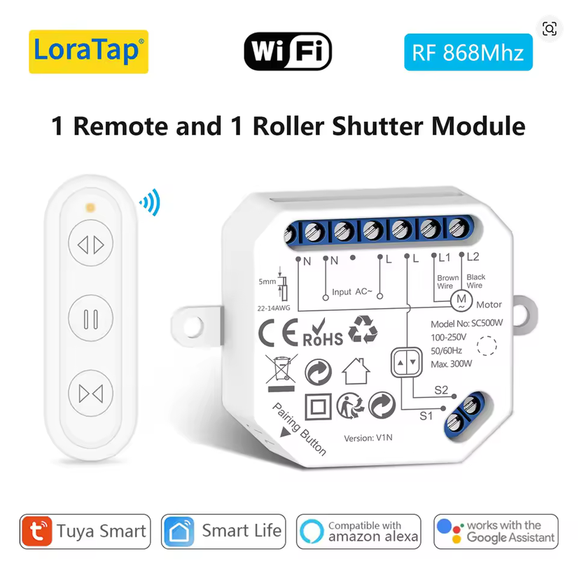
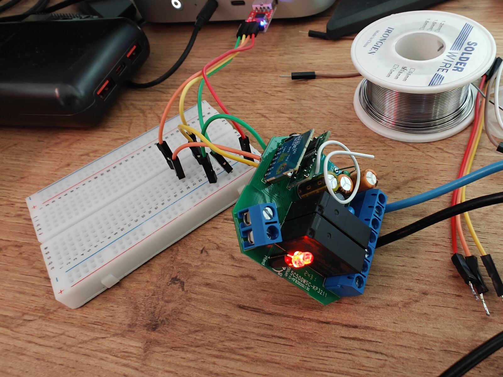

## Product Description

In-wall roller shutter / curtain relay sold by LoraTap, based on a Tuya CB2S module
with a Beken BK7231N SoC. It has two relays (up/down) and inputs for physical wall buttons.

The original RF remote works at 868 MHz with an independent receiver, so it keeps working
after flashing ESPHome (its signal is not readable by the module anyway).

## Product Images




## Flashing

The CB2S module is flashed via UART with [ltchiptool](https://docs.libretiny.eu/docs/flashing/tools/ltchiptool/).
Things to keep in mind with Beken chips:

1. Bridge the CEN pin to GND before powering the chip, and remove the bridge before the writing starts.
2. The 3.3 V rail of most USB-UART adapters cannot power the module reliably during flashing
   (brownouts on flash erase). The most reliable method is mounting the CB2S back on the LoraTap
   board powered from mains and connecting only GND, RX and TX to the adapter.
   **If you power the board from mains, do NOT connect the 3.3 V line of the USB-UART adapter.**
3. An order that works: power up the board, plug in the USB adapter, launch the flash command,
   wait a few seconds, then remove the CEN-to-GND bridge.

**Warning: this device works with mains voltage. Take all necessary precautions.**
**Never short P26 (or any relay pin) to GND: it destroys the module.**

## GPIO Pinout

| Pin | Function        |
| --- | --------------- |
| P24 | Up relay        |
| P26 | Down relay      |
| P23 | Up button       |
| P21 | Down button     |
| P7  | Stop button     |
| P10 | Onboard LED     |

Pin naming on Beken chips is `P6`, `P7`, `P8`..., not `GPIOxx`.

## Basic Configuration

The config below uses scripts with a 500 ms gap between directions instead of the `cover`
component, which causes interlock issues after a stop on this hardware, plus a 60 s safety
timeout that always turns both relays off.

```yaml file=config.yaml
```

## Links

- [Full firmware with position tracking, calibration times and direction invert](https://github.com/gnacho/esphome-loratap-curtain-cb2s)
- [CB2S pinout and documentation (LibreTiny)](https://docs.libretiny.eu/boards/cb2s/)
