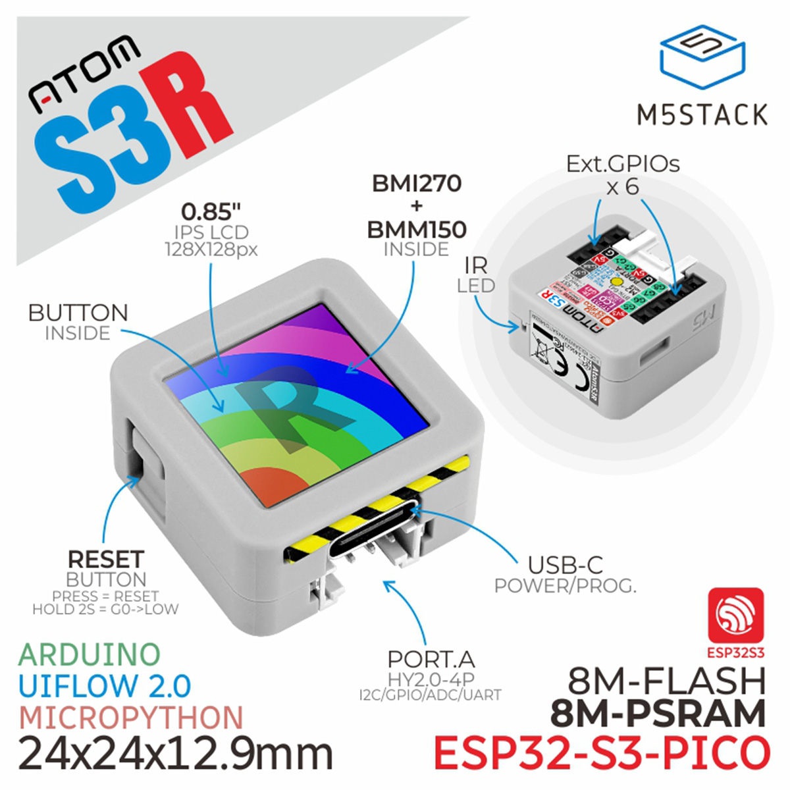

## Product Description

The M5Stack AtomS3R is a compact ESP32-S3 development board featuring:

- ESP32-S3 microcontroller (Xtensa dual-core 32-bit LX7)
- 128x128 ST7789V LCD display
- BMI270 6-axis IMU with a BMM150 magnetometer wired through its auxiliary I2C interface
- LP5562 LED driver for the display backlight
- USB-C connector
- Grove connector for expansion
- Single programmable button

Available from [M5Stack](https://docs.m5stack.com/en/core/AtomS3R).

## GPIO Pinout

| Pin     | Function       |
| ------- | -------------- |
| GPIO 0  | I2C SCL        |
| GPIO 14 | Display CS     |
| GPIO 15 | SPI CLK        |
| GPIO 21 | SPI MOSI       |
| GPIO 41 | Button         |
| GPIO 42 | Display DC     |
| GPIO 45 | I2C SDA        |
| GPIO 48 | Display Reset  |

## I2C Devices

| Address | Device                       |
| ------- | ---------------------------- |
| 0x30    | LP5562 (Display Backlight)   |
| 0x68    | BMI270 (IMU)                 |

The BMM150 magnetometer at 0x10 is accessed via the BMI270's auxiliary I2C interface rather than
appearing directly on the main bus.

## Basic Configuration

<!-- TODO: esphome/esphome#18436 and #18453 are pending merge into a release. Once both land,
     remove the external_components: override in config.yaml and delete this paragraph. -->

The IMU (`bmi270`, with BMM150 auxiliary support) and the display backlight driver (`lp5562`) are
both driven by upstream ESPHome platforms that are currently pending merge as
[esphome/esphome#18436](https://github.com/esphome/esphome/pull/18436) and
[esphome/esphome#18453](https://github.com/esphome/esphome/pull/18453). Until those land in a
release, the config below pulls them in directly via `external_components:` — remove that block
once both PRs are merged.

BMI270 also requires a large I2C buffer, hence the `build_flags: -DI2C_BUFFER_LENGTH=8193`.

```yaml file=config.yaml
```

## Display All Sensor Values

The basic configuration above only prints "Hello World!" on the display. To turn it into a small
IMU dashboard, add a smaller font (the default 20pt font is too large to fit ten readings on a
128x128 screen) and replace the `display:` lambda with one that prints the accelerometer,
gyroscope, magnetometer, temperature, and current backlight brightness:

```yaml inline
font:
  - file: "gfonts://Roboto"
    id: font_mini
    size: 10

display:
  - platform: ili9xxx
    model: st7789v
    dimensions:
      height: 128
      width: 128
      offset_height: 1
      offset_width: 2
    cs_pin: 14
    dc_pin: 42
    reset_pin: 48
    invert_colors: true
    rotation: 0
    lambda: |-
      it.printf(0, 0, id(font_mini), "AX %.2f AY %.2f", id(imu_accel_x).state, id(imu_accel_y).state);
      it.printf(0, 10, id(font_mini), "AZ %.2f", id(imu_accel_z).state);
      it.printf(0, 20, id(font_mini), "GX %.1f GY %.1f", id(imu_gyro_x).state, id(imu_gyro_y).state);
      it.printf(0, 30, id(font_mini), "GZ %.1f", id(imu_gyro_z).state);
      it.printf(0, 40, id(font_mini), "MX %.1f MY %.1f", id(imu_mag_x).state, id(imu_mag_y).state);
      it.printf(0, 50, id(font_mini), "MZ %.1f", id(imu_mag_z).state);
      it.printf(0, 60, id(font_mini), "Temp %.1f C", id(imu_temperature).state);
      it.printf(0, 70, id(font_mini), "Backlight %.0f%%", id(display_backlight).current_values.get_brightness() * 100.0f);
```

## Use Cases

- **IMU applications**: Motion sensing, orientation detection
- **Status displays**: Show sensor data or Home Assistant state on the built-in display
- **Compact IoT projects**: Small form factor with a display, IMU, and expansion port built in

## Resources

- [M5Stack AtomS3R Documentation](https://docs.m5stack.com/en/core/AtomS3R)
- [BMI270 Motion Platform](https://esphome.io/components/motion/bmi270/)
- [ESP32-S3 Datasheet](https://www.espressif.com/sites/default/files/documentation/esp32-s3_datasheet_en.pdf)
