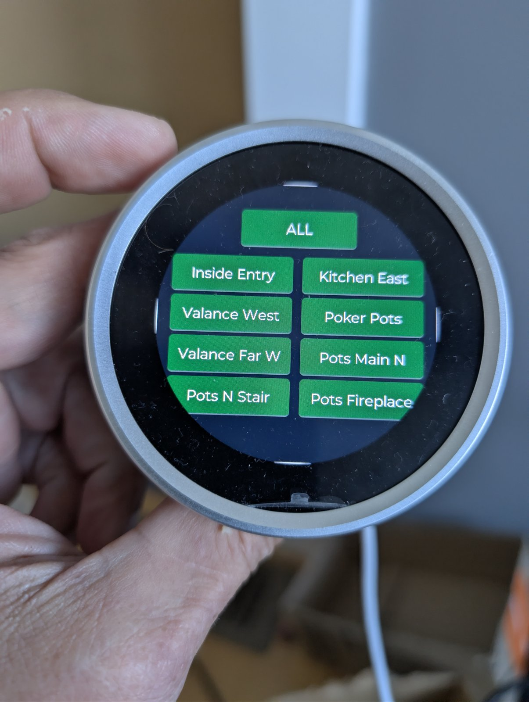
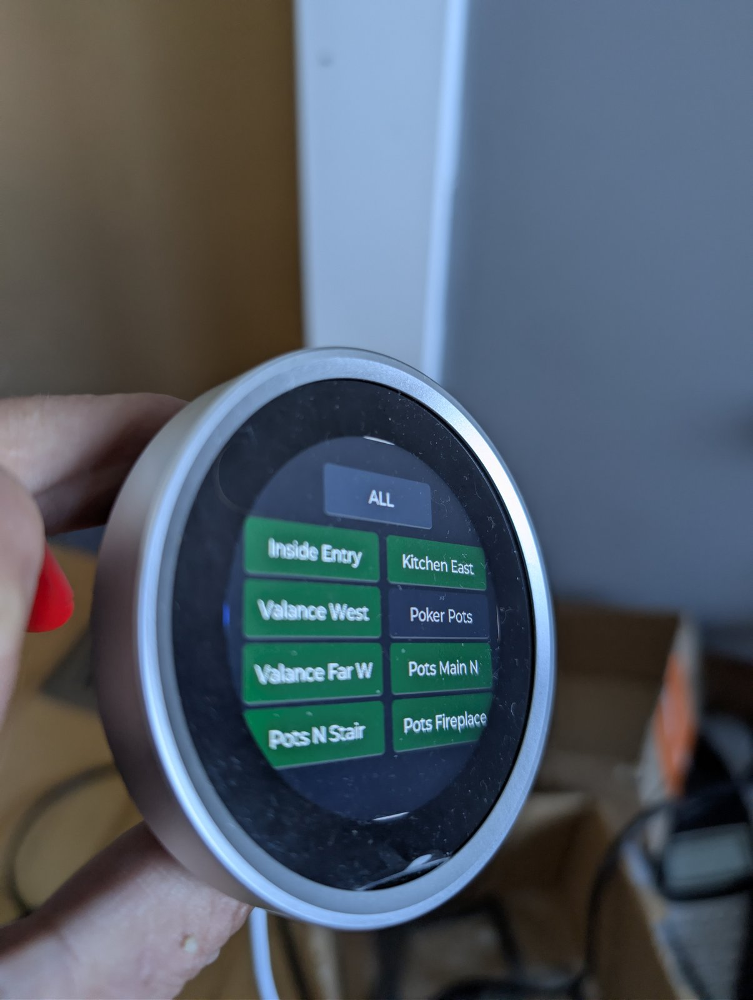

## Description

The Makerfabs MaTouch ESP32-S3 Rotary is a 2.1&nbsp;inch round 480&nbsp;×&nbsp;480 IPS panel with capacitive
touch and a rotary encoder ringing the display. The encoder shaft also presses, which gives you a dial, a
touchscreen and a button in one wall-mountable unit.

- 2.1&nbsp;inch 480&nbsp;×&nbsp;480 round IPS panel, ST7701S over RGB565 plus 3-wire SPI
- Capacitive touch via a CST826 controller on I²C
- Rotary encoder on `GPIO10` / `GPIO13` with a press button on `GPIO14`
- ESP32-S3 with 16&nbsp;MB flash and 8&nbsp;MB octal PSRAM
- LEDC backlight control on `GPIO38`
- USB-C for power and flashing



## Setup

1. Connect the board over USB-C. It enumerates as a USB serial device.
2. Create a device in ESPHome Device Builder and merge the hardware configuration
   below into it. The configuration here is the hardware layer only &mdash; your own
   `wifi:` credentials, `api:` and `ota:` come from the node configuration around it,
   which the Device Builder generates for you.
3. Flash over USB, then adopt the device in Home Assistant.

## Configuration

This is the hardware configuration: panel, touch, encoder, button and backlight. It brings the display up
without assuming what you want to put on it.

```yaml file=config.yaml
```

### The touch controller needs an external component

`cst826` is not in ESPHome mainline, so the configuration pulls it from an external component. The controller
also does not answer an I²C probe on this board even though it works once addressed, which is why
`skip_probe: true` is set. Without it, setup fails with the touchscreen reported as not found.

### The panel init sequence is not optional

The `init_sequence` in the configuration is the full ST7701S bring-up for this specific panel. It looks like
boilerplate that could be trimmed, and it cannot — dropping entries gives you a display that lights up and
shows either nothing or a scrambled image.

### Rotary dimmer example

Add this on top of the hardware configuration for a dial that dims one Home Assistant light. The knob is bound
to LVGL as an encoder input device, so the arc widget is driven by rotation and the knob press becomes LVGL's
enter button — nothing redefines the encoder or button from the hardware configuration.

```yaml file=dimmer.yaml
```

## Notes

- **The dimmer example needs Home Assistant actions enabled.** In the ESPHome
  integration, turn on *Allow the device to perform Home Assistant actions* for this
  device. Without it the arc moves on screen and the light never changes.
- **Rate-limit what you send while the knob is turning.** The example uses a `mode: restart` script with a
  short delay so a spin collapses into one call. Sending on every detent floods the API; sending only after
  the knob stops makes the dial feel dead in the hand.
- **A linear step curve feels wrong on LED loads.** Steps below roughly 1% per detent are under most LED
  drivers' resolution at the bottom of the range and invisible at the top. Stepping by a percentage of the
  current level tracks perception better than a fixed increment.
- Turning to zero is better sent as an explicit `light.turn_off` than as a brightness of zero, which some
  light platforms treat ambiguously.
