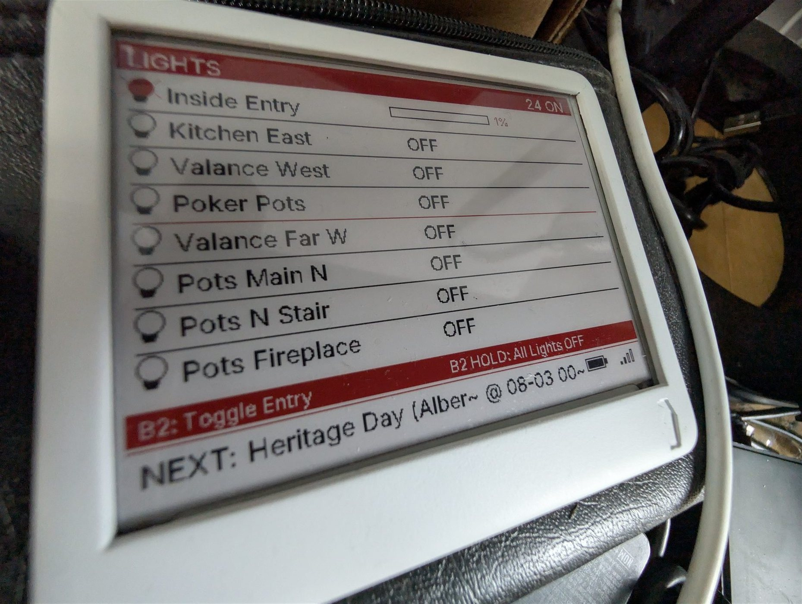

## Description

The [Paperd.ink](https://paperd.ink/) Merlot is a battery-powered ESP32 e-paper board built around a 4.2&nbsp;inch
tri-colour (black / white / red) panel.

- ESP32-WROVER with a 4.2&nbsp;inch 400×300 tri-colour e-paper panel
- Four front buttons on `GPIO14`, `GPIO27`, `GPIO4` and `GPIO2`
- LiPo battery connector with charging detection and a switched voltage divider for battery monitoring
- Load switches on both the panel and the battery divider, so neither draws current when idle
- USB-C for power and flashing

## Setup

1. Connect a LiPo battery, or run the board from USB-C.
2. Flash the configuration below.
3. Press one of the four buttons to confirm the board is responding, and wait for the first panel refresh.

## Configuration

Hardware only — SPI, the e-paper panel, the two load switches, the four buttons, charge detection and battery
voltage. The example lambda draws the date, time and battery voltage so you can see all three colours working.

```yaml file=config.yaml
```

### The panel is behind a load switch

`epd_enable` on `GPIO12` is **active low** and powers the panel. Until it is turned on, the display component
talks to a panel that is not powered — the device boots, connects and logs perfectly normally while the screen
never changes. The `on_boot` block turns it on and waits before the first refresh.

`batt_enable` on `GPIO25` does the same job for the battery voltage divider. Leaving it on continuously drains
the battery for no reason, which rather defeats the point of a battery-powered display.

## Notes

- **Put a timestamp on the screen.** E-paper keeps its last rendered image with no power at all, so the panel
  alone can never tell you whether what you are reading is current — a board that lost power hours ago looks
  exactly like one that just refreshed. Rendering the time of the last update, as the example does, is a design
  requirement on e-paper rather than a nice-to-have.
- **Tri-colour panels refresh slowly.** A full black/white/red update takes roughly 15&nbsp;seconds, during which
  the panel flashes through its colour passes. Pick a long `update_interval` and drive extra refreshes from
  button presses rather than polling.
- The panel is a `4.20in-bV2-bwr` as far as the `waveshare_epaper` component is concerned.
