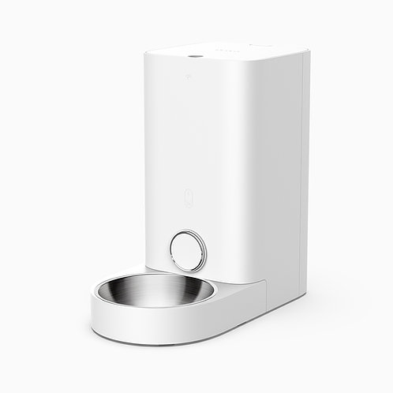

*Product image: [PETKIT](https://petkit.com), archived by the
[Internet Archive](https://web.archive.org/).*

## Product description

The Petkit Fresh Element Mini, product code P530, is an automatic dry-food pet
feeder with an ESP8266 Wi-Fi module. ESPHome replaces the stock cloud firmware
on that module and communicates with the feeder's ISD91230 motor controller,
so no additional microcontroller or motor rewiring is required.

The Mini uses two processors:

- the ESP8266 handles Wi-Fi, schedules, and high-level control;
- a Nuvoton ISD91230 Cortex-M0 controls the motor, outlet, indicators, beeper,
  and sensors.

Keeping the ISD91230 motor controller preserves its motion and door-safety
logic. The ESP32-based Fresh Element Solo is a different device and requires
its own configuration.

## Hardware

The ESP8266 and ISD91230 communicate over UART0 at 115200 baud. Packets use an
`AA AA` header and CRC-16/CCITT-FALSE. The external `petkit_feeder` component
implements that protocol.

| ESP8266 pin | Function |
| --- | --- |
| GPIO1 | UART0 transmit to ISD91230; board pad TX0 |
| GPIO3 | UART0 receive from ISD91230; board pad RX0 |
| GPIO2 | UART1 transmit-only logger; board pad TX1 |
| GPIO13 | Manual-feed button, active-low with pull-up |
| GPIO0 | Wi-Fi/reset button and ESP8266 boot strap |
| GPIO15 | ISD91230 active-low reset |
| GPIO5 / GPIO14 | Battery-backed PCF8563 RTC I2C bus |

UART1 logging remains available on TX1 because the feeder control bus uses
UART0.

## Features

- local one-serving feed control, nominally 5 g per counted wheel cycle;
- stock-style held manual feeding with discrete servings;
- outlet open, close, timeout recovery, and motor-controller reset;
- four schedules stored and evaluated on the feeder;
- battery-backed time through the PCF8563 RTC;
- food detection, plus numeric outlet-door and wheel sensor levels;
- adapter and battery voltage, plus a mains/battery power-source sensor;
- upper Wi-Fi indicator and beeper control;
- normal ESPHome OTA after the initial migration.

Actual serving weight varies with kibble size, density, and hopper level.

## Installation

Build and flash this configuration as with any other ESPHome device; a manual
UART flash works. On a feeder that still runs the stock firmware, a wireless
install needs the project's Kickstart transition image first, because the stock
bootloader uses Espressif's paired non-OS SDK layout (the "V2 user-bin" layout)
rather than ESPHome's eboot layout.

Follow the project's [installation
guide](https://github.com/wrobelda/petkit-element-mini-esphome#installation).
The guided installer provisions the feeder, installs Kickstart, saves a recovery
image, and uploads the final ESPHome firmware. The guide also provides a manual
procedure for development and diagnosis.

## Configuration

```yaml file=config.yaml

```

The configuration above describes the feeder hardware. The complete project
adds the local schedules, controls, indicator policy, encrypted Home Assistant
API, and wireless installer.
After migration, normal ESPHome OTA updates are supported.
