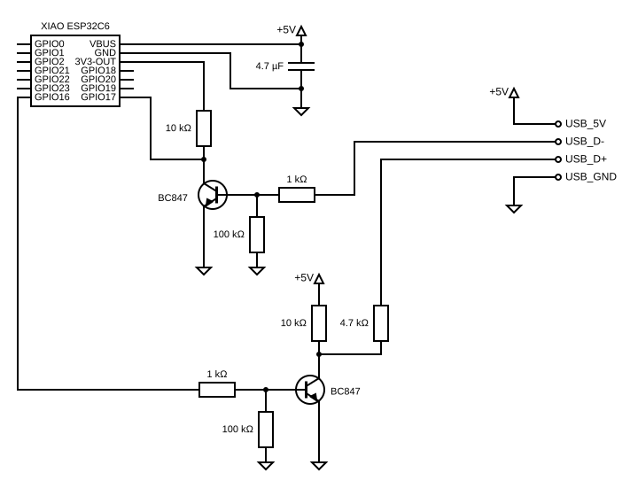

The Remko RKL 355 Eco is a mono-block air conditioning unit. Remko added a port
that looks like a USB port and allows connecting a separately sold Wi-Fi stick.
The original Wi-Fi stick works only with the manufacturer's web service. It
doesn't have any additional local control capabilities. The connection to the
manufacturer's web service was quite unstable during some tests.

Remko decided to use a physical USB A connector. But instead of USB, they use a
normal serial protocol with 5V TTL levels. The serial settings are 9600 8N1. The
protocol is Tuya compatible.

## Hardware

The original stick uses an ESP32. So in theory, it could be re-flashed. But it's
quite expensive and I didn't want to trace all pins. Therefore I used a XIAO
ESP32C6 board, two BC847 transistors and a few resistors as a replacement.



Any other ESP32 with a hardware serial interface should work too. For the
transistors, any small signal NPN transistor should work. A well-known THT
alternative for the BC847 is the BC547.

## Configuration

Only the parts necessary for the hardware. Don't forget to add your Wi-Fi
credentials under the existing `wifi:` block, plus your own `api:` and `ota:`
sections.

```yaml file=config.yaml
```
