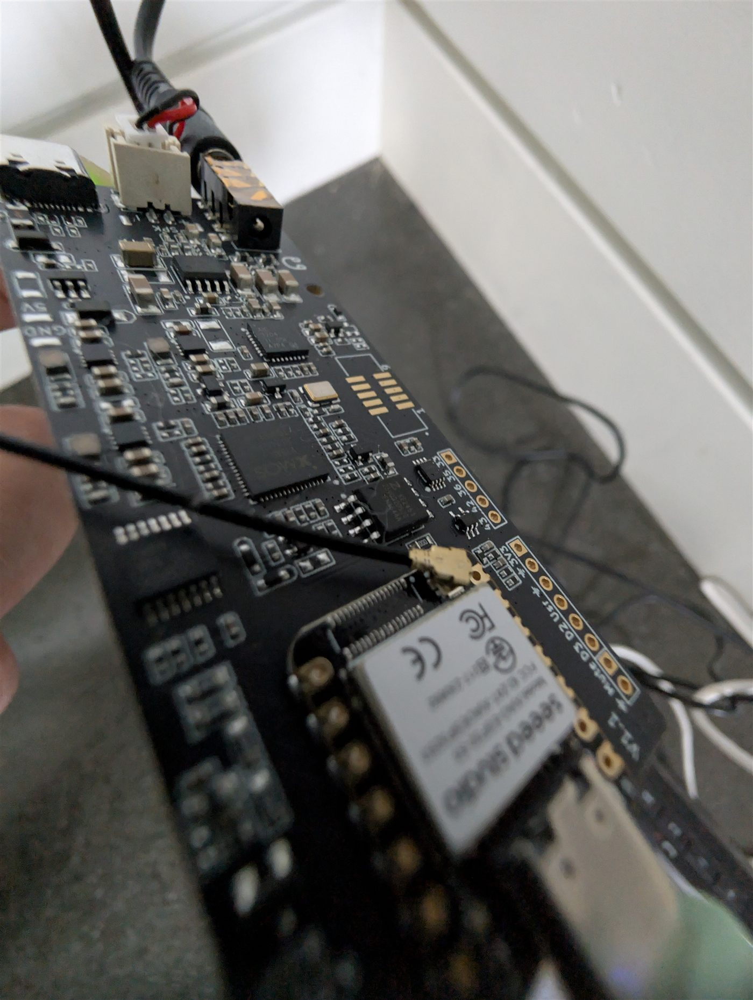

## Description

The Seeed Studio ReSpeaker Lite is a two-microphone array board for voice applications. It pairs an XMOS XU316
DSP with a socketed Seeed XIAO ESP32-S3 module, which is the part ESPHome runs on.

- Dual microphone array fed through an XMOS XU316 DSP that handles acoustic echo cancellation and beamforming
- TI AIC3204 audio codec on I²C at address `0x18`
- 3.5&nbsp;mm headphone/speaker output and an onboard speaker connector
- Socketed Seeed XIAO ESP32-S3 (8&nbsp;MB flash, 8&nbsp;MB PSRAM) as the host microcontroller
- USB-C for power and flashing



## Setup

1. Seat the XIAO ESP32-S3 module in the socket and connect the board over USB-C.
2. Flash the configuration below. The XIAO enters its bootloader by holding **BOOT** while tapping **RESET**.
3. Adopt the device in Home Assistant and add it to a voice assistant pipeline.

## Configuration

This is the hardware configuration — buses, codec, microphone and speaker. It brings the board up as a
media player without assuming anything about how you want to use it.

```yaml file=config.yaml
```

### The microphone is the I²S clock master

This is the one thing worth knowing before you modify the audio section.

The XMOS DSP drives the I²S clocks, so the microphone bus is the **primary** and the speaker bus is a
**secondary** riding those same clocks. Two consequences follow:

- **Both buses must use the same sample rate and bit depth.** A 16&nbsp;kHz microphone with a 48&nbsp;kHz
  speaker looks reasonable and will fail as soon as the microphone actually starts streaming.
- **The microphone has to keep running while the board is speaking.** Stopping the wake-word engine during
  playback — the instinctive way to stop a device waking itself — also stops the clocks the speaker depends on,
  and the reply comes out silent.

The two logical `i2s_audio` buses in the configuration share one physical set of pins, which is why the pins are
marked `allow_other_uses: true`.

### Voice assistant

Add this on top of the hardware configuration for wake-word detection and a Home Assistant voice pipeline. Note
that `on_tts_start` **restarts** microWakeWord instead of stopping it, for the clock reason described above.

```yaml file=voice-assistant.yaml
```

## Notes

- **Build on ESPHome 2026.7.3 or newer.** The tflite runtime in some earlier releases cannot load current
  microWakeWord models. It fails at boot with `Failed to allocate tensors for the streaming model`, the wake
  engine stops, and nothing else reports a problem — the device connects, logs normally and answers the API, it
  simply never hears you. Older versions flash and run perfectly happily, which is what makes it easy to miss.
- The headphone output level is exposed as a Home Assistant number entity rather than being fixed in firmware.
