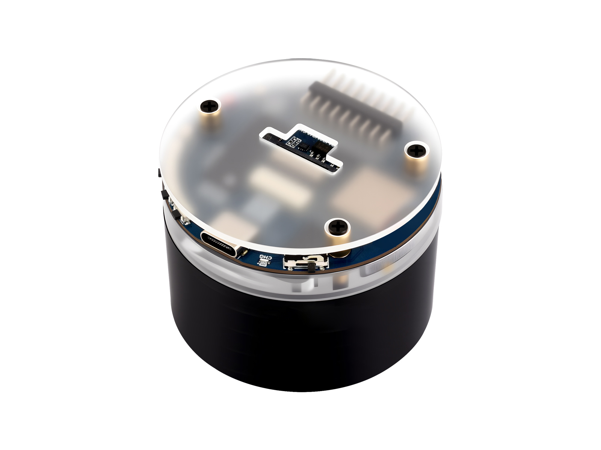

## Product Description

The [Waveshare ESP32-S3 Audio Board](https://www.waveshare.com/esp32-s3-audio-board.htm) is a compact development
board built around the ESP32-S3R8 module, designed for audio applications such as voice assistants, media players,
and intercom systems. It integrates a quad-channel audio ADC (ES7210), a mono audio DAC/codec (ES8311), a Class-D
speaker amplifier (NS4150B), a 7-LED WS2812B RGB ring, an RTC, and a TCA9555 I/O expander. Optional accessories
include SPI/QSPI displays (1.47" to 3.5"), a DVP camera module, and an SD card.

## Hardware Specs

| Spec | Detail |
|------|--------|
| MCU | ESP32-S3R8 (dual-core Xtensa LX7, 240 MHz) |
| Flash | 16 MB (QIO, 80 MHz) |
| PSRAM | 8 MB (Octal, 80 MHz) |
| Wi-Fi | 2.4 GHz 802.11 b/g/n |
| Bluetooth | 5 (LE) |
| Audio ADC | ES7210 (4-channel, I2C 0x40) |
| Audio DAC | ES8311 (mono codec, I2C 0x18) |
| Speaker Amp | NS4150B (mono Class-D) |
| I/O Expander | TCA9555PWR (16-bit, I2C 0x20) |
| RTC | PCF85063 (I2C 0x51) |
| LEDs | 7x WS2812B RGB ring (GPIO38) |
| Buttons | BOOT (GPIO0) + 3 keys via TCA9555 |
| Power | USB-C 5V, 3.7V lithium battery (MX1.25), DC-DC buck 3.3V/2A |

## GPIO Pinout

### I2C Bus

| Function | GPIO |
|----------|------|
| SCL | GPIO10 |
| SDA | GPIO11 |

### I2S Audio Bus

| Function | GPIO |
|----------|------|
| MCLK | GPIO12 |
| BCLK | GPIO13 |
| LRCLK | GPIO14 |
| DIN (mic data in) | GPIO15 |
| DOUT (speaker data out) | GPIO16 |

### LED and Misc

| Function | GPIO |
|----------|------|
| WS2812B LED Ring | GPIO38 |
| BOOT Button | GPIO0 |
| Battery ADC | GPIO8 |
| USB D- | GPIO19 |
| USB D+ | GPIO20 |

### LCD (18-pin FPC)

| Function | GPIO |
|----------|------|
| CS | GPIO3 |
| SCLK | GPIO4 |
| Backlight | GPIO5 |
| SDA0 / MOSI | GPIO9 |
| SDA1 / MISO | GPIO8 |
| SDA2 / DC | GPIO7 |
| SDA3 | GPIO6 |

### SD Card (SDMMC 1-bit)

| Function | GPIO |
|----------|------|
| CLK | GPIO40 |
| CMD | GPIO42 |
| D0 | GPIO41 |

### TCA9555 I/O Expander Pin Assignments

| Pin | EXIO | Function |
|-----|------|----------|
| 0 | EXIO00 | LCD Reset |
| 1 | EXIO01 | Touch Panel Reset |
| 2 | EXIO02 | Touch Panel Interrupt |
| 3 | EXIO03 | SD Card CS |
| 4 | EXIO04 | Reserved |
| 5 | EXIO05 | Camera Power Down (active low) |
| 6 | EXIO06 | Camera Select (HIGH=Tx/Rx, LOW=USB) |
| 7 | EXIO07 | Camera/USB GPIO mux control |
| 8 | EXIO08 | Speaker amplifier enable (PA_CTRL) |
| 9 | EXIO09 | Key1 button (active low) |
| 10 | EXIO10 | Key2 button (active low) |
| 11 | EXIO11 | Key3 button (active low) |
| 12-15 | EXIO12-15 | Expansion header |

## I2C Devices

| Device | Address | Function |
|--------|---------|----------|
| ES8311 | 0x18 | Audio DAC (speaker output) |
| ES7210 | 0x40 | Audio ADC (microphone input) |
| TCA9555 | 0x20 | 16-bit I/O expander |
| PCF85063 | 0x51 | Real-time clock |

## Basic ESPHome Configuration

This minimal configuration sets up the audio hardware (microphone, speaker, DAC/ADC), the LED ring, buttons, and a
voice assistant with on-device wake word detection. Note that `use_wake_word` is set to `false` because
`micro_wake_word` handles wake word detection directly. Wake word restart happens in `on_tts_stream_end` (after the
speaker finishes playing TTS audio) rather than `on_end`, which avoids an I2S bus conflict where restarting the
microphone in `on_end` would preempt the speaker. `api:`, `ota:`, and Wi-Fi credentials are omitted below since
they're boilerplate rather than hardware-specific; add them as usual for your own network. For a full-featured
configuration with LED animations for each voice assistant state, see the
[project repository](https://github.com/jensenbox/waveshare-esp32-s3-audio).

```yaml file=config.yaml
```

## Links

- [Waveshare Product Page](https://www.waveshare.com/esp32-s3-audio-board.htm)
- [Waveshare Wiki](https://www.waveshare.com/wiki/ESP32-S3-AUDIO-Board)
- [ESPHome Configuration Project](https://github.com/jensenbox/waveshare-esp32-s3-audio)
