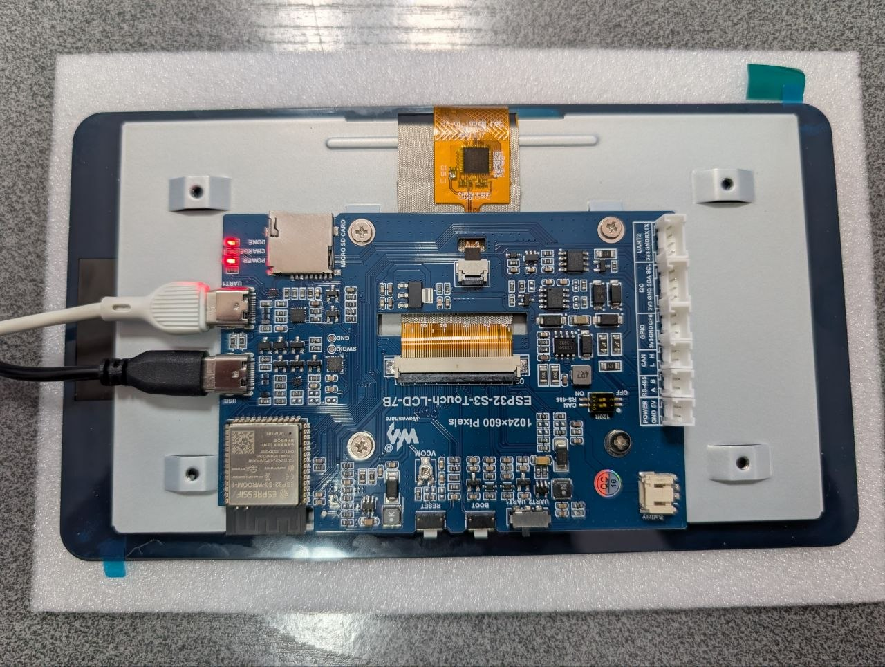

## Product specs

| Feature      | Spec                                       |
| ------------ | ------------------------------------------- |
| Screen       | RGB parallel, 1024×600, IPS, 65K colors     |
| Touch screen | GT911 (capacitive, I2C, 5-point)             |
| CPU          | ESP32-S3-WROOM-1-N16R8 (dual-core, 240MHz)  |
| Flash        | 16MB                                         |
| PSRAM        | 8MB                                          |
| I/O Expander | CH422G (I2C)                                 |
| Interfaces   | CAN, RS485, I2C, USB, TF card slot           |

## Product description

A 7inch, low-cost ESP32-S3 development board with an onboard 1024×600 RGB
IPS capacitive touch LCD, designed for HMI / LVGL applications. The board
has a large number of peripheral headers (CAN, RS485, I2C, 5V output, TF
card slot) and uses a CH422G I2C I/O expander to control the LCD
backlight/VCOM enable, touch reset, the SD card chip-select line, and the
shared USB/CAN mode-select line, because most of the ESP32-S3's usable
GPIOs are consumed by the 16-bit RGB LCD bus.

Available on [Waveshare](https://www.waveshare.com/wiki/ESP32-S3-Touch-LCD-7B)
for ~$40. A version without touch (ESP32-S3-LCD-7B) is also sold.

## GPIO Pinout

### LCD (RGB parallel bus)

| ESP32-S3 | LCD Signal | Function            |
| -------- | ---------- | -------------------- |
| GPIO0    | G3         | Green data bit 3     |
| GPIO1    | R3         | Red data bit 3       |
| GPIO2    | R4         | Red data bit 4       |
| GPIO3    | VSYNC      | Vertical sync        |
| GPIO5    | DE         | Data enable          |
| GPIO7    | PCLK       | Pixel clock          |
| GPIO10   | B7         | Blue data bit 7      |
| GPIO14   | B3         | Blue data bit 3      |
| GPIO17   | B6         | Blue data bit 6      |
| GPIO18   | B5         | Blue data bit 5      |
| GPIO21   | G7         | Green data bit 7     |
| GPIO38   | B4         | Blue data bit 4      |
| GPIO39   | G2         | Green data bit 2     |
| GPIO40   | R7         | Red data bit 7       |
| GPIO41   | R6         | Red data bit 6       |
| GPIO42   | R5         | Red data bit 5       |
| GPIO45   | G4         | Green data bit 4     |
| GPIO46   | HSYNC      | Horizontal sync      |
| GPIO47   | G6         | Green data bit 6     |
| GPIO48   | G5         | Green data bit 5     |
| CH422G/2 | DISP       | Backlight enable (via IO expander, EXIO2) |
| CH422G/6 | LCD_VDD_EN | VCOM voltage enable (via IO expander, EXIO6) |

### Touch (I2C, GT911)

| ESP32-S3 | Function              |
| -------- | ---------------------- |
| GPIO4    | Touch interrupt (TP_IRQ) |
| GPIO8    | I2C SDA (shared bus)   |
| GPIO9    | I2C SCL (shared bus)   |
| CH422G/1 | Touch reset (TP_RST, via IO expander) |

### I2C bus

Shared by the CH422G I/O expander and the GT911 touch controller.

| ESP32-S3 | Function |
| -------- | -------- |
| GPIO8    | SDA      |
| GPIO9    | SCL      |

### RS485

| ESP32-S3 | Function          |
| -------- | ------------------ |
| GPIO16   | RS485 RX (UART TX) |
| GPIO15   | RS485 TX (UART RX) |

### CAN

| ESP32-S3 | Function       |
| -------- | --------------- |
| GPIO20   | CAN TX          |
| GPIO19   | CAN RX          |
| CH422G/5 | CAN/USB select (pull high for CAN, via IO expander) |

### TF (SD) card, SPI

| ESP32-S3 | Function          |
| -------- | ------------------ |
| GPIO11   | MOSI                |
| GPIO12   | SCK                 |
| GPIO13   | MISO                |
| CH422G/4 | SD card CS, active low (via IO expander) |

note
The 7inch RGB LCD bus consumes most of the ESP32-S3's usable GPIOs, so
backlight/VCOM enable, touch reset, SD card chip-select and the CAN/USB
mode-select line are all routed through the onboard IO expander instead
of direct GPIOs.

warning
**The ESPHome `ch422g:` component does not work on this board.** On real
hardware it NACKs (I2C error 2, `ERROR_NOT_ACKNOWLEDGED`) on every write to
the per-function addresses it uses (`0x38`, `0x23`, `0x26`) — confirmed with
a direct I2C bus probe, independent of `ch422g:` itself. The vendor's own
driver ([`io_extension.c`](https://github.com/waveshareteam/ESP32-S3-Touch-LCD-7B))
instead sends 2-byte `[command, data]` packets to a *single* I2C address
`0x24` (`0x02`=mode register, `0x03`=output register, `0x04`=input register) —
this is the protocol that actually works on this board/chip revision. The
example config below bypasses `ch422g:` entirely and replicates the vendor
protocol directly via a `lambda` on the shared I2C bus.

## Basic Configuration

Minimal working configuration: display + backlight/VDD enable + touchscreen,
confirmed working on real hardware. No network/API/OTA — add your own
`wifi:`, `api:` and `ota:` blocks on top of this.

```yaml file=config.yaml
```

## Links

- [Product Page](https://www.waveshare.com/wiki/ESP32-S3-Touch-LCD-7B)
- [Wiki / Documentation](https://docs.waveshare.com/ESP32-S3-Touch-LCD-7B)
- [Working with Arduino](https://docs.waveshare.com/ESP32-S3-Touch-LCD-7B/Arduino)
- [Working with ESP-IDF](https://docs.waveshare.com/ESP32-S3-Touch-LCD-7B/ESP-IDF)
