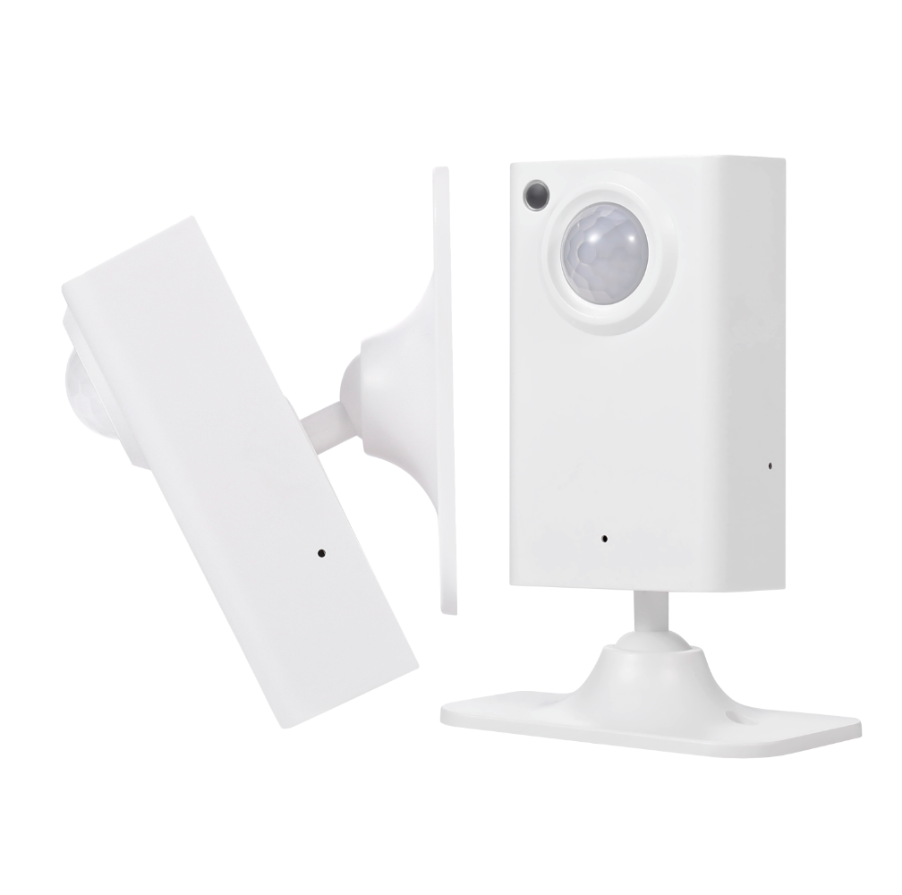

Maker: [https://www.athom.tech/](https://www.athom.tech/)

## Available from

[Athom](https://www.athom.tech/blank-1/human-presence-sensor)

## Note

Built-in CH340C serial port chip, connect the Type-C data cable to flash the firmware directly
(the in box provided Type-C cable can be used to flash the firmware)

## GPIO Pinout

| Pin    | Function     |
| ------ | ------------ |
| GPIO2  | LedLink      |
| GPIO3  | Pir Output   |
| GPIO4  | Radar Output |
| GPIO5  | Radar RX     |
| GPIO8  | Radar TX     |
| GPIO9  | Button       |
| GPIO18 | I2C SDA      |
| GPIO19 | I2C SCL      |

## Basic Configuration

```yaml file=config.yaml
```

```yaml url=https://github.com/athom-tech/esp32-configs/blob/main/athom-presence-sensor-v3.yaml
```
