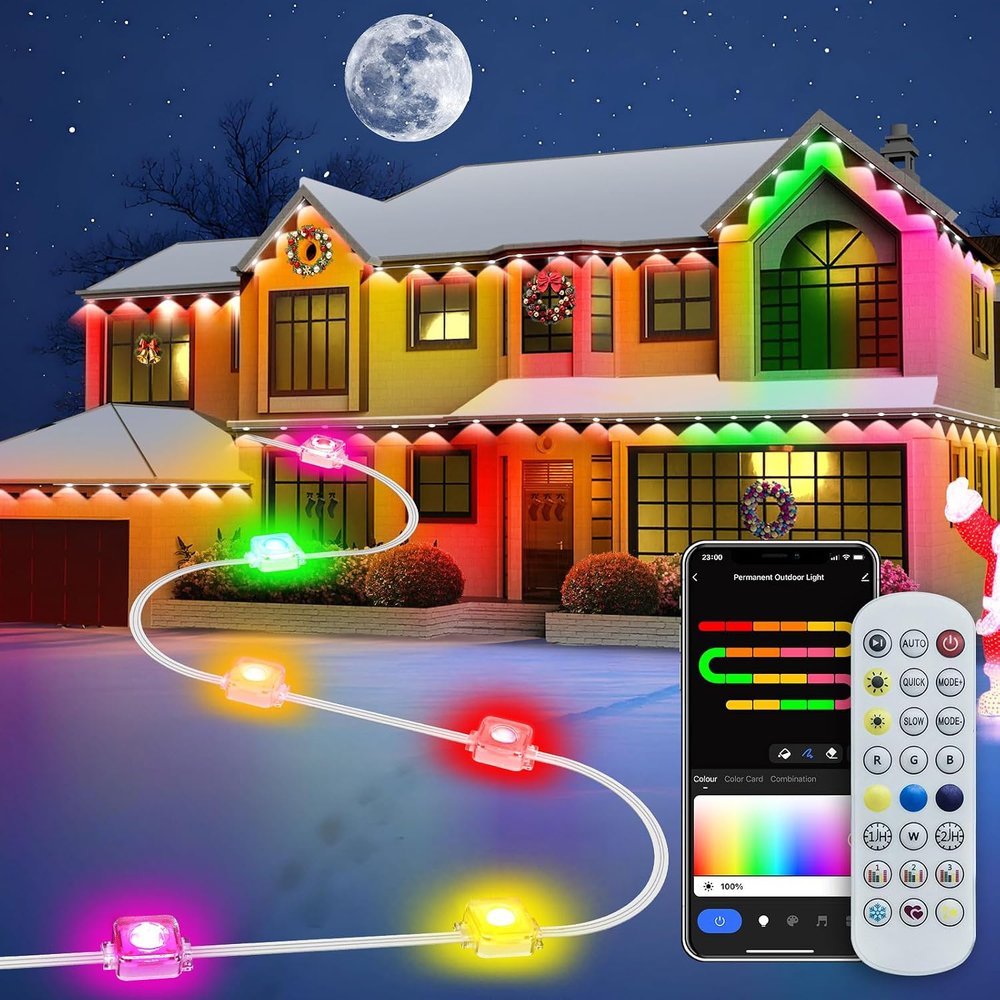

## General Notes

This setup was modeled after the [BTSMX Outdoor LED String Lights](https://www.amazon.com/dp/B0FNNGRVLK) which are
advertised as Tuya/SmartHome compatible with RGB+IC addressing. Many other such clones are likely compatible with this
setup, since the box has absolutely no branding.



The control board was potted over with silicone, but only the back needs to be cleaned off for flashing with LibreTiny.

## Basic Configuration

```yaml file=config.yaml
```
