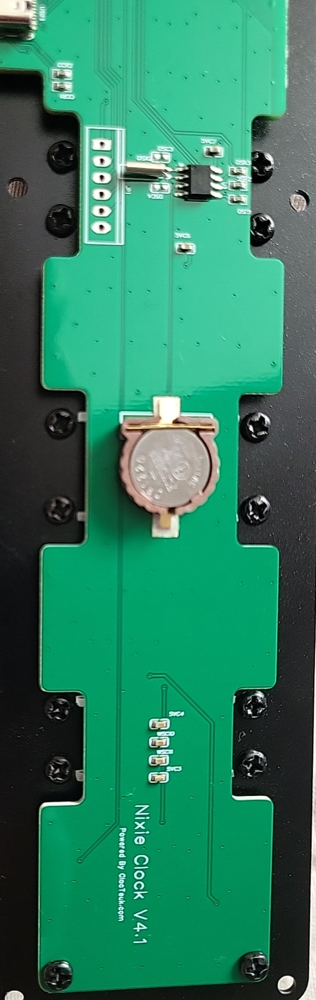
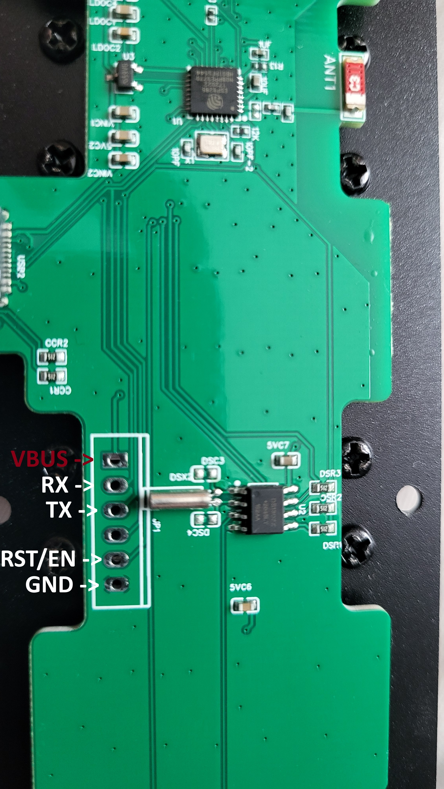

## Overview

The ClocTeck RGB Tube Clock is a desk clock with six "nixie-style" tubes made from
LED strips. The board inside is silkscreened `Nixie Clock V4.1` and
`Powered by: Oiostudio.com`. It runs an ESP8285.

Ten LEDs sit behind each digit, so all six tubes are one 60 LED WS2812 strip on a
single data pin. That gives you per digit colours and animations, which the stock
firmware does not expose.

Converting it means opening the case and attaching a USB-UART adapter to an
unlabelled 6-pad header, so this is a difficulty 4. The USB-C port carries power
only.

Sold as the ClocTeck RGB Tube Clock, and the same board turns up under the
`Nixie Clock V4.1` name. The stock access point is called
`ClocTeck_<last 4 hex of the MAC>`.

## Why replace the stock firmware

Worth knowing before you connect it to your network:

- `GET /config` and `/wificonf` have no authentication and hand out the Wi-Fi
  passphrase in plain text to anything on the LAN.
- OTA is hardcoded to a bucket in China over plain HTTP, and the clock fetches its
  display code from there at runtime.
- The vendor firmware itself is built on the Arduino core for ESP8266.

Blocking the clock from the internet is worth doing whichever firmware you run.

## Product images

The board with the case open. The J1 programming header is the 6-pad row near the
top, the CR1220 coin cell in the middle is the RTC backup, and the silkscreen reads
`Nixie Clock V4.1` and `Powered by: Oiostudio.com`.



The same board with the J1 pads labelled. Pin 1 is the square pad and is VBUS, which
you leave alone. The adapter connects to RX, TX and GND only.



## Hardware

| Item        | Detail                                                       |
| ----------- | ------------------------------------------------------------ |
| SoC         | ESP8285N08 (ESP8266 family), QFN-32, 1 MB internal flash      |
| Crystal     | 26 MHz                                                        |
| LEDs        | 60 WS2812, ten per digit, data on GPIO13                      |
| Buttons     | Mode, Time, Up, and Down                                      |
| Buzzer      | Active buzzer on GPIO15                                       |
| RTC         | None. Time comes from NTP, same as the stock firmware.        |
| Power       | USB-C, power only, no USB-UART chip on the board              |

### GPIO pinout

| GPIO     | Function              | Notes                                              |
| -------- | --------------------- | -------------------------------------------------- |
| GPIO13   | LED data, 60 WS2812   |                                                    |
| GPIO0    | Mode button           | Also the download mode strap                        |
| GPIO2    | Time button           |                                                    |
| GPIO16   | Up button             | Active low. No pull-up and no interrupts on ESP8266 |
| GPIO15   | Buzzer                | Active buzzer, driven high                          |
| GPIO1    | UART TX               | Used for flashing                                   |
| GPIO3    | UART RX               | Used for flashing                                   |
| unknown  | Down button           | Not identified, see below                           |

### LED index map

The strip runs right to left, and the numeral order inside a tube differs between
the hour tubes and the rest. To show digit `d`:

| LED block | Digit           | LED index          |
| --------- | --------------- | ------------------ |
| 0-9       | seconds ones    | `9 - d`            |
| 10-19     | seconds tens    | `9 - d`            |
| 20-29     | minutes ones    | `9 - d`            |
| 30-39     | minutes tens    | `9 - d`            |
| 40-49     | hours tens      | `d`                |
| 50-59     | hours ones      | `d`                |

Getting this backwards shows `08` where `19` should be. Measured on hardware.

### Programming header J1

Six unlabelled pads. Pin 1 is the square one, and the `J1` silkscreen sits below
the row.

| Pin | Shape  | Measured | Signal                        |
| --- | ------ | -------- | ----------------------------- |
| 1   | square | 5.22 V   | VBUS, do not connect          |
| 2   | round  | 3.2 V    | RX, GPIO3                     |
| 3   | round  | 3.6 V    | TX, GPIO1                     |
| 4   | round  | 3.6 V    | not UART                      |
| 5   | round  | ~3 V     | RST / EN                      |
| 6   | round  | 0 V      | GND, connect this one first   |

A 3.2 V reading does not mean a pin is 3V3. Pin 2 reads 3.2 V and is actually RX
held high by a pull-up. A multimeter cannot tell a supply rail from an idle UART
input, since both sit at about 3.3 V. Only an esptool sync settles it.

## Flashing

Wire a CH340 or CP2102 adapter, jumpered to 3.3 V. The I/O rail measures 3.6 V,
which is the ESP8266 absolute maximum, so do not use the 5 V setting.

```text
adapter GND -> J1 pin 6   (connect first)
adapter RX  -> J1 pin 3   (TX)
adapter TX  -> J1 pin 2   (RX)
```

Power the clock from its own USB-C. Do not feed 3V3 back into the board.

### Enter download mode without a wire

Hold the Mode button while you plug in the USB-C power. Mode is GPIO0, which is the
download strap. The tubes show `00 00 00` once you are in the bootloader.

The flip side is that holding Mode at power-on stops the clock from starting. That
is expected, not a fault.

### Back up first

The stock firmware is MAC bound, so a dump from someone else will not restore your
unit. Your own dump is the only way back.

```bash
python -m esptool --port COM3 --before no-reset --after no-reset -b 74880 \
  read_flash 0x0 0x100000 clocteck-stock-1MB.bin
python -m esptool --port COM3 --before no-reset --after no-reset -b 74880 \
  verify-flash 0x0 clocteck-stock-1MB.bin
```

### Flash it

```bash
python -m esptool --port COM3 --before no-reset --after no-reset -b 74880 \
  write_flash 0x0 clocteck-factory.bin
```

`--before no-reset --after no-reset` stops esptool toggling DTR and RTS, which would
knock the chip back out of download mode. 74880 is the rate that proved reliable on
this chip.

After flashing, remove the Mode jumper and power cycle normally. The clock boots a
`ClocTeck-Setup` hotspot. Join it, pick your network, and it shows up in Home
Assistant.

## Configuration

This is the hardware manifest. Add your own `wifi`, `api` and `ota` sections the way
you normally would, or build it in the ESPHome Device Builder.

```yaml file=config.yaml
```

## Features

| Control | Type | Notes |
|---|---|---|
| Display | switch | display on/off |
| Effect | select | 8 effects: Clock, Rainbow, Fire, Breathe, Rainbow sweep, Colour fade, Colour (sliders), Alarm red |
| Brightness | number | 10–100 % |
| Colour R / G / B | numbers | the colour used by the two "Colour" effects |
| Next Effect | button | cycle effects |
| Mode / Time / Up | buttons on the case | next effect · back to Clock · brightness +10 % |
| Buzzer | switch | buzzer on/off |
| Restart | button | reboot |

## Notes if you build on this

- In `addressable_set`, `range_to` is inclusive. One LED is
  `range_from: N, range_to: N`.
- Colour lambdas must return 0 to 1. Returning 0 to 255 logs
  `Lambda for parameter red ... should return values in range 0-1` and scales the
  output wrong.
- `Color(r, g, b)` takes 0 to 255, so `Color(1.0f, 0.25f, 0.0f)` is essentially
  black. Use `ESPHSVColor::to_rgb()` when you want a real colour.
- `gamma_correct` defaults to 2.8 and applies to the light's own brightness rather
  than to `color_brightness`. Pinning the light at 100 percent and dimming with
  `color_brightness` keeps the full range available.
- `esp8266_uart` and `esp8266_dma` only work on GPIO2. The data pin here is GPIO13,
  so `bit_bang` is required.

## Known issues

- The Down button does not work. It is not on any externally reachable GPIO. Every
  remaining pin was scanned with both pull-up and inverted binding on a clean high
  baseline and no press produced an edge. The likely answer is that Down shares the
  Up pin through a resistor divider and the stock firmware reads it as a voltage
  rather than as a logic level. The stock application image never touches the ADC,
  which points at the ADC read living in the display code it downloads at runtime.
  Down's original jobs were brightness down and the 12/24 hour toggle, and the
  brightness slider and Up button cover both.
- No RTC, so after a power cut the clock cannot know the time until it reaches
  Wi-Fi. The stock firmware has the same limitation.
- The buzzer is on GPIO15, which is also a boot strap. It needs
  `restore_mode: ALWAYS_OFF`.

## Notes on the hardware

- `addressable_set`'s `range_to` is **inclusive** (ESPHome adds `+1` internally):
  one LED is `range_from: N, range_to: N`.
- All colour lambdas must return **0–1**; returning 0–255 triggers
  `Lambda for parameter red ... should return values in range 0-1` and mis-scales
  the output.
- `Color(r,g,b)` takes **0–255 uint8**, so `Color(1.0f, 0.25f, 0.0f)` is
  essentially **black**. Use `ESPHSVColor::to_rgb()` for real colours.
- `gamma_correct` defaults to **2.8** and applies to the light's *own* brightness,
  not to `color_brightness`. The config therefore pins the light at brightness
  100 % and does all dimming with `color_brightness` (linear, full range).
- `esp8266_uart` / `esp8266_dma` only work on **GPIO2**; the data pin here is
  GPIO13, so **`bit_bang`** is required.

## Stock firmware notes

Worth knowing before replacing it:

- `GET /config` and `GET`/`POST /wificonf` are **unauthenticated** and return the
  Wi-Fi passphrase in plaintext to anyone on the LAN.
- OTA is hardcoded to a China-hosted bucket over **plain HTTP**:
  `http://clocteck.oss-cn-shanghai.aliyuncs.com/`
- The clock **downloads its display code at runtime** (`6tubes.ino.bin`,
  `6tubes_ver.json`, `/fwlink`, `/upserver`, `/changeupdate`).
- Build string: `SDK ver: %s compiled @ Jul 3 2019`; the vendor firmware is itself
  built on the **Arduino core for ESP8266**.

Consider blocking the device from WAN regardless of which firmware you run.

## Needed work

- **A flashable image that can be installed *without* a USB-UART adapter would be a
  big win.** Every unit is flashed at the factory over the 6-pad J1 header, and the
  USB-C port carries power only, so today the conversion needs soldering or pogo
  pins. Since the stock firmware has an **unauthenticated plain-HTTP OTA endpoint**,
  it may be possible to build an image that the **stock firmware itself will accept
  over OTA** — letting people convert with only a browser. Contributions very
  welcome.
- **Identifying the `Down` button.** If you have a scope, the useful measurement is
  the voltage on the Up pin while pressing Up vs Down; a distinct non-zero reading
  would confirm a resistor divider and allow an ADC threshold.
