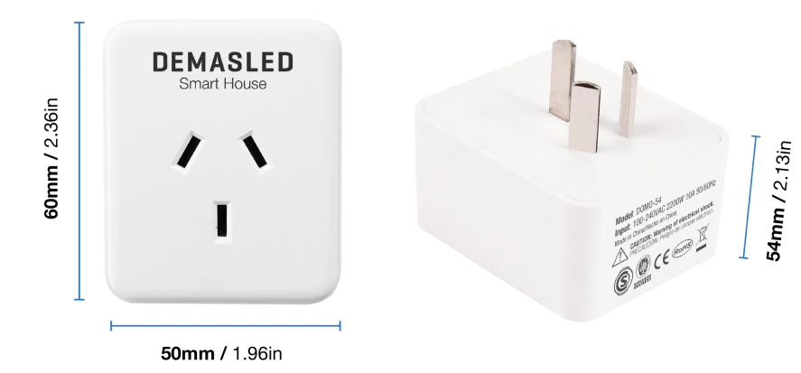
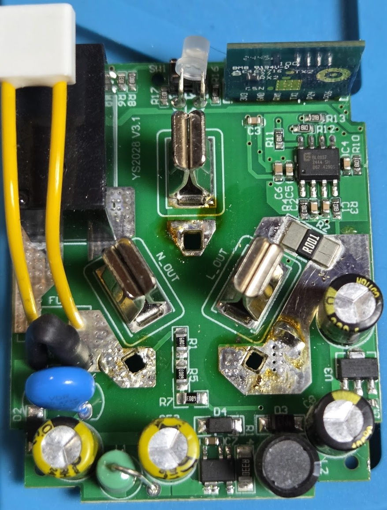
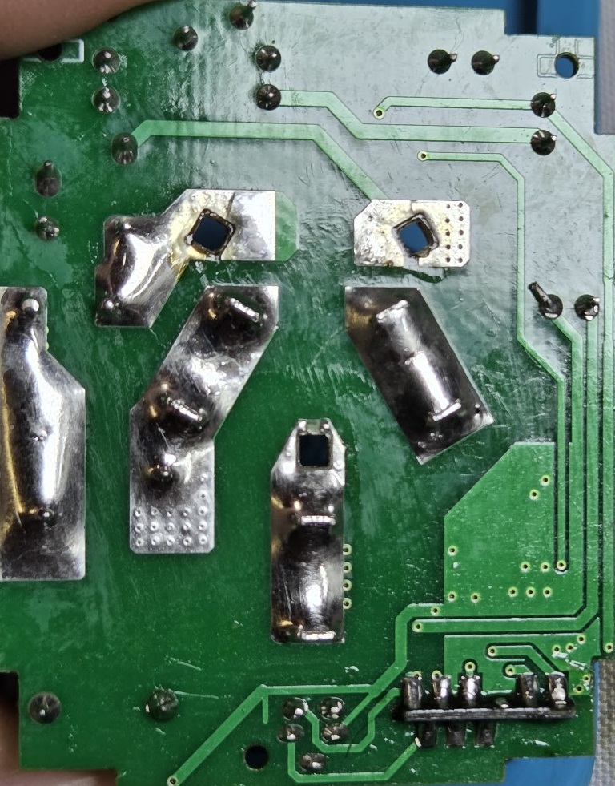

The DEMASLED DOMO-54 is a Wi-Fi smart plug based on the **BK7231N**
microcontroller and the **BL0937** power monitoring IC.

It supports:

- Relay control
- Physical push button
- Voltage measurement
- Current measurement
- Active power measurement
- Energy measurement



## Opening the device

> **Warning**
>
> This device is connected directly to mains voltage. Disconnect it completely
> from the mains before opening, soldering, probing, or modifying it.
>
> Parts of the PCB are not isolated from mains voltage.

The enclosure is held together by plastic clips.

To open the device, carefully pry the enclosure at **each of the four corners**,
releasing the clips one at a time.

Avoid applying excessive force in only one location, as this may damage the
plastic enclosure or its retaining clips.

## Internal construction

Top side of the PCB:



Bottom side of the PCB:



The mains receptacle is attached to the enclosure and prevents convenient
access to the BK7231N module pins.

In order to access and solder the programming pins, it is necessary to
**desolder the PCB from the mains receptacle terminals**.

The receptacle itself is fixed to the plastic enclosure, so attempting to
remove the complete PCB without first desoldering these connections is not
recommended.

Once the PCB has been separated from the receptacle, the BK7231N module pins
can be accessed for flashing.

## Hardware

The device contains:

- **BK7231N** Wi-Fi/Bluetooth microcontroller
- **BL0937** power monitoring IC
- Mechanical relay
- Physical push button
- Current shunt marked `R001`

The `R001` shunt corresponds to approximately **1 mΩ (0.001 Ω)**.

## Pinout

The GPIO mapping was determined experimentally after flashing ESPHome and
monitoring the GPIOs individually.

| Function | BK7231N GPIO | Notes |
| --- | --- | --- |
| Physical button | `P6` | Active low |
| Relay | `P8` | Active high |
| BL0937 SEL | `P10` | Voltage/current selection |
| BL0937 CF | `P24` | Active power pulse output |
| BL0937 CF1 | `P26` | Voltage/current pulse output |

### BL0937 signals

The BL0937 exposes two pulse outputs:

- `CF` provides a pulse frequency proportional to active power.
- `CF1` provides either voltage or current information.
- `SEL` selects whether `CF1` represents voltage or current.

During GPIO identification, `P24` was found to react strongly to changes in
load, identifying it as the BL0937 `CF` output.

`P26` produces the `CF1` pulse signal, while changing `P10` switches the
measurement mode, confirming `P10` as `SEL`.

## ESPHome configuration

A minimal configuration for this device is:

```yaml file=config.yaml
```

The inverted configuration of the BL0937 pins was required for reliable
operation on the tested device.

## Power monitoring calibration

The BL0937 measurements should be calibrated before they are considered
accurate.

Calibration of the documented device was performed using a **resistive load**.
A resistive load was chosen because its power factor is close to `1.0`, which
makes it suitable for comparing voltage, current, and active power
measurements.

An **ATORCH energy meter** was used as the reference instrument.

During calibration, the following values were compared between ESPHome and
the ATORCH meter:

- RMS voltage
- RMS current
- Active power
- Energy consumption

The calibration procedure consisted of applying a stable resistive load,
allowing both meters to stabilize, and then adjusting the ESPHome measurement
constants until the readings closely matched the ATORCH reference meter.

Because component tolerances may vary between individual units, calibration
values should not necessarily be assumed to be identical for every
DEMASLED DOMO-54.

For best accuracy, each device should be calibrated against a known reference
meter.

## Notes

The power monitoring circuitry is based on the BL0937 and is supported by
ESPHome through the `hlw8012` platform using:

```yaml inline
model: BL0937
```

The final GPIO mapping for the tested DEMASLED DOMO-54 is:

```text
P6  -> Physical button
P8  -> Relay
P10 -> BL0937 SEL
P24 -> BL0937 CF
P26 -> BL0937 CF1
```

## Safety

This device contains circuitry connected directly to mains voltage.

Do not work on the PCB while the device is connected to mains power. Always
disconnect the device before opening the enclosure, soldering, or making
electrical measurements.

Only perform these modifications if you understand the risks associated with
mains-powered electronics.
