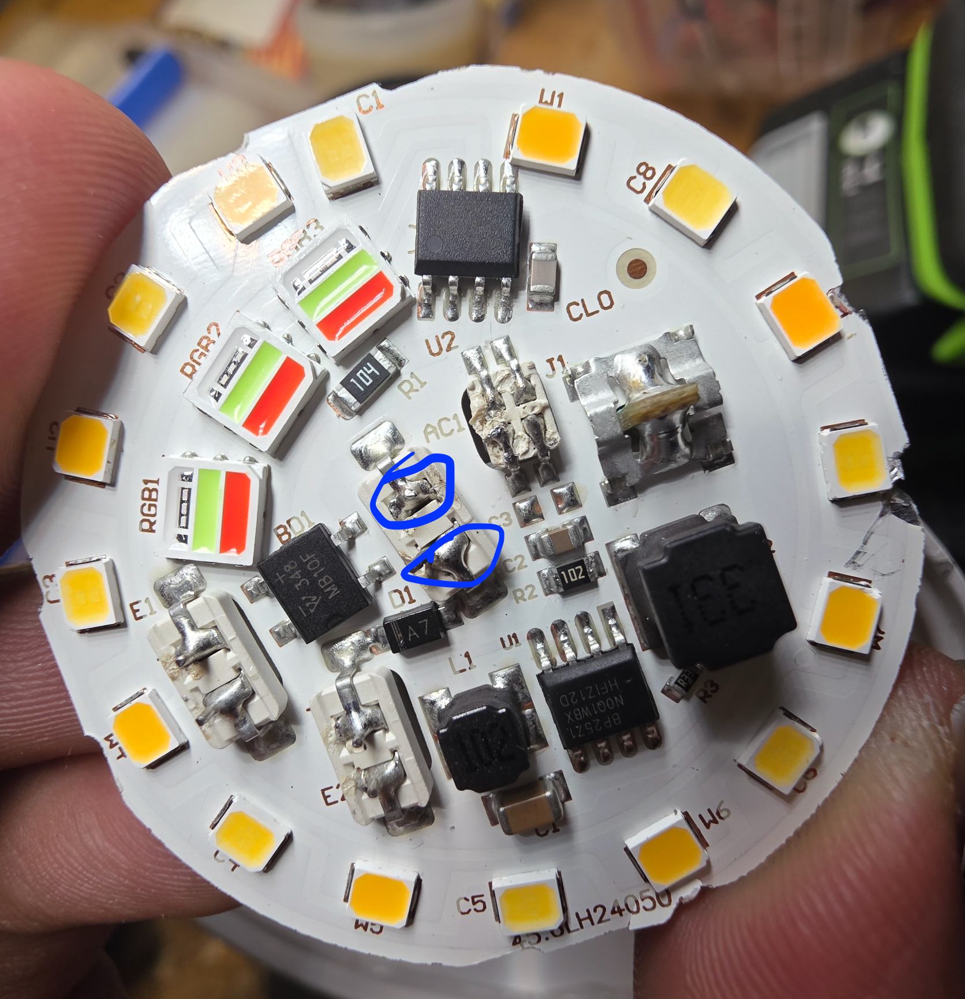
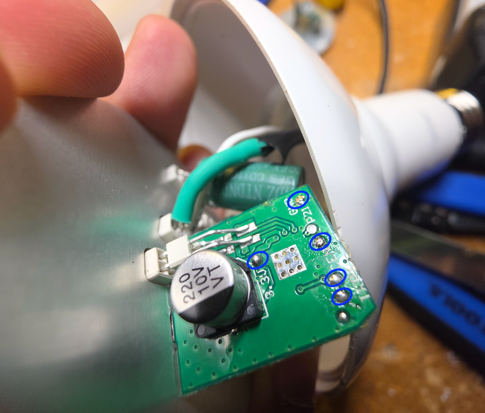

This is an Energizer BR30 RGBWW light bulb for the US market (E26 base). I found this as a 2-pack for $5 at BJ's.

## Initial Install

You must open the bulb to access the VDD, GND, RX, and TX pins. They can be accessed on the custom BK7231N daughterboard.

#### Initial Dissasembly
Use a chisel and hammer to separate the diffuser from the housing.

Use a thin, flathead screwdriver to pry the LED board up from the metal housing. This will disconnect the wires leading to the E26 socket. I reattached them by soldering new wires to the E26 socket and board. To avoid this, you can try pushing out the wires from these center two pins before prying up the board, using a needle or 22 gauge wire:



(I soldered these pins for added rigidity, they are press-fit in the original assembly).

#### Flashing

Solder 3.3V, RX, TX, and GND to a USB to UART adapter from the pins on the bottom daughterboard. The pins are labelled in the silk screen.



Solder a small jumper wire to the CEN pad, as you will need to temporarily jump this pin to GND when flashing.

Compile the ESPHome image and save it as a uf2 file.

Install ltchiptool on your computer, plug the UART adapter in, and run `ltchiptool flash write firmware.uf2`. Keep CEN shorted to GND for the first few seconds, as ltchiptool attempts to connect to the chip. Once you see a progress bar of flashing, disconnect the CEN pin.

Once your device fully flashes, reboots, and connects to the Wi-Fi, you can desolder the UART adapter, and re-assemble the device.

## Notes

Instead of using PWM, this device uses a bp5758 i2c 5-channel LED dimmer.

There are two on the main board, but only one is wired (5 channels - red, green, blue, warm white, cool white). The other one seems to be for a different SKU of product, as its traces lead nowhere on the board.

## Basic Configuration

```yaml file=config.yaml
```
