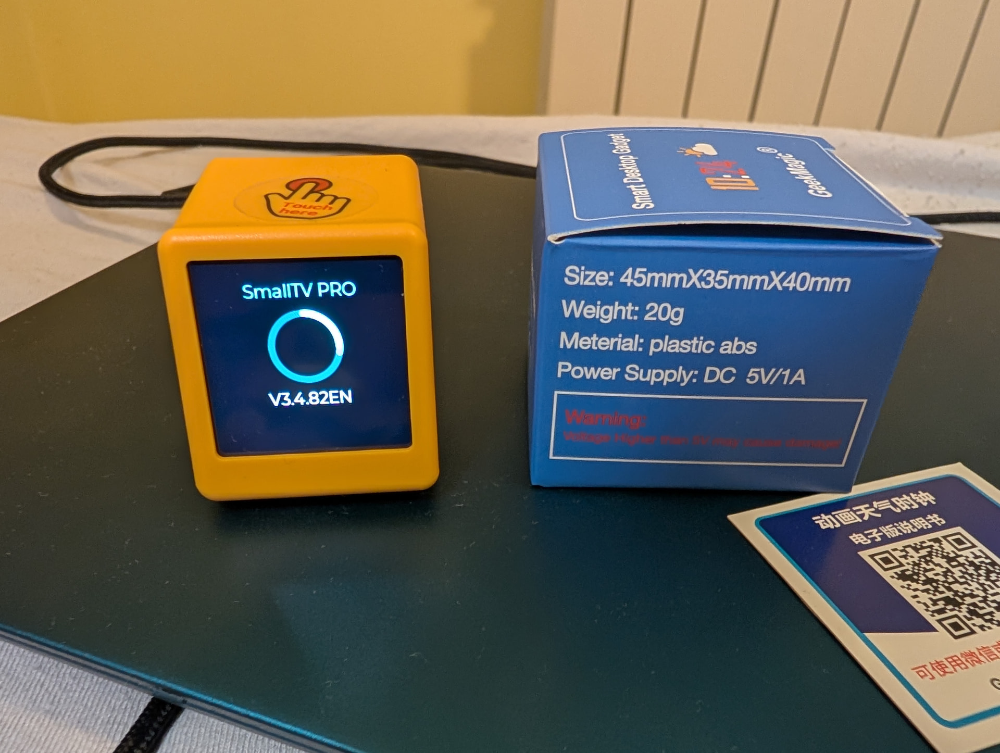
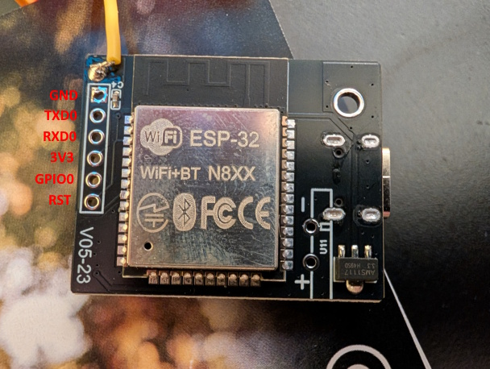
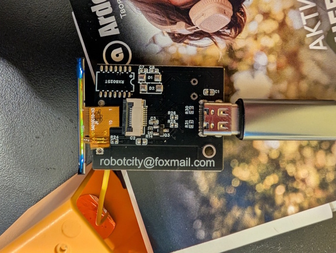
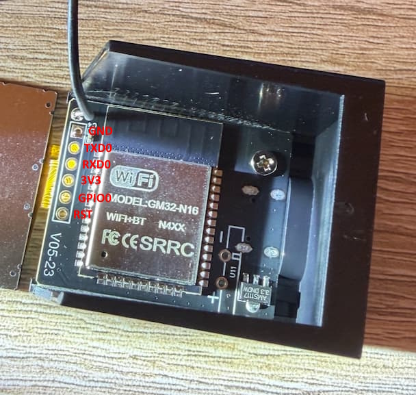
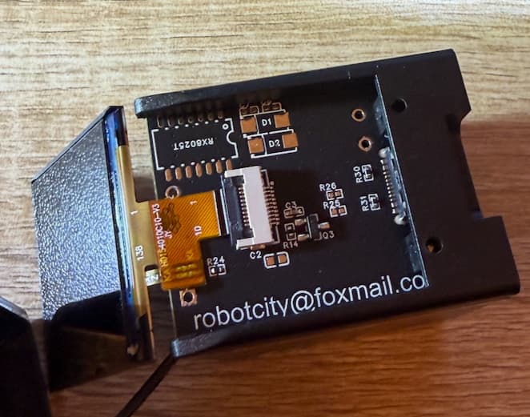

## Product Description

The GeekMagic SmallTV Pro is a LCD display designed to look like a mini computer.

It is USB-C powered and has an ESP32 inside (sometimes labeled GM32-N16).

The LCD panel has a 28x28mm size resulting in a 240x240 pixel resolution.

Available on [AliExpress](https://de.aliexpress.com/item/1005005132140010.html) at various vendors.

## Product Images



## Flash ESPHome

Flashing the device can be done in 2 different ways.

### 1. Upload .bin file (using original firmware)(easiest)

The original firmware comes with the option to upload a custom .bin file.
This can be done by connecting to the device's access point over Wi-Fi.
Open a browser and navigate to the IP address displayed on the screen of the device.
Find the "Firmware update" section in the web interface and upload your .bin file.
The .bin file can be generated with ESPHome Device Builder using the correct config below.

### 2. Manual flashing via Serial (Disassembly needed)

If the first option is not usable for you, you can always flash the device manually by disassembling it first.
Unscrew the 2 screws at the bottom of the device and slide the plastic casing open from the back of the device.
Because this device doesn't have a USB to serial chip, we need to connect some wires to it in order to flash it.

PCB and Pinout - ESP32:




PCB and Pinout - GM32-N16:




**Note:** To enter flash mode, GPIO0 must be pulled to GND during power-up.

## Basic Configuration

```yaml file=config.yaml
```
