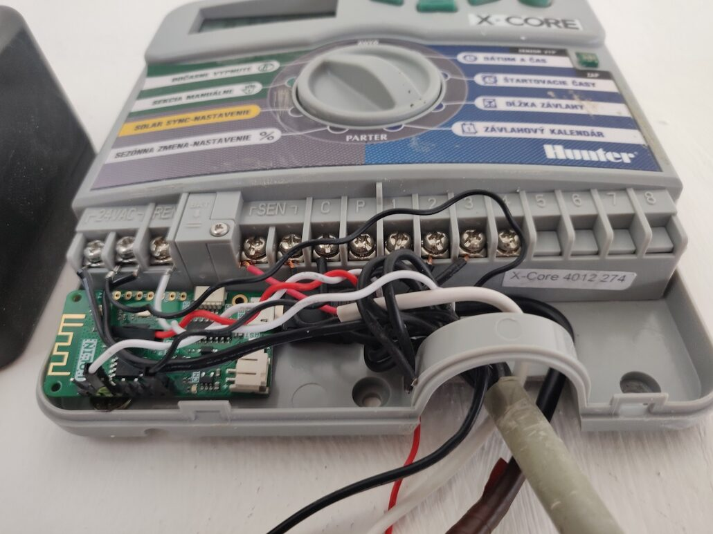
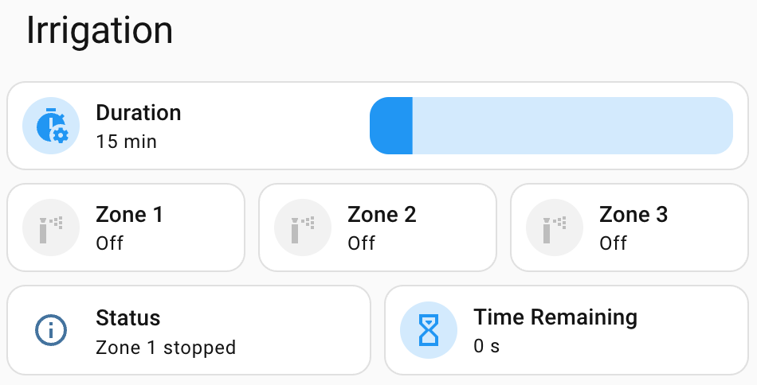

## General Notes

The **Hunter X-Core** is a residential irrigation controller with 2 to 8 zones. It has no network
connectivity of its own, but it exposes a `REM` (remote) terminal that is normally used by the Hunter ROAM
handheld remote. This project drives that terminal from an ESP8266 or ESP32 using the Hunter SmartPort
protocol, turning the controller into a Wi-Fi remote while keeping the physical dial and manual programs
fully functional.

- **Remote control**: Start or stop up to 8 zones and 4 programs from Home Assistant.
- **Status**: Exposes the active zone, remaining run time and Wi-Fi diagnostics.
- **Platform agnostic**: Works with ESP8266 (e.g. Wemos D1 Mini) and ESP32 boards.
- **Optional MQTT**: A second external component adds MQTT topics for non-Home-Assistant setups.

The `REM` line is write-only, so the firmware cannot read back the controller's actual state. It can only
report which commands it has sent.

## Pinout & Hardware Setup

Connect the ESP board directly to the controller's terminal block:

| Hunter X-Core | ESP8266 (D1 Mini) | ESP32  |
| ------------- | ----------------- | ------ |
| **REM**       | D0 (GPIO16)       | GPIO18 |
| **GND**       | GND               | GND    |

The `REM` signal is referenced to `AC#2` (or `GND`, depending on your wiring). Please read the
[installation guide](https://github.com/marek-polak/esphome-hunter-xcore/blob/main/docs/installation.md)
in the project repository for grounding and power-supply details before connecting anything.

## Basic Configuration

The protocol is implemented by the `hunter_roam` external component from the
[project repository](https://github.com/marek-polak/esphome-hunter-xcore). The configuration below is the
minimum needed to get the hardware talking to the controller; zones and programs are then driven from
lambdas or the more complete example further down.

```yaml file=config.yaml
```

## Full Configuration

The repository ships a ready-to-flash configuration with one switch per zone, a program selector,
a countdown sensor and optional MQTT integration. Both platform files include `hunter-xcore-common.yaml`
as a package.

```yaml url=https://github.com/marek-polak/esphome-hunter-xcore/blob/main/hunter-xcore-esp8266.yaml
```

```yaml url=https://github.com/marek-polak/esphome-hunter-xcore/blob/main/hunter-xcore-esp32.yaml
```

```yaml url=https://github.com/marek-polak/esphome-hunter-xcore/blob/main/hunter-xcore-common.yaml
```

Clone the repository, copy `config.yaml` to `secrets.yaml` and fill in:

- **`zone_count`**: Number of zones on your controller (`2`–`8`). Unused zones are hidden from
  Home Assistant.
- **Wi-Fi**: `wifi_ssid`, `wifi_password`
- **API**: `api_encryption_key`
- **MQTT** (optional): `mqtt_broker`, `mqtt_username`, `mqtt_password`
- **Web server** (optional, ESP32 only): `web_username`, `web_password`

## Home Assistant Dashboard

Once configured, the zone switches and countdown timer are available natively in Home Assistant.
An example Lovelace dashboard is included in the repository:


