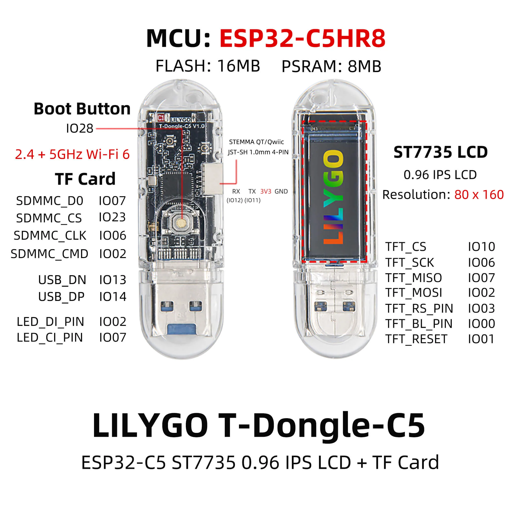

## Overview


## Basic Configuration
```yaml
esphome:
  name: t-dongle-c5
  friendly_name: T-Dongle-C5

esp32:
  variant: esp32c5
  flash_size: 16MB
  framework:
    type: esp-idf

logger:

wifi:
  ssid: !secret wifi_ssid
  password: !secret wifi_password
  ap:

spi:
  - id: spi_display
    clk_pin: GPIO6
    mosi_pin: GPIO2
    miso_pin: GPIO7
  - id: spi_led
    clk_pin: GPIO4
    mosi_pin: GPIO5

display:
  - platform: mipi_spi
    id: display_mipi_spi_1
    model: ST7735
    spi_id: spi_display
    cs_pin:
      number: GPIO10
    dc_pin: GPIO3
    reset_pin: GPIO1
    rotation: 0
    dimensions:
      width: 80
      height: 160
      offset_width: 26
      offset_height: 1
      pad_height: 0
      pad_width: 0
    invert_colors: true
    auto_clear_enabled: true
    color_order: BGR
    show_test_card: true  # Turn this off when programming the display.

light:
  - platform: spi_led_strip
    name: SPI LED Light
    id: light_spi_led_strip_1
    spi_id: spi_led

switch:
  - platform: gpio
    name: LCD BackLight
    id: switch_gpio_1
    pin: GPIO0
    restore_mode: ALWAYS_ON
    inverted: true

binary_sensor:
  - platform: gpio
    name: Boot BTN
    id: binary_sensor_gpio_1
    pin: GPIO28
    filters:
      - invert:

sensor:
  - platform: internal_temperature
    name: Internal Temperature Sensor
    id: sensor_internal_temperature_1
    update_interval: 30s

```
