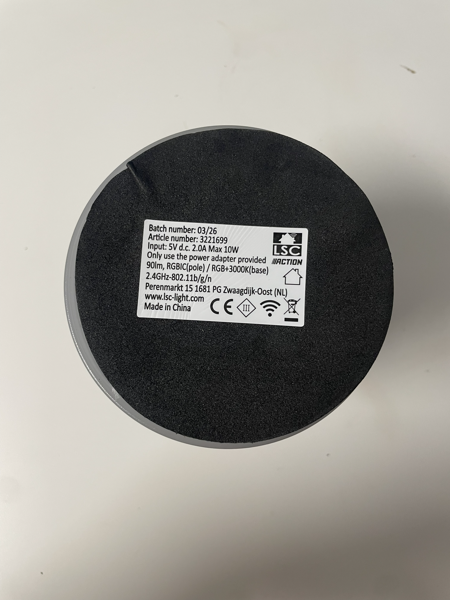
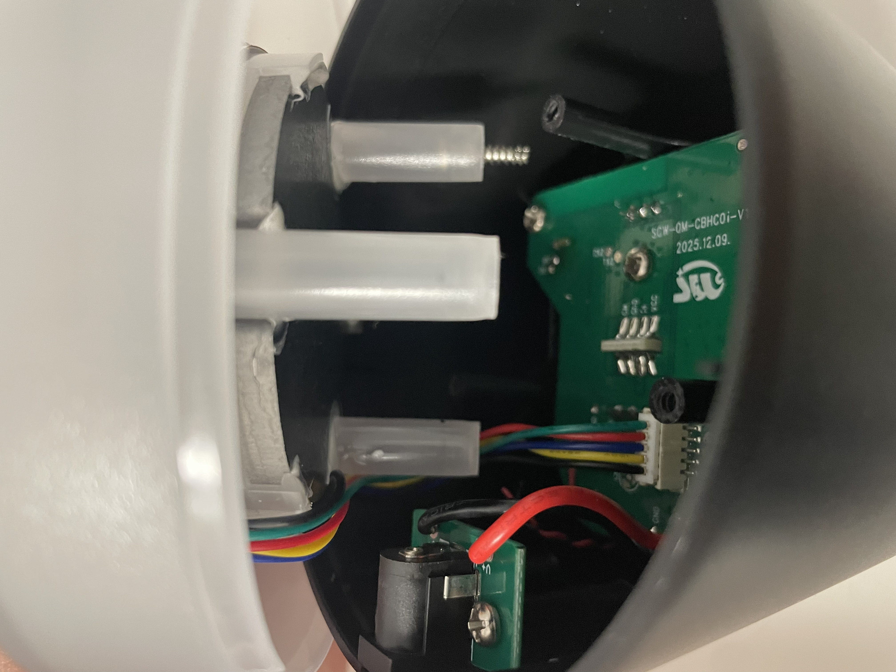

# LSC Smart Connect Smart RGB Floor Lamp

This guide applies to the **LSC Smart Connect Smart RGB Floor Lamp** sold by **Action**.

| Property | Value |
|----------|-------|
| Brand | LSC Smart Connect |
| Retailer | Action |
| Product | Smart RGB Floor Lamp |
| Article number | **3221699** |


The lamp features two independently controllable lighting zones. The main light section is an **addressable LED strip**, allowing animations and individually controlled LEDs. The illuminated base uses a conventional **RGBW LED Strip**, providing independent RGB and white light control.

## Flashing

The device can be flashed using **LTChipTool** and a **3.3 V USB-to-UART adapter**.

### Hardware flashing

1. Turn the lamp upside down.



2. Carefully remove the large foam pad from the bottom of the base.

3. Remove the three screws underneath the foam pad.


4. Carefully open the base to access the PCB.

5. Disconnect the connector between the base and the PCB. Hold the connector itself instead of pulling on the wires.



6. Connect the USB-to-UART adapter to the programming pads.


| USB-to-UART | Lamp |
|-------------|------|
| TX | RX1 |
| RX | TX1 |
| GND | GND |

The programming pads can be accessed either by soldering temporary wires or by using pogo pins. **Pogo pins are recommended**, as they do not require any permanent modification to the PCB.

7. In **LTChipTool**, select the correct firmware and serial port, then start the flashing process. Once LTChipTool is waiting for the device, either power on the lamp or briefly short the **RESET** pad to **GND**. The bootloader will be detected automatically and flashing will begin.

8. Wait until flashing has completed successfully.

9. Disconnect the programmer, reconnect the cable between the PCB and the base, and reassemble the lamp.

> **Warning**
>
> Use only a **3.3 V** USB-to-UART adapter. Applying **5 V** may permanently damage the device.

### LTChipTool

For detailed installation and usage instructions, please refer to the official LibreTiny LTChipTool documentation:

https://docs.libretiny.eu/docs/flashing/tools/ltchiptool/#flashing-firmware

## GPIO configuration

| Function | GPIO |
|----------|------|
| Red PWM | |
| Green PWM | |
| Blue PWM | |
| White PWM | |
| Addresable Led | |

## ESPHome configuration

```yaml file=config.yaml
```

## Notes

- Supports two independently controllable lighting zones.
- Main light section uses addressable LEDs.
- Base uses a conventional RGBW LED Strip.
- Flashing requires opening the device.
- This guide is based on the Action retail version with article number **3221699**.
````
