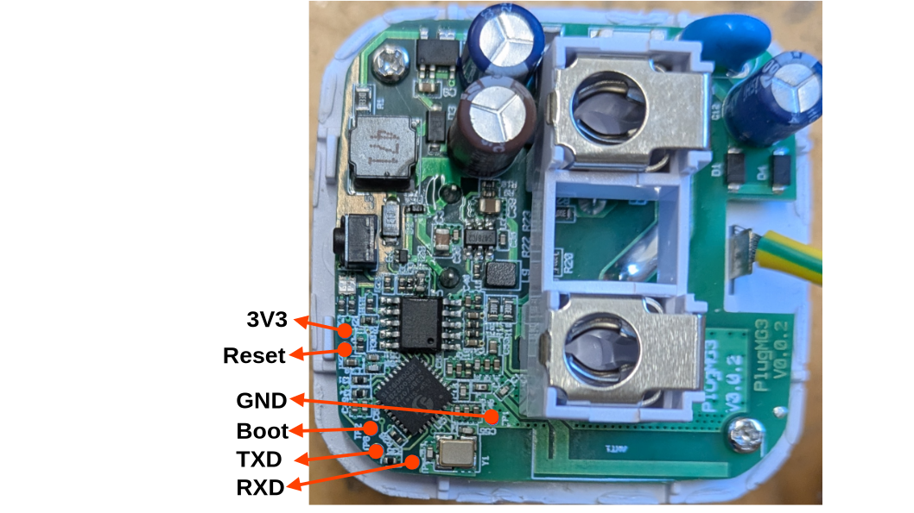

<!-- Describe the device here. See the front-matter table on the contributing page for valid options. -->



To enter bootloader mode, Boot needs to be pulled down (connected to ground).

## GPIO Pinout

| Pin   | Function  |
| ----- | --------- |
| GPIO3 | NTC       |
| GPIO5 | BL0942 TX |
| GPIO4 | BL0942 RX |
| GPIO19 | Blue LED |
| GPIO10 | Green LED|
| GPIO7 | Button    |
| GPIO0 | Relay     |

## Basic Configuration

```yaml file=config.yaml
```
