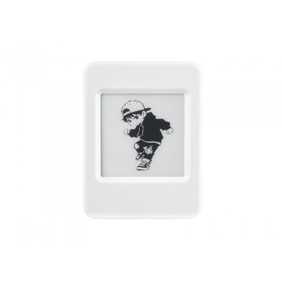
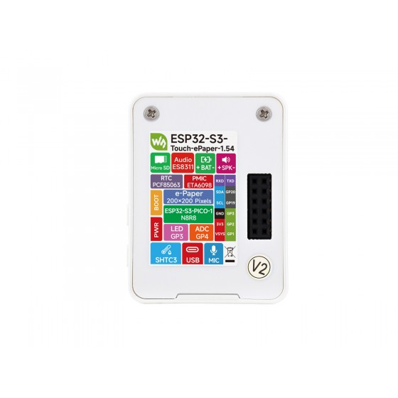

## Product Description

ESP32-S3 (PICO-1-N8R8, 8MB flash + 8MB PSRAM) AIoT board with a 1.54" 200x200
e-paper display (monochrome on the `-EN`/base variant, 4-color BWRY on the
`...1.54G` variant), an ES8311 audio codec driving an onboard analog
microphone and speaker, a SHTC3 temperature/humidity sensor, a PCF85063 RTC,
a microSD slot, and lithium battery charging/monitoring. The `Touch` variant
additionally has a capacitive touch panel.

This guide focuses on using the board as a fully local Home Assistant Voice
Assistant satellite (wake word + STT + TTS) while keeping the SHTC3 sensor.
The e-paper display is intentionally **not** covered in the config below — a
full refresh takes ~15-20s, so it cannot show live listening/thinking/replying
states and competes with the audio pipeline for SPI/CPU. See the
[Waveshare ESPHome climate-display writeup](https://www.espboards.dev/blog/waveshare-esp32-s3-epaper-esphome-climate/)
for a separate display-only firmware for this board family.

**Important:** the pins below are specific to *this* board. Every visually
similar Waveshare ES8311 board (S3-Audio-Board, S3-RLCD-4.2, S3-Box, Korvo,
...) uses **different** I2S pins for its codec. Copying a sibling board's
audio config compiles fine but leaves the mic/speaker producing no usable
audio — this is the single biggest time sink with this board family.

## Product Images





## GPIO Pinout

| GPIO   | Function                                                     |
|--------|---------------------------------------------------------------|
| GPIO0  | BOOT button (active low)                                      |
| GPIO4  | Battery voltage ADC (200K/200K divider)                       |
| GPIO6  | e-paper panel power (inverted: LOW = on)                       |
| GPIO8  | e-paper BUSY (inverted: idle HIGH / busy LOW)                  |
| GPIO9  | e-paper RESET                                                  |
| GPIO10 | e-paper DC                                                     |
| GPIO11 | e-paper CS                                                     |
| GPIO12 | SPI CLK (e-paper)                                              |
| GPIO13 | SPI MOSI (e-paper)                                             |
| GPIO14 | I2S MCLK                                                       |
| GPIO15 | I2S BCLK                                                       |
| GPIO16 | I2S DIN (microphone, ES8311 ADC)                               |
| GPIO17 | Battery power latch (must be HIGH on battery)                 |
| GPIO18 | PWR button (active low, also deep-sleep wake)                 |
| GPIO38 | I2S LRCLK / WS                                                 |
| GPIO42 | Audio power rail (PA_EN, active LOW)                           |
| GPIO45 | I2S DOUT (speaker, ES8311 DAC), strapping pin                 |
| GPIO46 | Speaker amplifier enable (PA_CTRL, NS4150B), strapping pin     |
| GPIO47 | I2C SDA (shared: ES8311 @0x18, SHTC3 @0x70, RTC @0x51)         |
| GPIO48 | I2C SCL                                                        |

Pin map verified against Waveshare's own official ESP-IDF firmware
(`Example/ESP-IDF_5.5.1/07_Audio_Test/components/codec_board/board_cfg.txt`
and `main/user_config.h` in the
[waveshareteam/ESP32-S3-ePaper-1.54G](https://github.com/waveshareteam/ESP32-S3-ePaper-1.54G)
repo, Apache-2.0) and against the board schematic PDF. GPIO45/46 are ESP32-S3
strapping pins; ESPHome will warn about this at compile time, it is expected
and harmless on this board.

## Basic Configuration

Includes Wi-Fi, the shared I2C bus, the ES8311 mic/speaker audio path, the
SHTC3 sensor, and the boot button. No `api:`/`ota:` yet — add your own (or
see the Voice Assistant config below, which includes them).

```yaml file=config.yaml
```

Key points, all reverse-engineered from ESPHome's own source
(`esphome/components/es8311/es8311.cpp`,
`esphome/components/i2s_audio/i2s_audio.h`) after several rounds of
plausible-looking-but-wrong config:

- **`use_microphone: false`** on the `es8311` `audio_dac` — do not set this
  `true`. The ES8311 component's own docstring says it "configures the
  codec's ADC to use PDM microphone input instead of analog," which reads
  like "turn the mic on." In the actual source:

  ```cpp
  uint8_t reg14 = 0x1A;                  // analog MIC enabled + max PGA gain
  if (this->use_mic_) reg14 |= BIT(6);   // switches ADC to PDM DIGITAL mic
  ```

  This board's mic is analog, wired into the ES8311's PGA — the analog path
  is already the default (`0x1A`). `use_microphone: true` points the ADC at
  a PDM digital mic this board doesn't have: total silence, no error, no
  warning anywhere. Wake word never fires, STT gets pure silence, and
  raising mic gain changes nothing (because there is no signal to gain).

- **`mic_gain: 24dB`** — 30dB and above clipped into garbled STT results in
  testing; 24dB gave accurate transcriptions.

- **The `switch:` block for GPIO42/GPIO17 uses `restore_mode: ALWAYS_ON`,
  not an `on_boot:` script.** ESPHome's `i2c:` component initializes at
  priority 1000 — before almost everything else, including any `on_boot`
  automation. If you gate the ES8311's power rail (GPIO42, active-low) from
  `on_boot`, the I2C bus starts scanning/talking to the codec while its
  power is still off. This can leave SCL stuck low and produce a scan full
  of bogus addresses ("Performing bus recovery" / "SCL is held LOW" in the
  logs). `restore_mode` is only a valid field on `switch: platform: gpio`
  (not `output: platform: gpio`), and switch/GPIO setup happens early
  enough to beat `i2c:`'s init.

## Voice Assistant Configuration

Extends the basic configuration above into a full local Voice Assistant
satellite: on-device wake word, STT/TTS through Home Assistant's Assist
pipeline, and spoken responses through the onboard speaker. Requires a Home
Assistant instance with an Assist pipeline configured — a local STT engine
such as Wyoming Whisper works well here and keeps everything off-cloud.

```yaml file=voice-assistant.yaml
```

Key points:

- **`gain_factor: 4`** on `micro_wake_word`'s microphone source. The
  default of 1 leaves the wake-word model too quiet to ever cross its
  probability cutoff (0.97 by default) — the wake word never fires with the
  default gain even though the mic itself is working fine.

- **The mic/speaker handover is done with `micro_wake_word.stop` / `.start`
  ONLY, driven from `media_player`'s `on_play` / `on_announcement` /
  `on_idle` hooks — never from `voice_assistant`'s own hooks, and never with
  explicit `microphone.capture` / `microphone.stop_capture` actions.**
  ESPHome's `i2s_audio` bus guards itself with a single mutex
  (`esphome/components/i2s_audio/i2s_audio.h`):

  ```cpp
  bool try_lock() { return this->lock_.try_lock(); }
  // speaker: if (!this->parent_->try_lock()) { ESP_LOGE(TAG, "Parent bus is busy"); }
  ```

  There is no full-duplex mic+speaker on stock ESPHome for a single
  ES8311/one I2S port — exactly one consumer holds the bus at a time.
  `micro_wake_word` captures continuously and already owns the microphone,
  so:
  - `voice_assistant`'s own `on_tts_stream_start`/`on_tts_stream_end` hooks
    require `speaker:` and are rejected at config-validation time when
    using `media_player:` instead (which you need for HA-initiated
    playback, not just pipeline TTS) — use `media_player`'s hooks instead.
  - `voice_assistant`'s `on_end` fires *before* the response actually plays,
    so it must not touch the mic/bus; only `media_player`'s `on_idle`
    (via `script.restart_mww`, which explicitly waits for
    `media_player.is_announcing` and `speaker.is_playing` to clear) should
    reacquire it.
  - Adding an explicit `microphone.capture` / `microphone.stop_capture`
    anywhere creates a **second, independent** claim on the mic that
    `micro_wake_word.stop` cannot release. The mic then keeps the bus mutex
    forever and the speaker retries "Parent bus is busy" in an **infinite**
    loop — not the harmless one-off retry you may see during a normal
    handover. This is easy to miss: a single announcement can work fine,
    and it only deadlocks after the first full voice-pipeline run.

- **Volume is not linear.** `media_player.volume_set` maps onto the
  ES8311's REG32 (0.5dB per step), where 191/255 = 0dB:
  - 0.45 → −38dB (inaudible)
  - **0.75 → 0dB** (good starting point)
  - 1.00 → +32dB (loud and distorted on a small speaker)

## Notes

- The touch panel (on the `Touch` variant) is not yet covered in this guide.
- The e-paper display is deliberately omitted from this voice-focused
  config; see the intro above.
- Every board in this family (S3-Audio-Board, S3-RLCD-4.2, S3-Box, Korvo,
  this board, ...) wires its ES8311 to *different* GPIOs. If you have a
  visually similar Waveshare board that isn't this one, don't reuse these
  pin numbers — check that board's own schematic/example firmware first.
